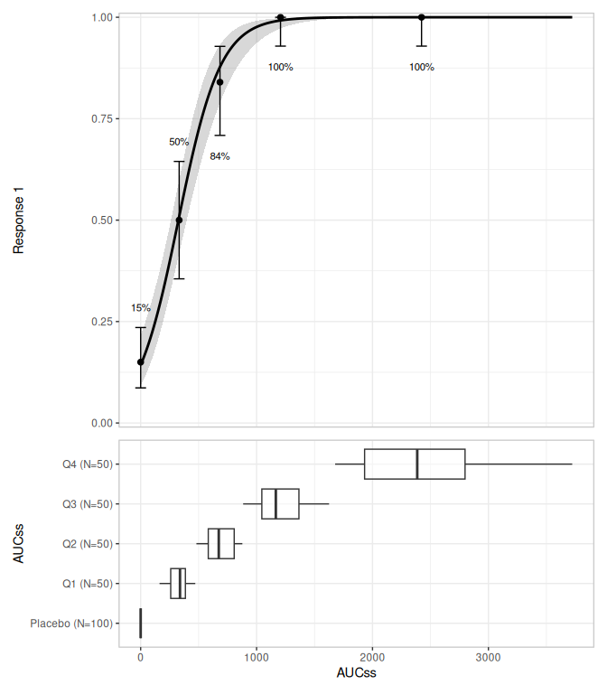
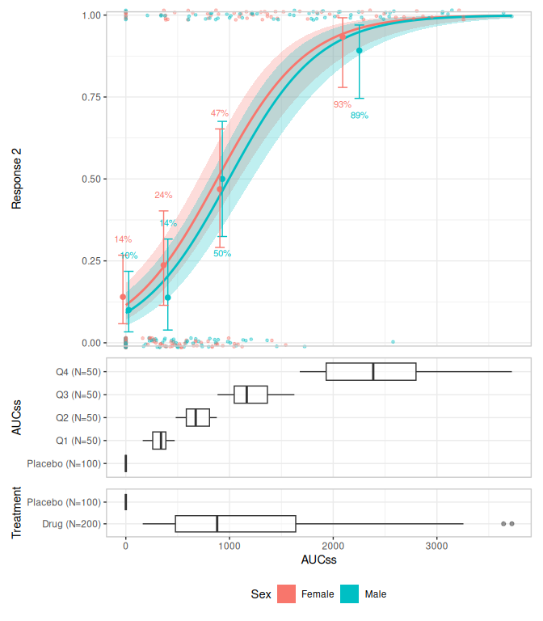
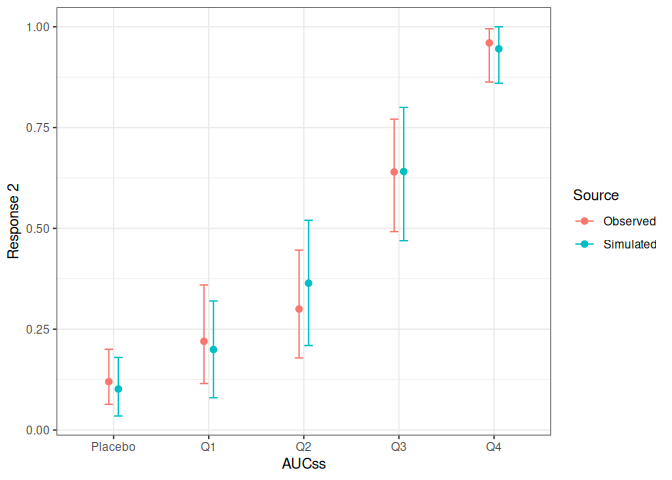
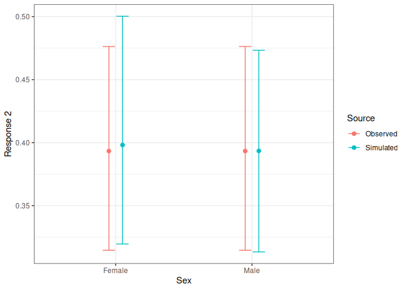

<!-- README.md is generated from README.Rmd. Please edit that file -->

# erplots

<!-- badges: start -->

[](https://lifecycle.r-lib.org/articles/stages.html#experimental)
[](https://github.com/djnavarro/erplots/actions/workflows/R-CMD-check.yaml)
[](https://app.codecov.io/gh/djnavarro/erplots)
<!-- badges: end -->

erplots provides a fluent mini-language for building exposure-response
plots: model curves/ribbons, quantile-binned response-rate summaries,
data strips, and grouped distribution panels. It is model-agnostic:
erplots never fits a model itself. Instead, you fit a model with
whatever package suits your workflow
(e.g. [erglm](https://github.com/djnavarro/erglm) for logistic
regression), and pass the fitted object to `er_plot_add_model()`. Any
model that implements `er_predict()` can be visualised; implementing
`er_simulate()` and `er_summary()` additionally enables uncertainty
spaghetti plots/VPCs and summary annotations (e.g. p-values). See
`?er_model_interface`.

## Installation

You can install the development version of erplots like so:

``` r
pak::pak("djnavarro/erplots")
```

## Example

``` r
library(erplots)
library(erglm)

mod <- erglm_model(ae1 ~ aucss, erglm_data, family = binomial())

erglm_data |> 
  er_plot(aucss, ae1) |> 
  er_plot_add_model(mod) |> 
  er_plot_add_quantiles() |> 
  er_plot_add_groups(aucss) |> 
  plot()
```



``` r

mod2 <- erglm_model(ae2 ~ aucss + sex, erglm_data, family = binomial())
mod2_marginal <- erglm_model(ae2 ~ aucss, erglm_data, family = binomial())

plt <- erglm_data |> 
   er_plot(aucss, ae2, stratify_by = sex) |> 
   # keep_strata = FALSE needs a model without the stratification
   # variable as a term, so we pass `mod2_marginal` here
   er_plot_add_model(mod2_marginal, keep_strata = FALSE) |> 
   er_plot_add_quantiles(bins = 3) |> 
   er_plot_add_data() |> 
   er_plot_add_groups(group_by = c(aucss, treatment), keep_strata = FALSE)

print(plt)
#> <er_plot>
#>   plot variables:
#>     - exposure:        aucss
#>     - response:        ae2
#>     - stratification:  sex
#>   plot layers:
#>     - model:           erglm_model/glm/lm
#>     - quantile:        3 bins
#>     - overlay:         stratified
#>     - group:           .aucss_quantile, treatment
#>   plots built: <none>
#>   output built: no
plot(plt)
```



## VPC plots

``` r
er_vpc_plot(erglm_data, exposure = aucss, response = ae2, group_by = aucss, model = mod2, seed = 1234)
```



``` r
er_vpc_plot(erglm_data, exposure = aucss, response = ae2, group_by = sex, model = mod2, seed = 1234)
```


