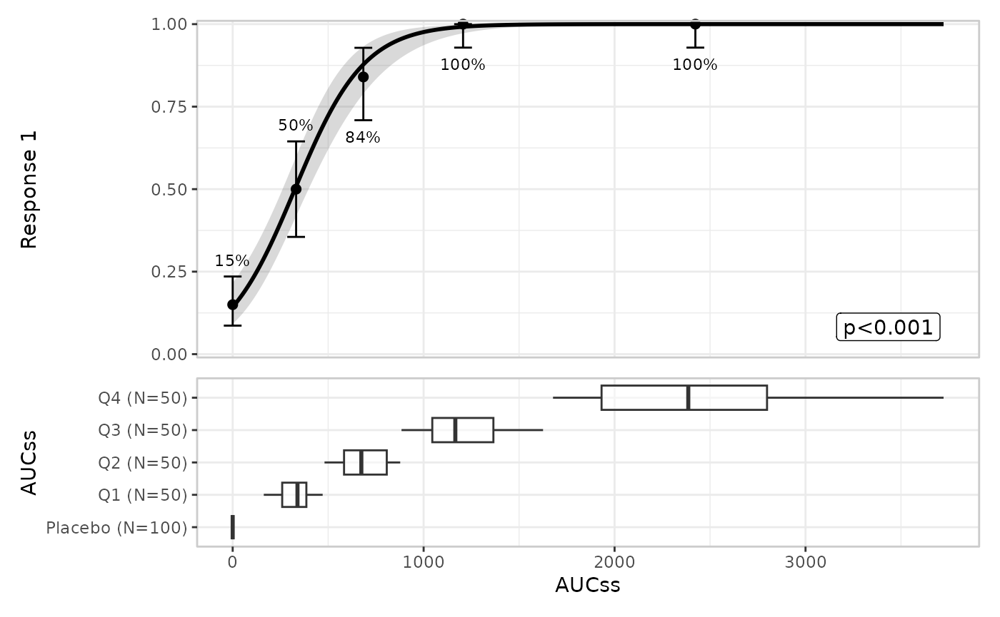
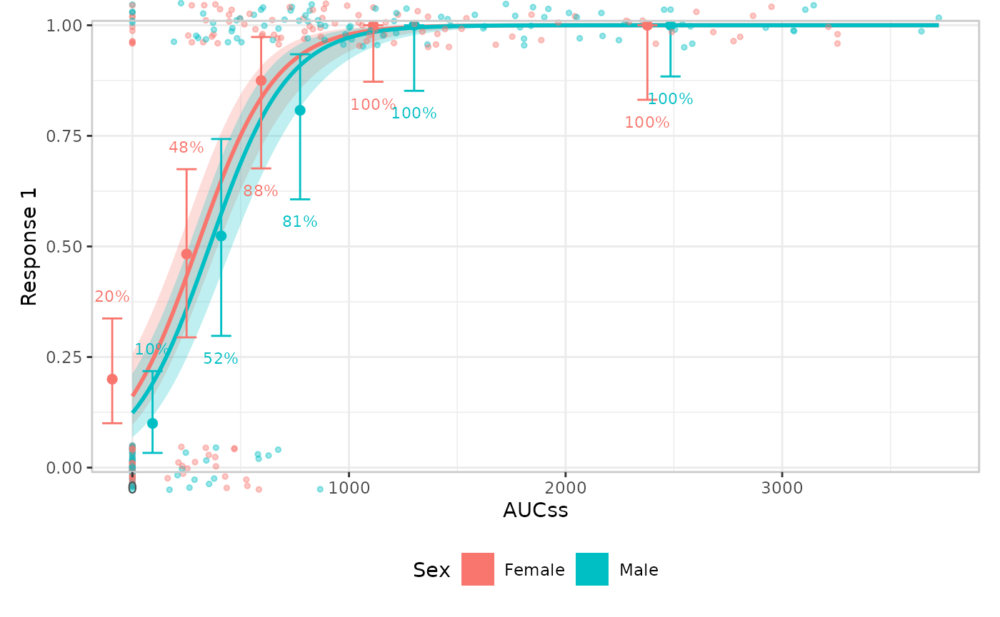

# The plotting grammar

This article is about the *grammar* erplots plots are built from, not
about any one plot’s mechanics – for worked examples of each layer, see
the [binary](https://erplots.djnavarro.net/articles/plot-binary.md),
[continuous](https://erplots.djnavarro.net/articles/plot-continuous.md),
and [count](https://erplots.djnavarro.net/articles/plot-count.md)
response articles; for writing a custom builder in detail, see
[Extending
erplots](https://erplots.djnavarro.net/articles/extending.md). If a
design choice described here ever changes, this article and `PLAN.md`’s
“Mini-language architecture review” section should be updated together;
see the note at the end.

``` r

library(erplots)
library(erglm)
```

## Building a plot is composing layers onto an object

[`er_plot()`](https://erplots.djnavarro.net/reference/er_plot.md)
creates an empty object of class `er_plot`, storing the data and the
plot’s exposure/response/stratification variables. You then pipe it
through one or more *layer* functions, each of which adds one visual
component, and finish with
[`plot()`](https://rdrr.io/r/graphics/plot.default.html)/[`print()`](https://rdrr.io/r/base/print.html)
(or \[er_plot_build()\] directly):

``` r

mod <- erglm_model(ae1 ~ aucss, erglm_data, family = binomial())

erglm_data |>
  er_plot(aucss, ae1) |>
  er_plot_add_model(mod) |>
  er_plot_add_quantiles() |>
  er_plot_add_groups(aucss) |>
  plot()
```



    observed data
          |
          v
      er_plot()                       -- creates the (empty) object
          |
          v
      layer functions (piped, any order, any subset):
        er_plot_add_model()
        er_plot_add_quantiles()
        er_plot_add_data()
        er_plot_add_groups()
          |
          v
      er_plot_build()                 -- called for you by plot()/print()
          |
          v
      polish: margins, labels, legends, theme
          |
          v
      compose: patchwork
          |
          v
      rendered plot

There are currently four layers, each documented on its own help topic:

| Layer | Function | Shows | Depends on `response_type`? |
|----|----|----|----|
| Model | \[er_plot_add_model()\] | Fitted curve/ribbon (or spaghetti) plus an optional summary annotation | No |
| Quantile | \[er_plot_add_quantiles()\] | Exposure-quantile-binned response summary (rate/mean + CI) | Yes |
| Data | \[er_plot_add_data()\] | Raw observations, by default overlaid on the model panel at their true (exposure, response) coordinates (\[er_builder_data_overlay()\]); or, for a binary response, \[er_builder_data_boxjitter()\]’s older panel-based boxplot + jitter design | Yes |
| Group | \[er_plot_add_groups()\] | Exposure distribution, boxplot/violin, split by a grouping variable | No |

## Layers are either singleton or additive

Calling a layer function twice on the same object doesn’t always do the
same thing. The model, quantile, and data layers are **singleton**: a
second call replaces the first call’s result rather than combining the
two.

``` r

plt <- erglm_data |>
  er_plot(aucss, ae1) |>
  er_plot_add_quantiles(bins = 4) |>
  er_plot_add_quantiles(bins = 8) # overwrites the bins = 4 call

plt$part$quantile$config$n_quantiles # 8, not 4
#> [1] 8
```

The group layer is the one exception: it’s **additive**. Each call adds
another panel alongside any already added, rather than replacing them:

``` r

plt <- erglm_data |>
  er_plot(aucss, ae1) |>
  er_plot_add_groups(aucss) |>
  er_plot_add_groups(treatment) # adds a second panel, doesn't replace the first

names(plt$part$group$config) # both grouping variables are still there
#> [1] ".aucss_quantile" "treatment"
```

This is a deliberate design choice, not an oversight: there is only one
“the model” and one “the quantile summary” to show per plot, but many
legitimate ways to slice the exposure distribution by different grouping
variables. The one flagged exception to watch for: because the model
layer is singleton, overlaying two model curves for comparison (e.g. a
candidate model against a reference model) isn’t currently possible.
That’s tracked as a plausible future addition, not planned work – see
`PLAN.md`.

## Stratification composes with layers, usually via color

`stratify_by`, set once in
[`er_plot()`](https://erplots.djnavarro.net/reference/er_plot.md),
declares a single discrete variable used to split layers by color/fill,
with one shared, deduplicated legend across the whole composed plot:

``` r

mod_strat <- erglm_model(ae1 ~ aucss + sex, erglm_data, family = binomial())

erglm_data |>
  er_plot(aucss, ae1, stratify_by = sex) |>
  er_plot_add_model(mod_strat) |>
  er_plot_add_quantiles() |>
  er_plot_add_data() |>
  plot()
```



Each layer’s own `keep_strata` argument controls whether *that* layer
uses the stratification (default `TRUE` whenever `stratify_by` was set).
The general rule, in the order a layer actually applies it: **a layer’s
own encoding takes precedence; stratification adapts to whatever channel
is left**, defaulting to color/fill.

For most layers, color/fill is always free for strata, so this rule is
invisible in practice. The data layer is the one exception, and its
behaviour now depends on which builder is in play, and which
*structural* family (declared via \[er_builder_tag()\]) that builder
belongs to:

- [`er_builder_data_overlay()`](https://erplots.djnavarro.net/reference/er_builder_data.md)
  (the default, `"overlay"`-layout): color, when mapped at all, always
  means strata – the response is already shown via y-position, so
  color/fill is free for stratification like every other layer, and the
  overlay shares the base plot’s own strata legend with the
  model/quantile layers.
- [`er_builder_data_boxjitter()`](https://erplots.djnavarro.net/reference/er_builder_data.md)
  (the older, panel-based design, `"panel"`-layout, binary-response
  only): behaves the same way as overlay – color/fill means strata,
  shared legend. There is no built-in `"panel"`-layout builder for a
  continuous/count response today; if one is written, its color
  aesthetic would typically already be spoken for by the response value
  itself (as the removed `build_data_color()` builder’s was), in which
  case stratification should fall back to one panel per stratum level
  instead of a shared legend – the concrete instance of “a layer’s own
  encoding takes precedence” that motivated the general rule. See
  `PLAN.md`’s “Continuous-response data strip” section for that design
  history, and \[er_plot_add_data()\] for the full breakdown.

A `config$color_role` tag (`"strata"` or `"response"`, set by
`.part_data()`) records which meaning applies for a given data-layer
build, so the composition machinery (`.polish_labels()`/
`.polish_legends()`) knows whether to treat a builder’s legend as the
shared strata legend or a standalone response colorbar.

## Response type changes what a layer summarises, not whether it appears

`response_type`, also set once in
[`er_plot()`](https://erplots.djnavarro.net/reference/er_plot.md)
(`"auto"`, `"binary"`, `"continuous"`, or `"count"`), governs the
response’s scale and which summary/CI method a response-type-aware layer
uses. The model and group layers don’t look at the response’s type at
all – they only consume \[er_predict()\]/\[er_simulate()\] output or the
exposure variable, respectively. The quantile layer dispatches on it
directly:

| `response_type` | Bin summary   | CI method                                  |
|-----------------|---------------|--------------------------------------------|
| `"binary"`      | Response rate | Clopper-Pearson (\[ci_clopper_pearson()\]) |
| `"continuous"`  | Mean          | t-interval (\[ci_t()\])                    |
| `"count"`       | Mean          | Exact Poisson interval (\[ci_poisson()\])  |

`"auto"` classifies a response as `"binary"` if it’s logical or confined
to `{0, 1}`, and `"continuous"` otherwise – so a genuine count response
auto-detects as `"continuous"` and is summarised as an
approximately-continuous quantity unless `response_type = "count"` is
declared explicitly. See \[er_plot_add_quantiles()\] for the full
rationale and the [count
responses](https://erplots.djnavarro.net/articles/plot-count.md)
article’s “Quantile component” section for a worked example, including a
case where the choice between the t-interval and exact Poisson interval
visibly matters.

The data layer doesn’t compute a summary statistic at all – it just
plots raw observations – so `response_type` instead changes *how* it’s
drawn:
[`er_builder_data_overlay()`](https://erplots.djnavarro.net/reference/er_builder_data.md)
(the default) needs no dispatch (a plain scatter, or a small vertical
jitter for a binary response’s exactly-0/1 y-values);
[`er_builder_data_boxjitter()`](https://erplots.djnavarro.net/reference/er_builder_data.md)
is binary-response only, and uses `response_type` only insofar as
[`er_plot_add_data()`](https://erplots.djnavarro.net/reference/er_plot_add_data.md)
guards against using it on a continuous/count response at all (there’s
no upper/lower partition to split on) – see \[er_plot_add_data()\].

## Extending erplots: writing your own builder

Every layer function delegates the actual drawing to a `builder`
argument
([`er_plot_add_model()`](https://erplots.djnavarro.net/reference/er_plot_add_model.md)
additionally has `summary_builder`) sharing a common signature –
`function(data, config, stratify, exposure, response, strata, style)`.
That signature is a documented, public part of the API (see
\[er_builder()\]), each layer’s `builder` defaults to one built-in
`er_builder_*()` function, and it can be set to any other function
matching the same signature – no need to fork the package or reach into
`object$part` internals. For the data layer specifically, a custom
builder must additionally declare which *structural* family it belongs
to via \[er_builder_tag()\].

Writing a custom builder in detail – including what `config` actually
contains for each layer, a worked crossbar example, and
\[er_builder_tag()\], the single helper a builder can use to declare its
`layout`/`fill_role`/`y_role` metadata for the composition machinery –
is its own article: [Extending erplots: writing your own
builder](https://erplots.djnavarro.net/articles/extending.md).

## Keeping this article in sync

This article describes the grammar as designed and implemented *today*.
Whenever a future change lands that alters any of the above – renaming a
layer, changing which layers are singleton vs. additive, changing how
stratification composes with a layer’s own encoding, or adding/removing
a `response_type` dispatch – update this article in the same change, and
update the cross-references in `PLAN.md`’s “Mini-language architecture
review” section (which points here) to match. Treat a design change that
isn’t reflected here as incomplete.
