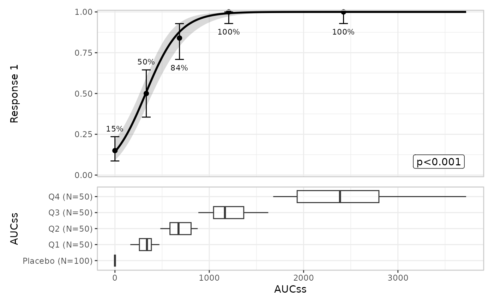
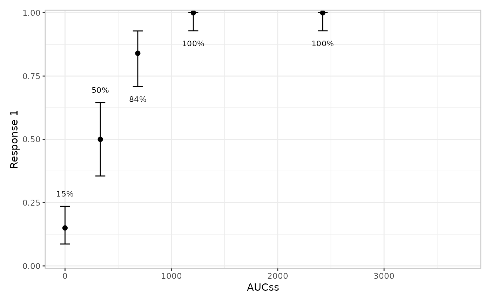
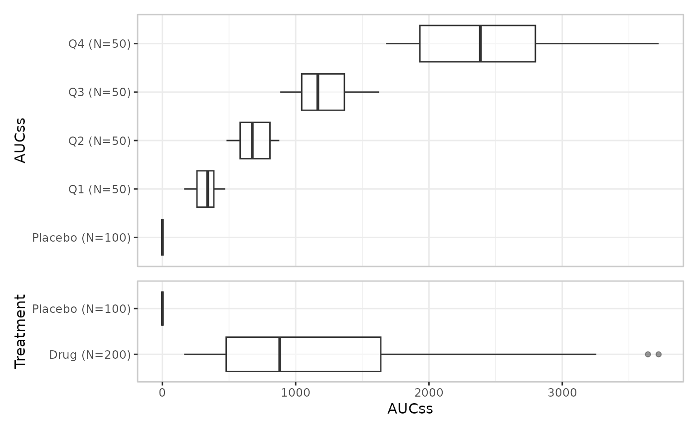

# The plotting grammar

The goal of this article is to describe the **grammar** that erplots
uses to generate exposure-response plots. It’s not intended to describe
all the style options available to users, or cover the mechanics of how
plots are constructed. If you want to see those in more detail, there
are articles covering
[binary](https://erplots.djnavarro.net/articles/plot-binary.md),
[continuous](https://erplots.djnavarro.net/articles/plot-continuous.md),
and [count](https://erplots.djnavarro.net/articles/plot-count.md)
response data. You can also read the article on [extending
erplots](https://erplots.djnavarro.net/articles/extending.md) if you
want to learn how you can write your own functions that change how the
plots are displayed.

``` r

library(erplots)
library(erglm)
```

## Plots are constructed in layers

The design of an exposure-response plot follows a very similar logic to
how plots are built in the ggplot2 package. The first function you call
is always
[`er_plot()`](https://erplots.djnavarro.net/reference/er_plot.md), which
creates an empty object of class `er_plot`. When you do this, it stores
the data set internally and keeps track of which columns correspond to
the exposure, response, and stratification variables. You then pipe it
through through one or more *layer* functions, each of which adds one
visual layer, and then finish by calling
[`plot()`](https://rdrr.io/r/graphics/plot.default.html) to generate the
plot. A typical plot generation pipeline might look like this:

``` r

mod <- erglm_model(ae1 ~ aucss, erglm_data, family = binomial())

erglm_data |>
  er_plot(aucss, ae1) |>
  er_plot_add_model(mod) |>
  er_plot_add_quantiles() |>
  er_plot_add_groups(aucss) |>
  plot()
```



There are a few features to notice here.

- First, the model object `mod` is not created by the erplots package
  itself. In this case, we fit the model using
  [`erglm::erglm_model()`](https://erglm.djnavarro.net/reference/erglm_model.html),
  and because the erglm package implements the erplots model interface
  functions, the erplots package knows how to extract everything it
  needs from the model.
- Second, notice that at the end of the pipeline we call
  [`plot()`](https://rdrr.io/r/graphics/plot.default.html)
  explicitly.One difference between ggplot2 and erplots is that erplots
  makes a strong distinction between calling
  [`print()`](https://rdrr.io/r/base/print.html) on the plot object
  (outputs a written description of the plot) and calling
  [`plot()`](https://rdrr.io/r/graphics/plot.default.html) on the plot
  object (renders the plot).
- Third, although erplots uses the “layers” language to talk about
  different parts of the plot, an erplot layer operates at a different
  level of abstraction to a ggplot2 geom. A single erplot layer might
  add several ggplot2 geoms rather than a single one; it might even
  create a separate ggplot2 object that gets merged with other ggplot2
  objects using the patchwork package.

The diagram below illustrates the structure of the erplots plotting
pipeline:

    observed data
          |
          v
      er_plot()                       -- creates the (empty) object
          |
          v
      layer functions (piped, any order, any subset):
        er_plot_add_model()
        er_plot_add_summary()
        er_plot_add_quantiles()
        er_plot_add_data()
        er_plot_add_groups()
          |
          v
      er_plot_build()                 -- called for you by plot()
          |
          v
      polish: margins, labels, legends, theme
          |
          v
      compose: patchwork
          |
          v
      rendered plot

From the user perspective, everything ends with the
[`er_plot_build()`](https://erplots.djnavarro.net/reference/er_plot_build.md)
function, which you don’t generally call directly: passing your plot to
the [`plot()`](https://rdrr.io/r/graphics/plot.default.html) function
will do that part for you. The additional “polish” and “compose” steps
are handled behind the scenes, but shown in the diagram to give you a
sense of what happens.

There are currently five different kinds of layer supported by erplots,
each documented on its own help topic:

| Layer | Function | Shows |
|----|----|----|
| Model | [`er_plot_add_model()`](https://erplots.djnavarro.net/reference/er_plot_add_model.md) | Fitted curve/ribbon (or spaghetti plot) that shows what the model predicts |
| Summary | [`er_plot_add_summary()`](https://erplots.djnavarro.net/reference/er_plot_add_summary.md) | A corner-placed annotation describing some aspect to the model (e.g., p-value) or the data set (e.g., sample statistics) |
| Quantile | [`er_plot_add_quantiles()`](https://erplots.djnavarro.net/reference/er_plot_add_quantiles.md) | Exposure-quantile-binned response summary, usually a mean and confidence interval |
| Data | [`er_plot_add_data()`](https://erplots.djnavarro.net/reference/er_plot_add_data.md) | Raw observations, by default overlaid on the model panel at their true (exposure, response) coordinates, but sometimes added to separate “data strips” that appear above and below the model panel |
| Group | [`er_plot_add_groups()`](https://erplots.djnavarro.net/reference/er_plot_add_groups.md) | Exposure distribution, boxplot/violin, split by a grouping variable |

## Layers are singleton or additive

Calling a layer function twice on the same object doesn’t always do the
same thing. The model, summary, quantile, and data layers are
**singleton**: a second call replaces the first call’s result rather
than combining the two.

``` r

erglm_data |>
  er_plot(aucss, ae1) |>
  er_plot_add_quantiles(bins = 8) |>
  er_plot_add_quantiles(bins = 4) |> # overwrites the bins = 8 call
  plot() # rendered plot has 4 quantile bins (plus placebo group)
```



The group layer is the one exception: it’s **additive**. Each call adds
another panel alongside any already added, rather than replacing them:

``` r

erglm_data |>
  er_plot(aucss, ae1) |>
  er_plot_add_groups(aucss) |> # adds first panel
  er_plot_add_groups(treatment) |> # adds second panel
  plot() # rendered plot contains both
```



This is a deliberate design choice, not an oversight: there is only one
“the model” and one “the quantiles” to show per plot, but many
legitimate ways to slice the exposure distribution by different grouping
variables.

Note that there is one important side-effect to this: because the model
layer is singleton, overlaying two model curves for comparison (e.g. a
candidate model against a reference model) isn’t currently possible.
That’s a plausible future addition, but not something currently planned.

## Stratification composes with layers

`stratify_by`, set once in
[`er_plot()`](https://erplots.djnavarro.net/reference/er_plot.md),
declares a single discrete variable used to split layers by color/fill,
with one shared, deduplicated legend across the whole composed plot:

``` r

mod_strat <- erglm_model(ae1 ~ aucss + sex, erglm_data, family = binomial())

erglm_data |>
  er_plot(aucss, ae1, stratify_by = sex) |>
  er_plot_add_model(mod_strat) |>
  er_plot_add_quantiles() |>
  er_plot_add_data() |>
  plot()
```


Each layer’s own `keep_strata` argument controls whether *that* layer
uses the stratification (default `TRUE` whenever `stratify_by` was set).
The general rule, in the order a layer actually applies it: **a layer’s
own encoding takes precedence; stratification adapts to whatever channel
is left**, defaulting to color/fill.

For most layers, color/fill is always free for strata, so this rule is
invisible in practice. The data layer is the one exception, and its
behaviour now depends on which builder is in play, and which
*structural* family (declared via
[`er_style_tag()`](https://erplots.djnavarro.net/reference/er_style_tag.md))
that builder belongs to:

- [`er_style_data_overlay()`](https://erplots.djnavarro.net/reference/er_style_data.md)
  (the default, `"overlay"`-layout): color, when mapped at all, always
  means strata – the response is already shown via y-position, so
  color/fill is free for stratification like every other layer, and the
  overlay shares the base plot’s own strata legend with the
  model/quantile layers.
- [`er_style_data_boxjitter()`](https://erplots.djnavarro.net/reference/er_style_data.md)
  (the older, panel-based design, `"panel"`-layout, binary-response
  only): behaves the same way as overlay – color/fill means strata,
  shared legend. There is no built-in `"panel"`-layout builder for a
  continuous/count response today; if one is written, its color
  aesthetic would typically already be spoken for by the response value
  itself, in which case stratification should fall back to one panel per
  stratum level instead of a shared legend – the concrete instance of “a
  layer’s own encoding takes precedence” that motivated the general
  rule. See \[er_plot_add_data()\] for the full breakdown.

A `config$color_role` tag (`"strata"` or `"response"`, set by
`.layer_data()`) records which meaning applies for a given data-layer
build, so the composition machinery (`.polish_labels()`/
`.polish_legends()`) knows whether to treat a builder’s legend as the
shared strata legend or a standalone response colorbar.

## Response type changes what a layer summarises

`response_type`, also set once in
[`er_plot()`](https://erplots.djnavarro.net/reference/er_plot.md)
(`"auto"`, `"binary"`, `"continuous"`, or `"count"`), governs the
response’s scale and which summary/CI method a response-type-aware layer
uses. The model and group layers don’t look at the response’s type at
all – they only consume
[`er_predict()`](https://erplots.djnavarro.net/reference/er_model_interface.md)/[`er_simulate()`](https://erplots.djnavarro.net/reference/er_model_interface.md)
output or the exposure variable, respectively. The quantile layer
dispatches on it directly:

| `response_type` | Bin summary | CI method |
|----|----|----|
| `"binary"` | Response rate | Clopper-Pearson ([`ci_clopper_pearson()`](https://erplots.djnavarro.net/reference/ci_clopper_pearson.md)) |
| `"continuous"` | Mean | t-interval ([`ci_t()`](https://erplots.djnavarro.net/reference/ci_t.md)) |
| `"count"` | Mean | Exact Poisson interval ([`ci_poisson()`](https://erplots.djnavarro.net/reference/ci_poisson.md)) |

`"auto"` classifies a response as `"binary"` if it’s logical or confined
to `{0, 1}`, and `"continuous"` otherwise – so a genuine count response
auto-detects as `"continuous"` and is summarised as an
approximately-continuous quantity unless `response_type = "count"` is
declared explicitly. See
[`er_plot_add_quantiles()`](https://erplots.djnavarro.net/reference/er_plot_add_quantiles.md)
for the full rationale and the [count
responses](https://erplots.djnavarro.net/articles/plot-count.md)
article’s “Quantile layer” section for a worked example, including a
case where the choice between the t-interval and exact Poisson interval
visibly matters.

The data layer doesn’t compute a summary statistic at all – it just
plots raw observations – so `response_type` instead changes *how* it’s
drawn:
[`er_style_data_overlay()`](https://erplots.djnavarro.net/reference/er_style_data.md)
(the default) needs no dispatch (a plain scatter, or a small vertical
jitter for a binary response’s exactly-0/1 y-values);
[`er_style_data_boxjitter()`](https://erplots.djnavarro.net/reference/er_style_data.md)
is binary-response only, and uses `response_type` only insofar as
[`er_plot_add_data()`](https://erplots.djnavarro.net/reference/er_plot_add_data.md)
guards against using it on a continuous/count response at all (there’s
no upper/lower partition to split on) – see
[`er_plot_add_data()`](https://erplots.djnavarro.net/reference/er_plot_add_data.md).

## Extending erplots

Every layer function delegates the actual drawing to a `style` argument
sharing a common signature –
`function(data, config, stratify, exposure, response, strata, theme, ...)`.
That signature is a documented, public part of the API (see
[`er_style()`](https://erplots.djnavarro.net/reference/er_style.md)),
each layer’s `style` defaults to one built-in `er_style_*()` function,
and it can be set to any other function matching the same signature – no
need to fork the package or reach into `object$layer` internals. For the
data layer specifically, a custom builder must additionally declare
which *structural* family it belongs to via
[`er_style_tag()`](https://erplots.djnavarro.net/reference/er_style_tag.md).

Writing a custom builder in detail – including what `config` actually
contains for each layer, a worked crossbar example, and
[`er_style_tag()`](https://erplots.djnavarro.net/reference/er_style_tag.md),
the single helper a builder can use to declare its
`layout`/`fill_role`/`y_role` metadata for the composition machinery –
is its own article: [Extending erplots: writing your own
builder](https://erplots.djnavarro.net/articles/extending.md).
