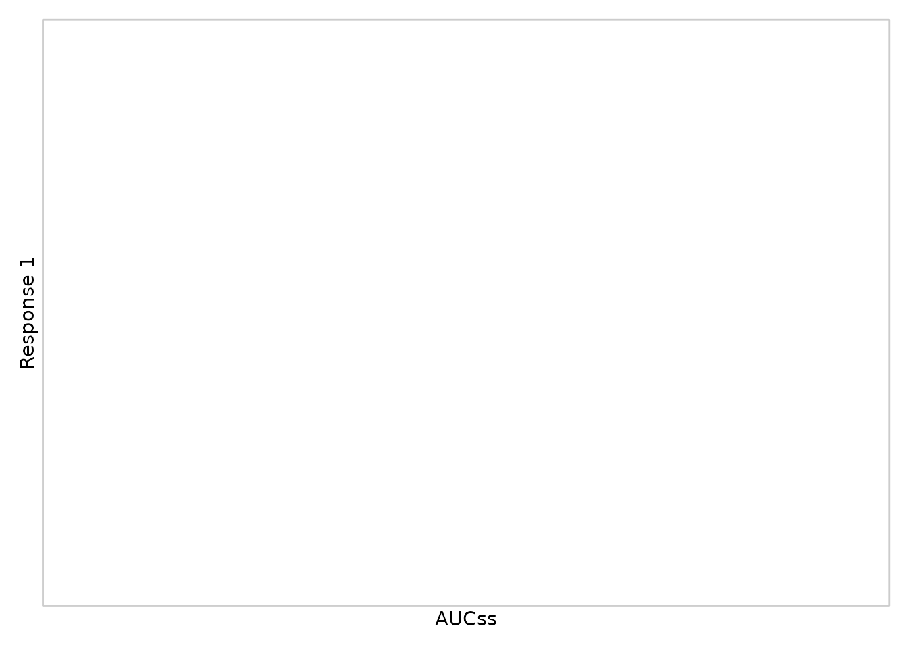
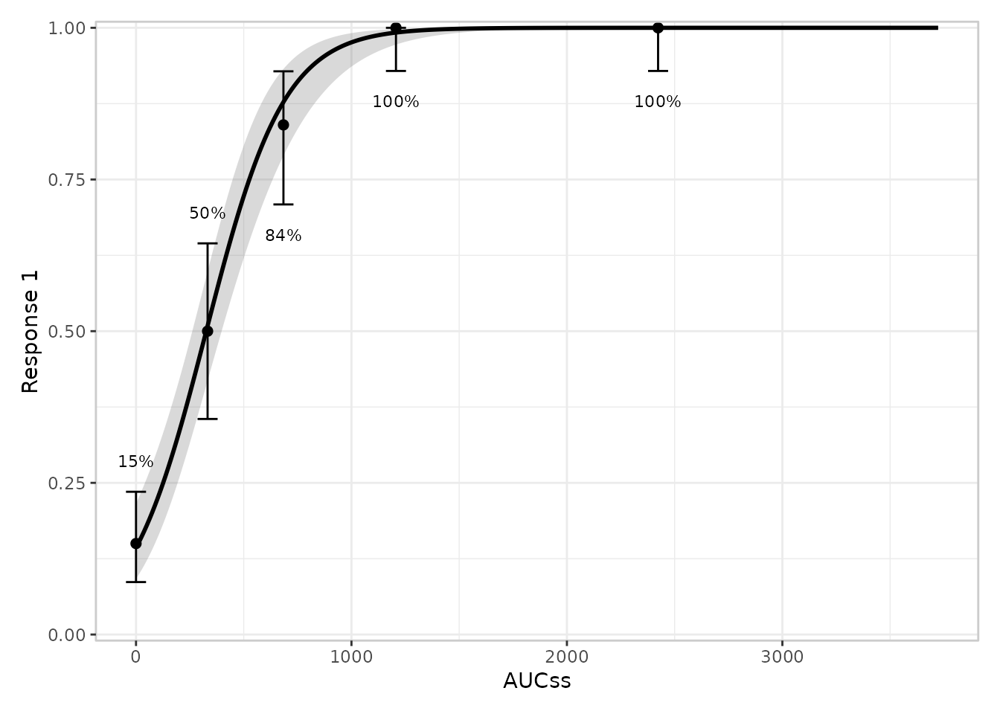
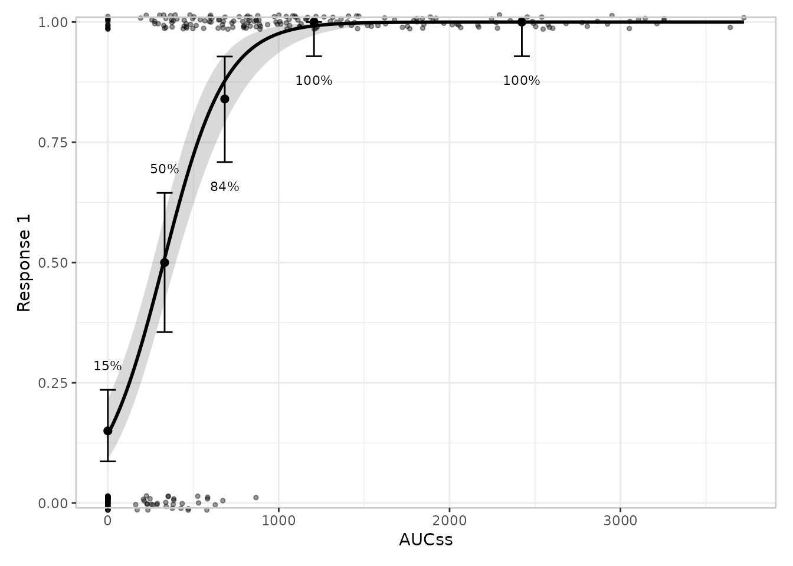
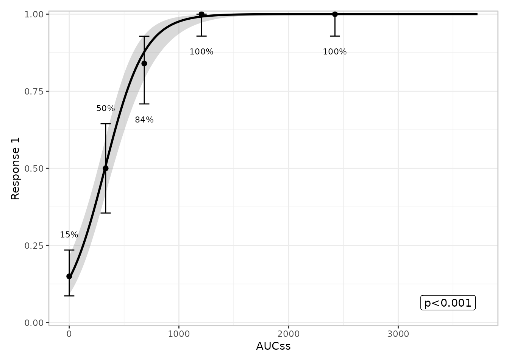
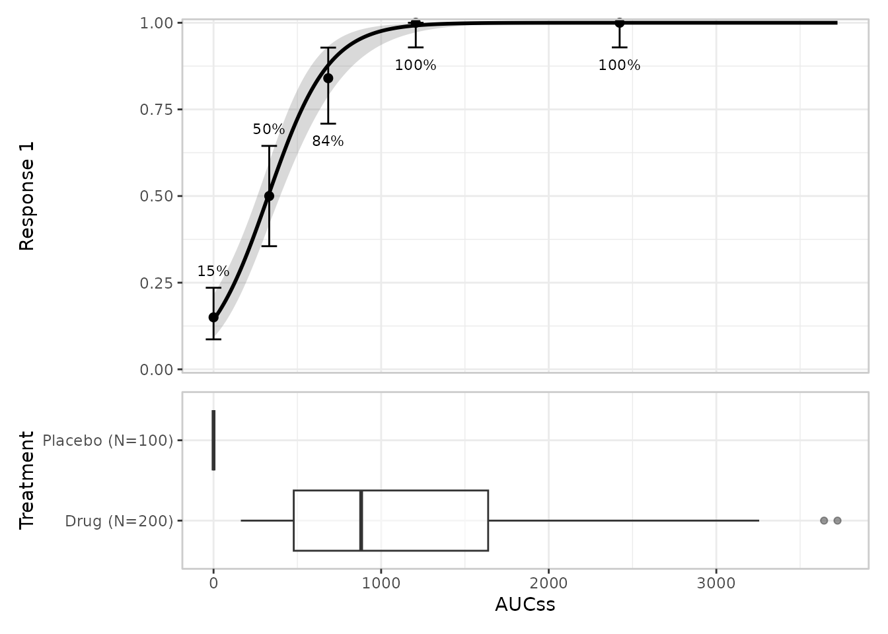
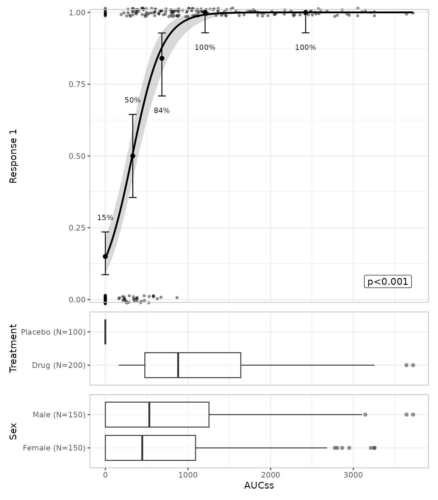
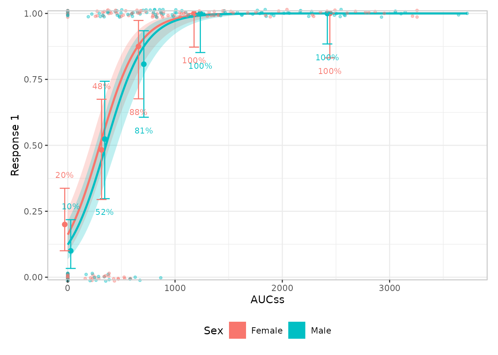
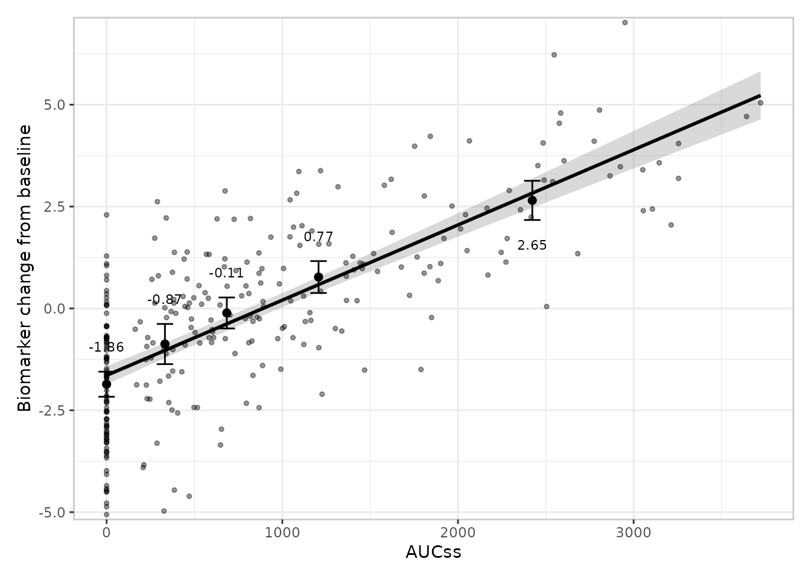
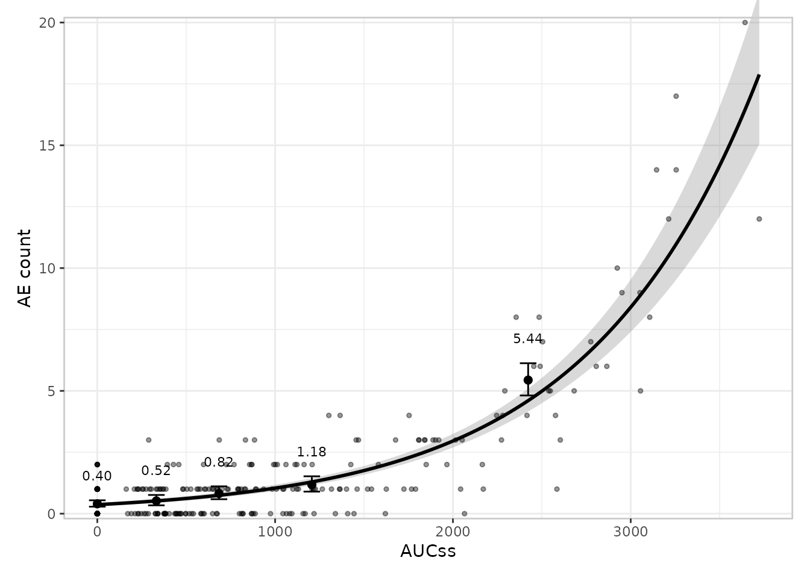
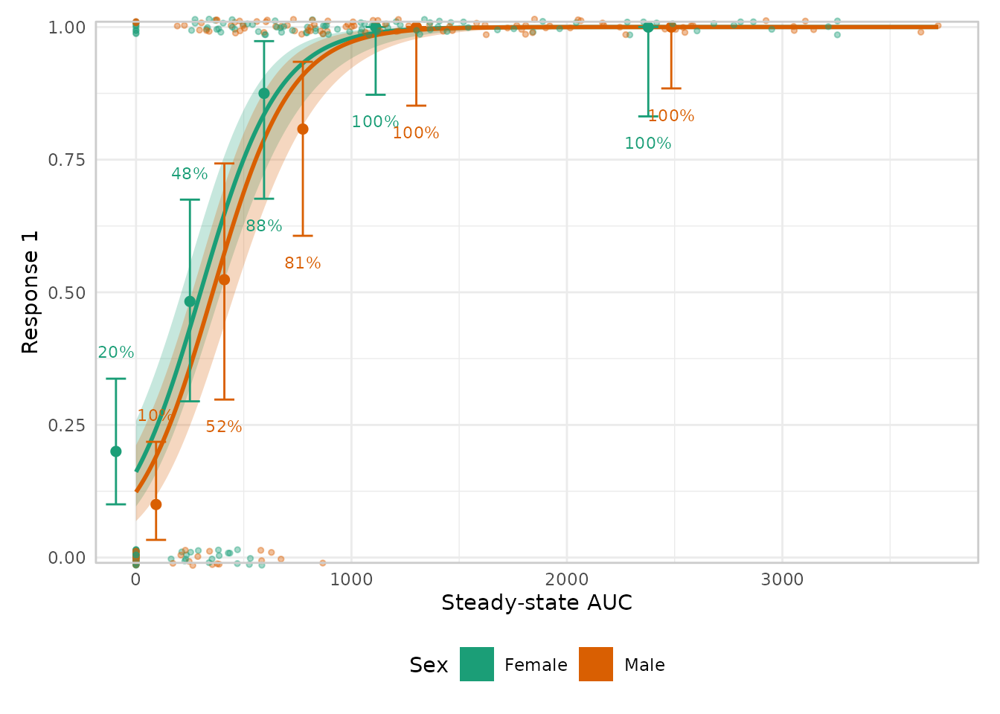

# Getting started with erplots

## What erplots is for

An exposure-response plot shows how a response variable relates to a
drug exposure variable (Cmax, AUC, and so on). The usual building blocks
are a fitted curve with an uncertainty band, some quantile-binned
summary points to check the curve against the raw data, the raw data
itself, and maybe some side panels showing how exposure is distributed
across other variables of interest. erplots gives you a small set of
functions for assembling exactly that, layer by layer, in a style that
should feel familiar if you’ve used ggplot2’s `+` to build up a plot.

The one thing erplots deliberately does *not* do is fit models. You fit
a model with whatever tool suits the job – logistic regression,
generalised linear models, non-linear least squares, or a package
purpose-built for exposure-response modelling – and then hand the fitted
object to erplots. As long as that object can produce predictions in the
way erplots expects (more on this at the end), the plotting code doesn’t
care what kind of model it is.

This vignette works through the pieces one at a time, using
[erglm](https://github.com/djnavarro/erglm), a companion package that
fits simple exposure-response models and provides an example dataset,
`erglm_data`. You don’t need erglm to *use* erplots on your own models,
but it’s a convenient way to get a fitted model for these examples.

``` r

library(erplots)
library(erglm)
```

`erglm_data` has an exposure column, `aucss`, and several response
columns of different kinds: `ae1`/`ae2` are binary (did an adverse event
occur?), `biomarker_change` is continuous, and `ae_count` is a count. It
also has some grouping/stratification columns, `sex` and `treatment`.
We’ll start with `ae1`.

(erplots also ships its own simulated example dataset, `erplots_data`,
with multiple exposure columns and one exposure/response pair suited to
each of the Emax, logistic, linear, and Poisson regression scenarios –
see
[`?erplots_data`](https://erplots.djnavarro.net/reference/erplots_data.md).)

``` r

mod <- erglm_model(ae1 ~ aucss, erglm_data, family = binomial())
```

## Building a plot, one layer at a time

### The empty canvas

Every erplots plot starts with
[`er_plot()`](https://erplots.djnavarro.net/reference/er_plot.md), which
tells erplots which column is the exposure and which is the response. On
its own it doesn’t draw anything – it’s just bookkeeping, the same way
`ggplot(df, aes(x, y))` doesn’t draw anything until you add a geom:

``` r

erglm_data |>
  er_plot(exposure = aucss, response = ae1)
#> <er_plot>
#>   plot variables:
#>     - exposure:        aucss
#>     - response:        ae1
#>     - stratification:  <none>
#>   plot layers: <none>
#>   plots built: <none>
#>   output built: no
```

In fact, this particular code doesn’t draw anything at all. One point of
difference between erplots and ggplot2 is that
[`print()`](https://rdrr.io/r/base/print.html) doesn’t render the plot:
all it does is print out a summary of your plot specification. If you
want to render the plot, you need to explicitly add
[`plot()`](https://rdrr.io/r/graphics/plot.default.html) to the end of
your pipeline:

``` r

erglm_data |>
  er_plot(exposure = aucss, response = ae1) |>
  plot()
```



As you can see, at this stage the output is little more than a blank
canvas.

### Adding the fitted curve

[`er_plot_add_model()`](https://erplots.djnavarro.net/reference/er_plot_add_model.md)
draws the model’s fitted curve, with a confidence ribbon around it. This
is where the fitted model you built earlier comes in:

``` r

erglm_data |>
  er_plot(exposure = aucss, response = ae1) |>
  er_plot_add_model(mod) |>
  plot()
```


### Adding a quantile-binned summary

Fitted curves are easier to trust when you can check them against a
simple, model-free summary of the raw data.
[`er_plot_add_quantiles()`](https://erplots.djnavarro.net/reference/er_plot_add_quantiles.md)
splits the exposure range into bins of roughly equal size and, within
each bin, plots the observed response rate (or mean, for a continuous or
count response) with a confidence interval:

``` r

erglm_data |>
  er_plot(exposure = aucss, response = ae1) |>
  er_plot_add_model(mod) |>
  er_plot_add_quantiles() |>
  plot()
```



You can change the number of bins with the `bins` argument, e.g.
`er_plot_add_quantiles(bins = 6)`.

### Adding the raw data

[`er_plot_add_data()`](https://erplots.djnavarro.net/reference/er_plot_add_data.md)
overlays the individual observations on top of the curve. For a binary
response the points are jittered vertically a little, since the
underlying values are exactly 0 or 1 and would otherwise draw as two
solid lines:

``` r

erglm_data |>
  er_plot(exposure = aucss, response = ae1) |>
  er_plot_add_model(mod) |>
  er_plot_add_quantiles() |>
  er_plot_add_data() |>
  plot()
```



### Adding a summary annotation

[`er_plot_add_summary()`](https://erplots.djnavarro.net/reference/er_plot_add_summary.md)
places a small text annotation in the corner of the plot that has the
least data in it. The default draws the model’s headline p-value, if it
has one:

``` r

erglm_data |>
  er_plot(exposure = aucss, response = ae1) |>
  er_plot_add_model(mod) |>
  er_plot_add_quantiles() |>
  er_plot_add_summary(model = mod) |>
  plot()
```



### Adding grouped exposure panels

The layers above all describe the response.
[`er_plot_add_groups()`](https://erplots.djnavarro.net/reference/er_plot_add_groups.md)
instead shows how *exposure itself* is distributed, split by one or more
other variables – useful for checking, say, whether exposure differs by
treatment arm. It adds a small boxplot panel below the main plot, and
unlike the other layers you can call it more than once to add several
panels side by side:

``` r

erglm_data |>
  er_plot(exposure = aucss, response = ae1) |>
  er_plot_add_model(mod) |>
  er_plot_add_quantiles() |>
  er_plot_add_groups(group_by = treatment) |>
  plot()
```



### Putting it all together

Every layer above is optional, and you can mix and match them in any
combination. A fairly complete plot might look like this:

``` r

erglm_data |>
  er_plot(exposure = aucss, response = ae1) |>
  er_plot_add_model(mod) |>
  er_plot_add_quantiles() |>
  er_plot_add_data() |>
  er_plot_add_summary(model = mod) |>
  er_plot_add_groups(group_by = c(treatment, sex)) |>
  plot()
```



## Comparing groups with colour

If you’d like to compare, say, two treatment arms on the same plot, pass
`stratify_by` to
[`er_plot()`](https://erplots.djnavarro.net/reference/er_plot.md). This
adds a colour (and, where relevant, fill) aesthetic to every layer, with
one shared legend. Because the curve now needs to differ between groups,
the model you pass in should include the stratification variable as a
predictor:

``` r

mod_strat <- erglm_model(ae1 ~ aucss + sex, erglm_data, family = binomial())

erglm_data |>
  er_plot(exposure = aucss, response = ae1, stratify_by = sex) |>
  er_plot_add_model(mod_strat) |>
  er_plot_add_quantiles() |>
  er_plot_add_data() |>
  plot()
```



## Continuous and count responses

Everything above works the same way for a continuous response (e.g. a
change from baseline in some biomarker) or a count response (e.g. the
number of adverse events a patient experienced). erplots figures out
which kind of response you have from the data, and adjusts the quantile
summary accordingly – a mean and interval instead of a rate:

``` r

mod_cont <- erglm_model(biomarker_change ~ aucss, erglm_data, family = gaussian())

erglm_data |>
  er_plot(exposure = aucss, response = biomarker_change) |>
  er_plot_add_model(mod_cont) |>
  er_plot_add_quantiles() |>
  er_plot_add_data() |>
  plot()
```



For a genuine count response, it’s worth telling erplots explicitly via
`response_type = "count"`, so that it uses an interval designed for
counts rather than treating it as an ordinary continuous measurement:

``` r

mod_count <- erglm_model(ae_count ~ aucss, erglm_data, family = poisson())

erglm_data |>
  er_plot(exposure = aucss, response = ae_count, response_type = "count") |>
  er_plot_add_model(mod_count) |>
  er_plot_add_quantiles() |>
  er_plot_add_data() |>
  plot()
```



## Theming

Everything above changes *what’s drawn*.
[`er_plot_theme()`](https://erplots.djnavarro.net/reference/er_plot_theme.md)
changes *how it looks*, without remapping any aesthetic: axis/legend
labels, a plot title, axis limits, the overall ggplot2 theme, a discrete
color/fill palette for stratification, and more.

``` r

erglm_data |>
  er_plot(exposure = aucss, response = ae1, stratify_by = sex) |>
  er_plot_add_model(mod_strat) |>
  er_plot_add_quantiles() |>
  er_plot_add_data() |>
  er_plot_theme(
    xlab = "Steady-state AUC",
    theme_base = ggplot2::theme_minimal(),
    color_discrete = ggplot2::scale_color_brewer(palette = "Dark2"),
    fill_discrete = ggplot2::scale_fill_brewer(palette = "Dark2")
  ) |>
  plot()
```



See [Theming erplots](https://erplots.djnavarro.net/articles/theming.md)
for every argument
[`er_plot_theme()`](https://erplots.djnavarro.net/reference/er_plot_theme.md)
supports.

## Where to next

This vignette only shows the default look for each layer. Every layer
also has one or more alternative styles you can switch to – spaghetti
plots instead of a ribbon, violin plots instead of boxplots, a
density-style overlay for the raw data when you have a lot of points,
and so on – and you can write your own if none of the built-in options
fit. From here:

- [Plotting binary
  responses](https://erplots.djnavarro.net/articles/plot-binary.md),
  [plotting continuous
  responses](https://erplots.djnavarro.net/articles/plot-continuous.md),
  and [plotting count
  responses](https://erplots.djnavarro.net/articles/plot-count.md) walk
  through every layer and every built-in style in detail, for each
  response type.
- [The plotting
  grammar](https://erplots.djnavarro.net/articles/design.md) explains
  the design rules behind the mini-language – which layers can appear
  more than once, how stratification interacts with each layer, and so
  on.
- [Theming erplots](https://erplots.djnavarro.net/articles/theming.md)
  covers every
  [`er_plot_theme()`](https://erplots.djnavarro.net/reference/er_plot_theme.md)
  argument in detail – labels, limits, the visual theme, the
  stratification palette, formatters, and panel heights.
- [Extending
  erplots](https://erplots.djnavarro.net/articles/extending.md) shows
  how to write your own layer style, and what erplots expects from a
  model object if you want to plug in one that isn’t erglm.
- [Model
  interface](https://erplots.djnavarro.net/articles/model-interface.md)
  describes the technicalities. It outlines what erplots needs from
  other packages in order to be able to use its models when drawing
  exposure-response plots.
