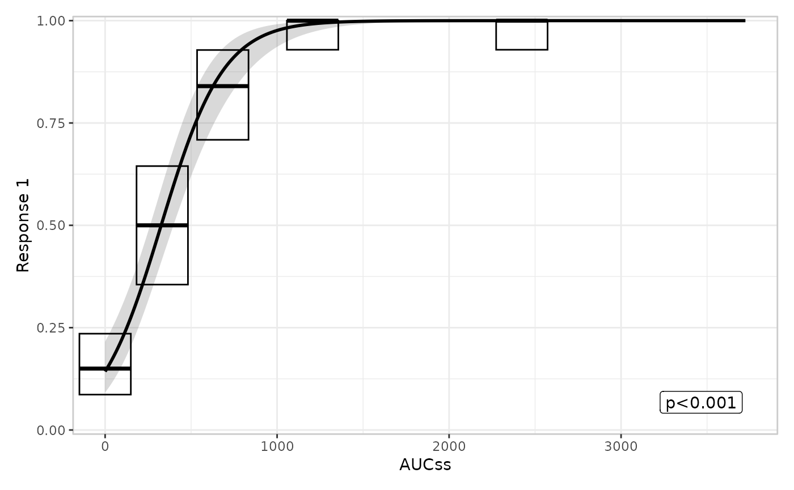
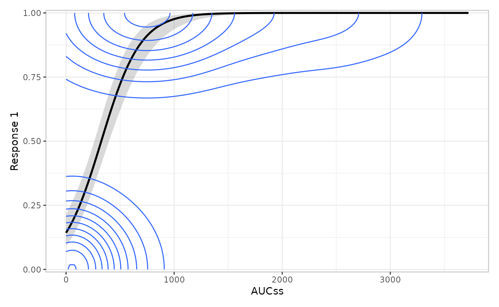
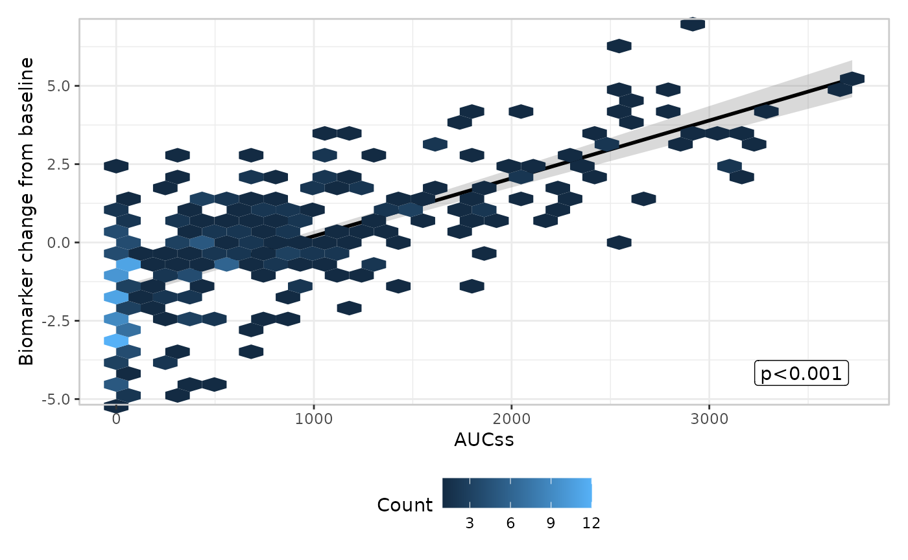
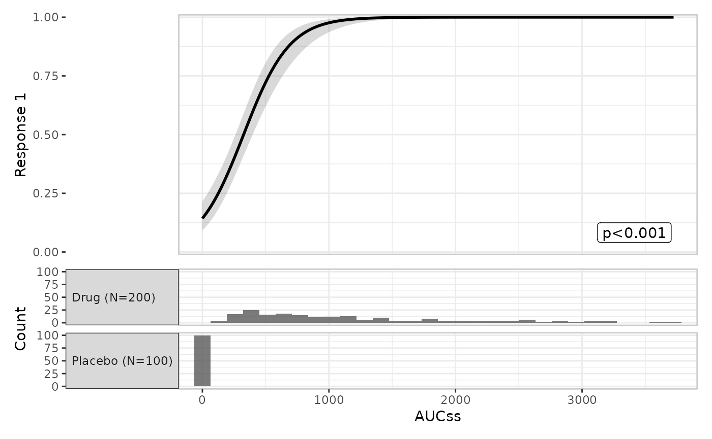

# Extending erplots: writing your own builder

This article is about writing a custom `er_builder_*()` function – the
mechanism by which any of erplots’ four layers can be drawn differently
from its built-in options, without forking the package. It assumes
you’re already familiar with the plotting grammar described in [the plot
grammar article](https://erplots.djnavarro.net/articles/design.md)
(layers, singleton/additive semantics, stratification); this article
goes into more depth on the one topic that article only introduces: the
`builder` escape hatch itself.

``` r

library(erplots)
library(erglm)
```

## The builder signature

Every layer function
([`er_plot_add_model()`](https://erplots.djnavarro.net/reference/er_plot_add_model.md),
[`er_plot_add_quantiles()`](https://erplots.djnavarro.net/reference/er_plot_add_quantiles.md),
[`er_plot_add_data()`](https://erplots.djnavarro.net/reference/er_plot_add_data.md),
[`er_plot_add_groups()`](https://erplots.djnavarro.net/reference/er_plot_add_groups.md))
delegates its actual drawing to a `builder` argument
([`er_plot_add_model()`](https://erplots.djnavarro.net/reference/er_plot_add_model.md)
additionally has `summary_builder`), which defaults to one built-in
`er_builder_*()` function and can be set to any other function –
built-in or custom – sharing this signature:

``` r
function(data, config, stratify, exposure, response, strata, style)
```

| Argument | What it is |
|----|----|
| `data` | The original data frame passed to [`er_plot()`](https://erplots.djnavarro.net/reference/er_plot.md), unmodified. |
| `config` | The pre-computed configuration for *this specific layer* – see below. |
| `stratify` | `TRUE`/`FALSE`: whether this layer should honour `stratify_by`. |
| `exposure`, `response`, `strata` | Plot-variable metadata lists (`name`, `label`, `limits`, …) describing the exposure, response, and stratification variables declared in [`er_plot()`](https://erplots.djnavarro.net/reference/er_plot.md). |
| `style` | Shared styling helpers: `style$theme_base()`, `style$draw_key`, `style$format_percent()`, `style$format_number()`. |

The function returns a geom, or a list of geoms/other objects that can
be added to a ggplot2 plot – nothing more. This signature is documented
as public API on
[`?er_builder`](https://erplots.djnavarro.net/reference/er_builder.md),
alongside each layer’s own `er_builder_*()` family page
([`?er_builder_model`](https://erplots.djnavarro.net/reference/er_builder_model.md),
[`?er_builder_quantile`](https://erplots.djnavarro.net/reference/er_builder_quantile.md),
etc.).

### `config` is the part that matters, and it’s already computed for you

`config` is where a custom builder actually gets its data from, and it
is **not** the raw `data` frame – it’s whatever the corresponding
internal `.part_*()` function derived from `data`/`exposure`/`response`/
`strata` before any builder ran. A custom builder’s whole job is to turn
that already-computed `config` into ggplot2 layers; it never needs to
re-bin, re-summarise, or re-fit anything itself. Concretely:

| Layer | `.part_*()` | Key `config` field | Contents |
|----|----|----|----|
| Model | `.part_model()` | `config$predictions` | One row per exposure grid point, with `fit_resp`, `ci_lower`, `ci_upper` (from [`er_predict()`](https://erplots.djnavarro.net/reference/er_model_interface.md)) |
| Quantile | `.part_quantile()` | `config$summary` | One row per exposure-quantile bin (× stratum), with `x_mid`, `y_mid`, `ci_lower`, `ci_upper`, plus label-placement columns. `config$breaks` also holds the `n + 1` quantile cutpoints themselves (from [`cut_exposure_quantile()`](https://erplots.djnavarro.net/reference/cut_quantile.md)), which [`er_builder_quantile_errorbar_vlines()`](https://erplots.djnavarro.net/reference/er_builder_quantile.md)/[`er_builder_quantile_pointrange_vlines()`](https://erplots.djnavarro.net/reference/er_builder_quantile.md) use to draw bin-boundary separators |
| Data | `.part_data()`/`.part_overlay()` | (none extra) | The builder mostly works from `data` directly, since this layer draws raw observations rather than a summary |
| Group | `.part_group()` | `config[[group_var]]$data`, `config[[group_var]]$counts` | The subset of `data` for that grouping variable, joined to per-group sample-size labels |

## Worked example: a custom quantile builder

Suppose the built-in
[`er_builder_quantile_errorbar()`](https://erplots.djnavarro.net/reference/er_builder_quantile.md)
(point + error bar) and
[`er_builder_quantile_pointrange()`](https://erplots.djnavarro.net/reference/er_builder_quantile.md)
alternatives (and their bin-boundary-annotated `_vlines` variants) all
feel like the wrong idiom, and you’d rather draw the per-bin summary as
a `geom_crossbar()`. First, look at what `config$summary` actually
contains, by building the quantile part on its own and inspecting it –
this is the step a custom builder’s author does once, by hand, before
writing the builder:

``` r

mod <- erglm_model(ae1 ~ aucss, erglm_data, family = binomial())

plt <- erglm_data |>
  er_plot(aucss, ae1) |>
  er_plot_add_quantiles(bins = 6)

plt$part$quantile$config$summary
#> # A tibble: 7 × 12
#>   exposure_bins strata    n1    n0 x_mid y_mid y_mid_lbl ci_lower ci_upper
#>   <fct>         <lgl>  <int> <int> <dbl> <dbl> <chr>        <dbl>    <dbl>
#> 1 Q3            NA        30     3  757. 0.909 91%         0.757     0.981
#> 2 Q6            NA        34     0 2693. 1     100%        0.897     1    
#> 3 Placebo       NA        15    85    0  0.15  15%         0.0865    0.235
#> 4 Q4            NA        33     0 1080. 1     100%        0.894     1    
#> 5 Q1            NA        16    18  287. 0.471 47%         0.298     0.649
#> 6 Q2            NA        21    12  488. 0.636 64%         0.451     0.796
#> 7 Q5            NA        33     0 1645. 1     100%        0.894     1    
#> # ℹ 3 more variables: y_lwr_lbl <dbl>, y_upr_lbl <dbl>, y_lbl <dbl>
```

`x_mid`/`y_mid` are the bin’s mean exposure and response rate;
`ci_lower`/`ci_upper` are the Clopper-Pearson interval bounds a builder
would map to `ymin`/`ymax`. (The other columns –
`y_mid_lbl`/`y_lwr_lbl`/`y_upr_lbl`/`y_lbl` – support the built-in label
geom that
[`er_builder_quantile_errorbar()`](https://erplots.djnavarro.net/reference/er_builder_quantile.md)
draws alongside its error bar; a builder that skips labels, like the one
below, can ignore them.) With that in hand, the builder itself is a
small function that maps those columns onto `geom_crossbar()`’s
aesthetics:

``` r

er_builder_quantile_crossbar <- function(data, config, stratify, exposure, response, strata, style) {
  ggplot2::geom_crossbar(
    data = config$summary,
    mapping = ggplot2::aes(x = x_mid, y = y_mid, ymin = ci_lower, ymax = ci_upper),
    inherit.aes = FALSE
  )
}

erglm_data |>
  er_plot(aucss, ae1) |>
  er_plot_add_model(mod) |>
  er_plot_add_quantiles(builder = er_builder_quantile_crossbar) |>
  plot()
```



A few things worth noting about this builder, all generalisable to any
layer:

- It ignores `data`, `stratify`, `exposure`, `response`, `strata`, and
  `style` entirely – a builder only needs to use the arguments relevant
  to what it draws. (A stratified version would need to map
  `color = strata` and use `config$summary`’s `strata` column, plus
  `style$draw_key` for a legend key consistent with the other layers –
  see
  [`er_builder_quantile_errorbar()`](https://erplots.djnavarro.net/reference/er_builder_quantile.md)’s
  source for a worked stratified example.)
- `inherit.aes = FALSE` is there because this geom supplies its own
  `data`/`mapping`, distinct from whatever’s already on the base plot
  (the model curve, in this example) – omitting it would try to inherit
  the base plot’s aesthetics and fail, since those don’t include
  `ymin`/`ymax`.
- No new `config` fields were needed.
  [`er_builder_quantile_pointrange()`](https://erplots.djnavarro.net/reference/er_builder_quantile.md)
  (a single `geom_pointrange()` in place of the errorbar+point pair)
  started life as exactly this kind of custom builder, and was promoted
  to a built-in option once it proved to fit the existing `config` shape
  – a reasonable bar to check your own custom builders against if you’re
  considering proposing one upstream.

## Builder metadata: tagging a builder with `er_builder_tag()`

The quantile builder above needed nothing beyond the function itself.
Some builders, though, make a structural or aesthetic choice that the
*composition* machinery (the code that assembles/labels/legends the
finished plot in `R/er-plot-compose.R`) needs to know about *before* it
calls the builder. Since a builder is “just a function”, that
information can’t live in its return value – composition needs it in
advance, to decide things like which panel to route the builder’s output
into, or how to title a legend. erplots solves this by letting a builder
carry metadata as **attributes on the function itself**, set by a single
wrapper function,
[`er_builder_tag()`](https://erplots.djnavarro.net/reference/er_builder_tag.md),
with one optional argument per piece of metadata (`layout`, `fill_role`,
`y_role`). It wraps a builder and returns it back, attributes attached,
so it composes naturally with assignment, and a builder that needs more
than one tag only needs one call:

``` r

my_builder <- er_builder_tag(my_builder, layout = "overlay")
```

### `layout`: which structural family a data-layer builder belongs to

The data layer
([`er_plot_add_data()`](https://erplots.djnavarro.net/reference/er_plot_add_data.md))
is the one layer with two mutually exclusive structural families a
builder can be slotted into:

- `"overlay"`: a single call merged directly onto the main model panel,
  at the observations’ true `(exposure, response)` coordinates (what
  [`er_builder_data_overlay()`](https://erplots.djnavarro.net/reference/er_builder_data.md),
  the default, does).
- `"panel"`: one or more panels stacked *below* the base plot, the way
  [`er_plot_add_groups()`](https://erplots.djnavarro.net/reference/er_plot_add_groups.md)’s
  panels are (what
  [`er_builder_data_boxjitter()`](https://erplots.djnavarro.net/reference/er_builder_data.md),
  the older binary-only boxplot+jitter design, does).

[`er_plot_add_data()`](https://erplots.djnavarro.net/reference/er_plot_add_data.md)
has to decide which of two different `config` shapes to build
(`.part_overlay()` vs. `.part_data()`) *before* it can call the builder
– so the layout can’t be inferred from what the builder returns; it has
to be knowable from the builder alone.
`er_builder_tag(builder, layout = ...)` attaches that information as an
attribute, and is the one tag that’s mandatory for a data-layer builder:

``` r

attr(er_builder_data_overlay, "er_builder_layout")
#> [1] "overlay"
attr(er_builder_data_boxjitter, "er_builder_layout")
#> [1] "panel"
```

A custom data-layer builder that omits this tag fails fast, with a
message telling you what to do, rather than silently landing in the
wrong structural slot:

``` r

untagged_builder <- function(data, config, stratify, exposure, response, strata, style) {
  ggplot2::geom_point(ggplot2::aes(x = .data[[exposure$name]], y = .data[[response$name]]))
}

erglm_data |>
  er_plot(aucss, ae1) |>
  er_plot_add_data(builder = untagged_builder) |>
  plot()
#> Error in `.builder_layout()`:
#> ! `builder` must declare its structural layout.
#> ℹ Wrap a custom data-layer builder with `er_builder_tag(builder, layout = "overlay")` or `er_builder_tag(builder, layout = "panel")`.
#> ℹ The built-in builders (`er_builder_data_overlay()`, `er_builder_data_boxjitter()`) already do this.
```

Tagging it with
[`er_builder_tag()`](https://erplots.djnavarro.net/reference/er_builder_tag.md)
fixes that. Here’s a complete custom `"overlay"`-layout data builder – a
2D density contour in place of raw points, useful when there are enough
observations that a scatter overplots into an unreadable smear:

``` r

er_builder_data_density <- er_builder_tag(
  function(data, config, stratify, exposure, response, strata, style) {
    ggplot2::geom_density2d(
      data = data,
      mapping = ggplot2::aes(x = .data[[exposure$name]], y = .data[[response$name]]),
      inherit.aes = FALSE
    )
  },
  layout = "overlay"
)

erglm_data |>
  er_plot(aucss, ae1) |>
  er_plot_add_model(mod) |>
  er_plot_add_data(builder = er_builder_data_density) |>
  plot()
```



### `fill_role`: what a builder’s `fill` aesthetic means

On the base plot, `fill` almost always means strata (e.g. a stratified
model ribbon).
[`er_builder_data_hex()`](https://erplots.djnavarro.net/reference/er_builder_data.md)
– a built-in `"overlay"`-layout data builder for when N is too large for
a legible scatter – is the one exception: its `fill` encodes 2D bin
density (a continuous scale), not strata, so `.polish_labels()` needs to
know to title that legend “Count” rather than the stratification
variable’s label. `er_builder_tag(builder, fill_role = "density")`
records exactly that:

``` r

attr(er_builder_data_hex, "er_builder_fill_role")
#> [1] "density"

erglm_data |>
  er_plot(aucss, biomarker_change) |>
  er_plot_add_model(erglm_model(biomarker_change ~ aucss, erglm_data, family = gaussian())) |>
  er_plot_add_data(builder = er_builder_data_hex) |>
  plot()
```



Note the legend is titled “Count”, not the (nonexistent, here) strata
label – that’s `.polish_labels()` consulting the `"density"` tag. Unlike
`layout`, `fill_role` is optional: a builder that doesn’t set it is
assumed to mean strata whenever it maps `fill` at all, which is the
right default for every other builder.

### `y_role`: what a builder’s y-axis means

[`er_plot_add_groups()`](https://erplots.djnavarro.net/reference/er_plot_add_groups.md)’s
default builders
([`er_builder_group_boxplot()`](https://erplots.djnavarro.net/reference/er_builder_group.md),
[`er_builder_group_violin()`](https://erplots.djnavarro.net/reference/er_builder_group.md))
put the *group variable itself* on the y-axis – one categorical row per
level – so the group variable’s own label is the right axis title.
[`er_builder_group_histogram()`](https://erplots.djnavarro.net/reference/er_builder_group.md)
instead needs its y-axis free for counts, moving group levels onto facet
strips instead; `er_builder_tag(builder, y_role = "count")` tells
`.polish_labels()` to title the y-axis “Count” rather than the group
variable’s label:

``` r

attr(er_builder_group_histogram, "er_builder_y_role")
#> [1] "count"

erglm_data |>
  er_plot(aucss, ae1) |>
  er_plot_add_model(mod) |>
  er_plot_add_groups(group_by = treatment, builder = er_builder_group_histogram) |>
  plot()
```



Like `fill_role`, this tag is optional – a group builder that doesn’t
set it keeps the old behaviour (group variable’s label on the y-axis),
which is correct for
[`er_builder_group_boxplot()`](https://erplots.djnavarro.net/reference/er_builder_group.md)/
[`er_builder_group_violin()`](https://erplots.djnavarro.net/reference/er_builder_group.md).

### `layer`: which `er_plot_add_*()` a builder is meant for

`layout`, `fill_role`, and `y_role` all feed the *composition* machinery
– deciding where a builder’s output goes, or how to title a legend/axis
once it’s drawn. `layer` is different: it’s read by the
`er_plot_add_*()` functions themselves, *before* they call the builder
at all, purely to catch a builder plugged into the wrong slot. Every
built-in builder declares it –
[`er_builder_quantile_errorbar()`](https://erplots.djnavarro.net/reference/er_builder_quantile.md)
is tagged `layer = "quantile"`,
[`er_builder_group_violin()`](https://erplots.djnavarro.net/reference/er_builder_group.md)
is tagged `layer = "group"`, and so on for all five layers (`"model"`,
`"summary"`, `"quantile"`, `"data"`, `"group"` – `"summary"` covers
\[er_plot_add_model()\]’s `summary_builder` argument specifically, since
it’s a different slot from `builder` on that same layer function).
Passing a builder tagged for one layer into a different layer’s
`er_plot_add_*()` call errors immediately, naming both the layer the
builder was tagged for and the layer it was actually passed to:

``` r

erglm_data |>
  er_plot(aucss, ae1) |>
  er_plot_add_model(mod) |>
  er_plot_add_data(builder = er_builder_quantile_errorbar)
#> Error in `.check_builder_layer()`:
#> ! `builder` is tagged for the "quantile" layer, but was passed to a "data" layer function.
#> ℹ Use a builder tagged `er_builder_tag(fn, layer = "data")` (or with no `layer` tag at all).
```

``` r

attr(er_builder_quantile_errorbar, "er_builder_layer")
#> [1] "quantile"
```

Unlike `layout`, `layer` is entirely optional – a custom builder that
omits it is simply never checked, regardless of which `er_plot_add_*()`
it’s passed to (this is also true of a builder tagged for one layer’s
`summary_builder`-style secondary argument if that layer doesn’t have
one; there’s currently only `"summary"`, specific to
\[er_plot_add_model()\]). This means existing custom builders written
before `layer` existed keep working unchanged; tagging one is purely a
way to get an earlier, more specific error if it’s ever passed to the
wrong place by mistake.

### One function, four independent arguments

`layout`, `fill_role`, `y_role`, and `layer` are all set via the same
[`er_builder_tag()`](https://erplots.djnavarro.net/reference/er_builder_tag.md)
call rather than four separate wrapper functions. Each argument is
independent and optional (aside from `layout` being mandatory for a
data-layer builder specifically – see above), so a builder that needs to
declare more than one piece of metadata – say, a custom “overlay”-layout
data builder whose `fill` also means something other than strata – can
do it in one call:

``` r

my_density_builder <- er_builder_tag(
  my_density_builder,
  layout = "overlay",
  fill_role = "density",
  layer = "data"
)
```

This is close to what the built-in
[`er_builder_data_hex()`](https://erplots.djnavarro.net/reference/er_builder_data.md)
does (it sets `layout`, `fill_role`, and `layer` together).

## Summary

| Argument | Applies to | Required? | What it controls |
|----|----|----|----|
| `layout` | Data-layer builders only | Yes – errors if missing | `"overlay"` (merged onto the main panel) vs. `"panel"` (stacked panels below) |
| `fill_role` | Any builder mapping `fill` | No – defaults to strata | Legend title for a non-strata `fill` aesthetic (e.g. `"density"`) |
| `y_role` | Group-layer builders only | No – defaults to the group variable’s label | y-axis title when the y-axis isn’t the group variable itself (e.g. `"count"`) |
| `layer` | Any builder | No – unchecked if unset | Which `er_plot_add_*()` (or `summary_builder`) the builder is meant for; mismatches error immediately |

None of this machinery is needed for a builder that draws a familiar
idiom in a familiar slot – the crossbar example above needed no tags at
all. It exists for the less common case where a builder changes *where*
its output goes, or *what* one of its aesthetics represents, and the
rest of the plot needs to be told so it can label things correctly. See
[`?er_builder`](https://erplots.djnavarro.net/reference/er_builder.md)
for the full public-API contract, and [the plot grammar
article](https://erplots.djnavarro.net/articles/design.md) for how these
layers fit together more broadly.
