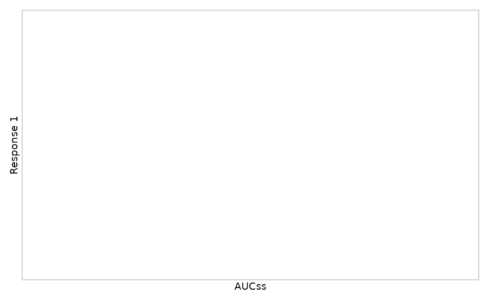
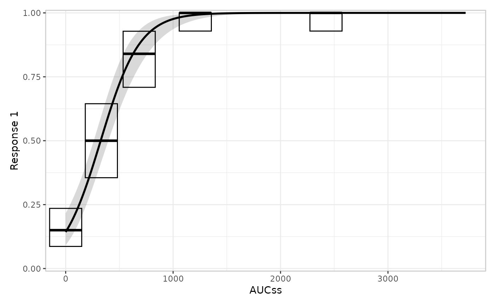
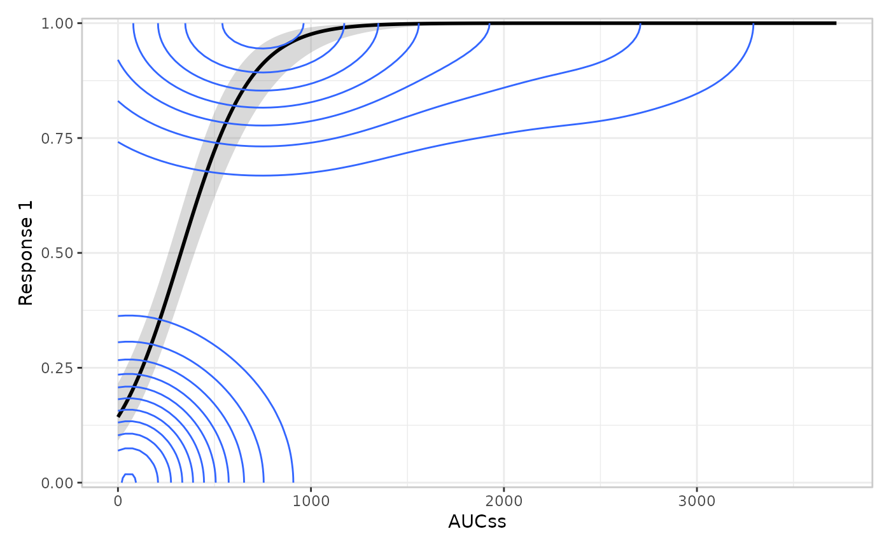
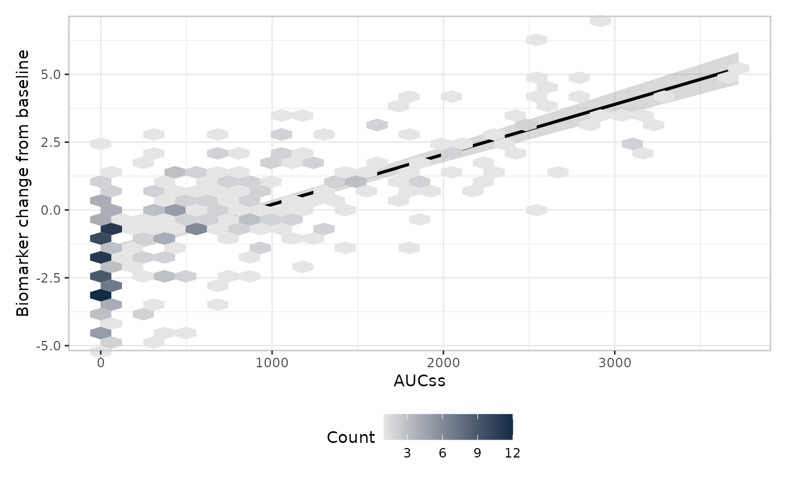
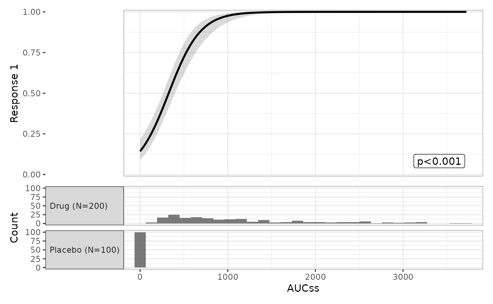
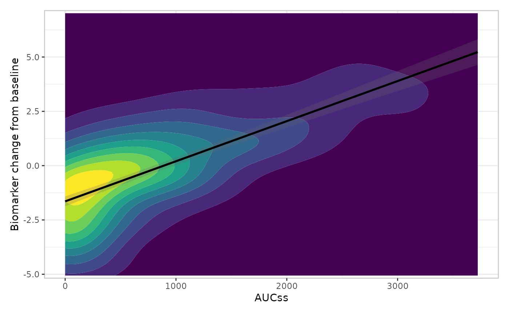
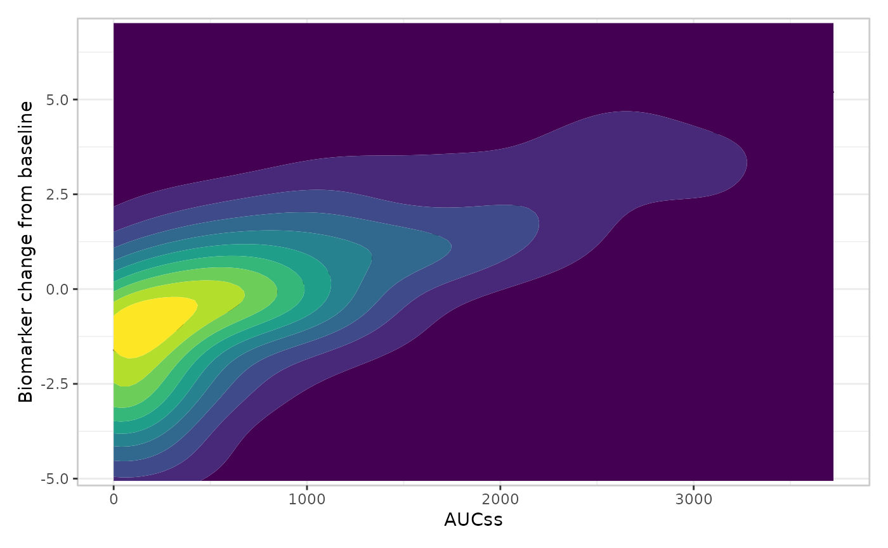

# Extending erplots

The goal when writing the erplots package was to provide a flexible
mini-language for exposure-response plots that pharmacometricians could
use to create most such plots without needing to write hundreds of lines
of ggplot2 code. One problem with doing so, however, is that it is
almost impossible to anticipate *every* possible use case for the
package. Inevitably, there will be some cases where the specific plot
that you need can’t be constructed using the functions that are supplied
by erplots. This could then become frustrating for the user, if they
already have code that generates most of what they need using erplots,
but can’t quite get exactly what they need because there’s one esoteric
special case that the package can’t handle.

To mitigate this risk, erplots comes with an extension mechanism: you
can write your own “builder” function that will generate the one part of
the exposure-response plot that you need to modify, and then erplots
will handle the rest.

This article discusses that extension mechanism, by showing you how to
write a “builder” function. It assumes you’re already familiar with the
erplots mini-language described in [the plot grammar
article](https://erplots.djnavarro.net/articles/design.md) (layers,
singleton/additive semantics, stratification); and have a good sense of
the overall process of building plots with the package.

``` r

library(erplots)
library(erglm)
```

## What is a builder function?

When creating an exposure-response plot with erplots, you first call
[`er_plot()`](https://erplots.djnavarro.net/reference/er_plot.md) to
create the basic data structure, and then add a series of layers using
the five layer functions
([`er_plot_add_model()`](https://erplots.djnavarro.net/reference/er_plot_add_model.md),
[`er_plot_add_summary()`](https://erplots.djnavarro.net/reference/er_plot_add_summary.md),
[`er_plot_add_quantiles()`](https://erplots.djnavarro.net/reference/er_plot_add_quantiles.md),
[`er_plot_add_data()`](https://erplots.djnavarro.net/reference/er_plot_add_data.md),
[`er_plot_add_groups()`](https://erplots.djnavarro.net/reference/er_plot_add_groups.md))
to add the features you want to see in your plot. The key thing to note
is that these layer functions don’t create the ggplot2 code themselves.
Instead, they delegate that work to some other function that you specify
via the `style` argument. That function is referred to as the “builder”
for that layer. The erplots package comes with several different
builders for each layer:

| Layer | Builders |
|----|----|
| Model | [`er_style_model_ribbonline()`](https://erplots.djnavarro.net/reference/er_style_model.md) (default), [`er_style_model_line()`](https://erplots.djnavarro.net/reference/er_style_model.md), [`er_style_model_spaghetti()`](https://erplots.djnavarro.net/reference/er_style_model.md) |
| Data | [`er_style_data_overlay()`](https://erplots.djnavarro.net/reference/er_style_data.md) (default), [`er_style_data_boxjitter()`](https://erplots.djnavarro.net/reference/er_style_data.md), [`er_style_data_hex()`](https://erplots.djnavarro.net/reference/er_style_data.md) |
| Quantile | [`er_style_quantile_errorbar()`](https://erplots.djnavarro.net/reference/er_style_quantile.md) (default), [`er_style_quantile_errorbar_vlines()`](https://erplots.djnavarro.net/reference/er_style_quantile.md), [`er_style_quantile_pointrange()`](https://erplots.djnavarro.net/reference/er_style_quantile.md), [`er_style_quantile_pointrange_vlines()`](https://erplots.djnavarro.net/reference/er_style_quantile.md) |
| Summary | [`er_style_summary_pvalue()`](https://erplots.djnavarro.net/reference/er_style_summary.md) (default), [`er_style_summary_n()`](https://erplots.djnavarro.net/reference/er_style_summary.md), [`er_style_summary_coefficients()`](https://erplots.djnavarro.net/reference/er_style_summary.md), [`er_style_summary_gof()`](https://erplots.djnavarro.net/reference/er_style_summary.md) |
| Groups | [`er_style_group_boxplot()`](https://erplots.djnavarro.net/reference/er_style_group.md) (default), [`er_style_group_histogram()`](https://erplots.djnavarro.net/reference/er_style_group.md), [`er_style_group_violin()`](https://erplots.djnavarro.net/reference/er_style_group.md) |

These builders cover a wide variety of different stylistic features you
might want to employ in your exposure-response plots, but if the feature
you want is not available, you can write your own. As long as your
builder function has the expected structure, erplots will understand
what it does and use it when constructing a plot.

## The builder signature

The main constraint that you need to satisfy when writing a builder
function is to make sure that it takes the expected arguments, and uses
those arguments in a manner that is consistent with what the erplots
grammar expects. Specifically, every builder function must have this
signature”

``` r
function(data, config, stratify, exposure, response, strata, theme, ...)
```

When writing the function itself, you should be aware of what erplots
will pass into your function within each of these slots:

| Argument | What it is |
|----|----|
| `data` | The original data frame passed to [`er_plot()`](https://erplots.djnavarro.net/reference/er_plot.md), unmodified. |
| `config` | The pre-computed configuration for this specific layer. This is different for each layer, and is discussed in more detail below. |
| `stratify` | `TRUE`/`FALSE`: whether this layer should honour `stratify_by`. |
| `exposure`, `response`, `strata` | Plot-variable metadata lists (`name`, `label`, `limits`, …) describing the exposure, response, and stratification variables declared in [`er_plot()`](https://erplots.djnavarro.net/reference/er_plot.md). |
| `theme` | Shared theming state, adjustable via [`er_plot_theme()`](https://erplots.djnavarro.net/reference/er_plot_theme.md): `theme$theme_base`, `theme$draw_key`, `theme$format_percent()`, `theme$format_number()`. |
| `...` | Extra named arguments forwarded from the corresponding `er_plot_add_*()` call’s own `...`. See “Passing extra arguments to a builder” below. |

## The builder return value

The function returns a geom, or a list of geoms/other objects that can
be added to a ggplot2 plot – nothing more.

## Passing extra arguments

Every `er_plot_add_*()` function also takes its own `...`, forwarded
unchanged to `style` when it’s called at build time. Extra arguments
must be named – they’re appended positionally after the seven standard
arguments, so an unnamed one would silently bind to the wrong parameter.
A builder that doesn’t need any extra arguments simply declares `...`
and ignores it, as every builder in this article does; see
[`?er_style`](https://erplots.djnavarro.net/reference/er_style.md)’s own
“Passing extra arguments to a builder” section (and
[`er_style_model_spaghetti()`](https://erplots.djnavarro.net/reference/er_style_model.md)’s
use of a `seed` passed this way) for a worked example.

This `...` is for the *builder* only. It’s a different mechanism from
[`er_plot_add_model()`](https://erplots.djnavarro.net/reference/er_plot_add_model.md)’s
`predict_args`,
[`er_plot_add_summary()`](https://erplots.djnavarro.net/reference/er_plot_add_summary.md)’s
`summary_args`, and
[`er_vpc_add_simulated()`](https://erplots.djnavarro.net/reference/er_vpc_add_simulated.md)’s
`simulate_args` – those are spliced into the model-interface generics
themselves
([`er_predict()`](https://erplots.djnavarro.net/reference/er_model_interface.md)/[`er_summary()`](https://erplots.djnavarro.net/reference/er_model_interface.md)/[`er_simulate()`](https://erplots.djnavarro.net/reference/er_model_interface.md)),
for a model-specific argument with no slot in their fixed contract
(e.g. a landmark time for a time-to-event model). If you’re writing a
custom builder, you’ll never see
`predict_args`/`summary_args`/`simulate_args` – they never reach
`config` or the builder’s own `...`. If you’re implementing the model
interface for your own model class instead, see [Implementing the model
interface](https://erplots.djnavarro.net/articles/model-interface.md),
which covers that mechanism.

## Understanding the `config` argument

`config` is where a custom builder actually gets its data from, and it
is **not** the raw `data` frame – it’s whatever erplots derived from
`data`/`exposure`/`response`/`strata` before any builder ran. A custom
builder’s whole job is to turn that already-computed `config` into
ggplot2 layers; it never needs to re-bin, re-summarise, or re-fit
anything itself. Concretely:

| Layer | Key `config` field | Contents |
|----|----|----|
| Model | `config$predictions` | One row per exposure grid point, with `fit_resp`, `ci_lower`, `ci_upper` (from [`er_predict()`](https://erplots.djnavarro.net/reference/er_model_interface.md)) |
| Summary | `config$summary`, `config$p_value`, `config$corner_distance` | `config$summary` is the full, raw return value of [`er_summary()`](https://erplots.djnavarro.net/reference/er_model_interface.md) (`NULL` unless a `model` was supplied) – see [Implementing the model interface](https://erplots.djnavarro.net/articles/model-interface.md) for its `p_value`/`coefficients`/`glance` contract; `config$p_value` is that same list’s `p_value` field, extracted separately since [`er_style_summary_pvalue()`](https://erplots.djnavarro.net/reference/er_style_summary.md) reads it directly; `corner_distance` is a named vector of four minimum distances (`top_left`/`top_right`/`bottom_left`/`bottom_right`), computed from `data`’s raw `(exposure, response)` points rescaled onto `[0, 1]`, used to place a label away from the observed data |
| Quantile | `config$summary` | One row per exposure-quantile bin (× stratum), with `x_mid`, `y_mid`, `ci_lower`, `ci_upper`, plus label-placement columns. `config$breaks` also holds the `n + 1` quantile cutpoints themselves (from [`cut_exposure_quantile()`](https://erplots.djnavarro.net/reference/cut_quantile.md)), which [`er_style_quantile_errorbar_vlines()`](https://erplots.djnavarro.net/reference/er_style_quantile.md)/[`er_style_quantile_pointrange_vlines()`](https://erplots.djnavarro.net/reference/er_style_quantile.md) use to draw bin-boundary separators |
| Data | (none extra) | The builder mostly works from `data` directly, since this layer draws raw observations rather than a summary |
| Group | `config[[group_var]]$data`, `config[[group_var]]$counts` | The subset of `data` for that grouping variable, joined to per-group sample-size labels |

## A worked example

The story above is not entirely complete, but it covers enough that we
can work through an example. Let’s suppose the built-in
[`er_style_quantile_errorbar()`](https://erplots.djnavarro.net/reference/er_style_quantile.md)
and
[`er_style_quantile_pointrange()`](https://erplots.djnavarro.net/reference/er_style_quantile.md)
alternatives all feel like the wrong way to display the data summaries
by exposure quantile. Instead, you would prefer to draw these binwise
summaries using a `geom_crossbar()`. Personally I think that’s a bad way
to do it, but you may have a good reason for wanting this that I haven’t
considered. So you decide to write your own builder function for this.
And since the quantile layer is mostly dependent on the `config$summary`
field, that’s the place to start. When doing so, it helps to look at
what `config$summary` actually contains, and the most reliable way to do
that is to ask erplots to show you: write a tiny “spy” builder that just
prints `config` and draws nothing, and pass it in as the `style` for the
layer you want to inspect:

``` r

mod <- erglm_model(ae1 ~ aucss, erglm_data, family = binomial())

inspect_config <- function(data, config, stratify, exposure, response, strata, theme, ...) {
  print(config$summary)
  list()
}

erglm_data |>
  er_plot(aucss, ae1) |>
  er_plot_add_quantiles(bins = 6, style = inspect_config) |>
  plot()
#> # A tibble: 7 × 12
#>   exposure_bins strata    n1    n0 x_mid y_mid y_mid_lbl ci_lower ci_upper
#>   <fct>         <lgl>  <int> <int> <dbl> <dbl> <chr>        <dbl>    <dbl>
#> 1 Q3            NA        30     3  757. 0.909 91%         0.757     0.981
#> 2 Q6            NA        34     0 2693. 1     100%        0.897     1    
#> 3 Placebo       NA        15    85    0  0.15  15%         0.0865    0.235
#> 4 Q4            NA        33     0 1080. 1     100%        0.894     1    
#> 5 Q1            NA        16    18  287. 0.471 47%         0.298     0.649
#> 6 Q2            NA        21    12  488. 0.636 64%         0.451     0.796
#> 7 Q5            NA        33     0 1645. 1     100%        0.894     1    
#> # ℹ 3 more variables: y_lwr_lbl <dbl>, y_upr_lbl <dbl>, y_lbl <dbl>
```



Looking at this object we see that it is a tibble with one row per
exposure quantile (as always, noting that the placebo group will be its
own distinct group). Each column contains a summary statistic or
indicator variable that you might want to use in your builder function:

- `x_mid` and `y_mid` capture mean exposure and mean response associated
  with the exposure bin. Our new builder will need to use these.
- `ci_lower` and `ci_upper` are the confidence interval bounds. Our
  bulder will need these too.
- `y_mid_lbl`, `y_lwr_lbl`, `y_upr_lbl`, and `y_lbl` support the
  built-in label geom that
  [`er_style_quantile_errorbar()`](https://erplots.djnavarro.net/reference/er_style_quantile.md)
  draws alongside its error bar. If we we wanted to use labels in our
  plot we would need these columns, but since we plan to skip that we
  can ignore them.

Now that we understand what `config$summary` already provides, writing
the builder itself is very straightforward. All we need is a small
function that maps those columns onto `geom_crossbar()`’s aesthetics:

``` r

er_style_quantile_crossbar <- function(data, 
                                       config, 
                                       stratify, 
                                       exposure, 
                                       response, 
                                       strata, 
                                       theme, 
                                       ...) {
  ggplot2::geom_crossbar(
    data = config$summary,
    mapping = ggplot2::aes(
      x = x_mid, 
      y = y_mid, 
      ymin = ci_lower, 
      ymax = ci_upper
    ),
    inherit.aes = FALSE
  )
}
```

That’s all we need here. This particular builder is simple enough that
we just need to specify a single geom, and erplots will handle the rest.
Here’s what it looks like when we use it:

``` r

erglm_data |>
  er_plot(aucss, ae1) |>
  er_plot_add_model(mod) |>
  er_plot_add_quantiles(style = er_style_quantile_crossbar) |>
  plot()
```



I am not at all convinced this is a good way to create an
exposure-response plot: in statistical graphics, the “cross bar” visual
idiom is almost always used to show distributional information (i.e., it
feels like a boxplot without the whiskers). Using it to display a mean
and confidence interval is almost certainly going to confuse anyone
looking at your plot. Even so, it’s convenient to illustrate how to
design a builder function.

Before moving on, there are a few things worth noting about this
builder, all of which are generalisable to any layer:

- It ignores `data`, `stratify`, `exposure`, `response`, `strata`, and
  `theme` entirely – a builder only needs to use the arguments relevant
  to what it draws. (A stratified version would need to map
  `color = strata` and use `config$summary`’s `strata` column, plus
  `theme$draw_key` for a legend key consistent with the other layers –
  see
  [`er_style_quantile_errorbar()`](https://erplots.djnavarro.net/reference/er_style_quantile.md)’s
  source for a worked stratified example.)
- `inherit.aes = FALSE` is there because this geom supplies its own
  `data`/`mapping`, distinct from whatever’s already on the base plot
  (the model curve, in this example) – omitting it would try to inherit
  the base plot’s aesthetics and fail, since those don’t include
  `ymin`/`ymax`.
- No new `config` fields were needed.
  [`er_style_quantile_pointrange()`](https://erplots.djnavarro.net/reference/er_style_quantile.md)
  (a single `geom_pointrange()` in place of the errorbar+point pair)
  started life as exactly this kind of custom builder, and was promoted
  to a built-in option once it proved to fit the existing `config` shape
  – a reasonable bar to check your own custom builders against if you’re
  considering proposing one upstream.

## Supplying builder metadata

The quantile builder above needed nothing beyond the function itself.
Some builders, though, make a structural or aesthetic choice that the
*composition* machinery (the code that assembles/labels/legends the
finished plot) needs to know about *before* it calls the builder. Since
a builder is “just a function”, that information can’t live in its
return value – composition needs it in advance, to decide things like
which panel to route the builder’s output into, or how to title a
legend. erplots solves this by letting a builder carry metadata as
**attributes on the function itself**, set by a single wrapper function,
[`er_style_tag()`](https://erplots.djnavarro.net/reference/er_style_tag.md),
with one optional argument per piece of metadata (`layout`, `fill_role`,
`y_role`, `layer`, `zorder`). It wraps a builder and returns it back,
attributes attached, so it composes naturally with assignment, and a
builder that needs more than one tag only needs one call:

``` r

my_builder <- er_style_tag(my_builder, layout = "overlay")
```

### `layout`: which structural family a data-layer builder belongs to

The data layer
([`er_plot_add_data()`](https://erplots.djnavarro.net/reference/er_plot_add_data.md))
is the one layer with two mutually exclusive structural families a
builder can be slotted into:

- `"overlay"`: a single call merged directly onto the main model panel,
  at the observations’ true `(exposure, response)` coordinates (what
  [`er_style_data_overlay()`](https://erplots.djnavarro.net/reference/er_style_data.md),
  the default, does).
- `"panel"`: one or more panels stacked *below* the base plot, the way
  [`er_plot_add_groups()`](https://erplots.djnavarro.net/reference/er_plot_add_groups.md)’s
  panels are (what
  [`er_style_data_boxjitter()`](https://erplots.djnavarro.net/reference/er_style_data.md),
  the binary-only boxplot+jitter design, does).

[`er_plot_add_data()`](https://erplots.djnavarro.net/reference/er_plot_add_data.md)
has to decide which of two different `config` shapes to build *before*
it can call the builder – so the layout can’t be inferred from what the
builder returns; it has to be knowable from the builder alone.
`er_style_tag(style, layout = ...)` attaches that information as an
attribute, and is the one tag that’s mandatory for a data-layer builder:

``` r

attr(er_style_data_overlay, "er_style_layout")
#> [1] "overlay"
attr(er_style_data_boxjitter, "er_style_layout")
#> [1] "panel"
```

A custom data-layer builder that omits this tag fails fast, with a
message telling you what to do, rather than silently landing in the
wrong structural slot:

``` r

untagged_builder <- function(data, config, stratify, exposure, response, strata, theme, ...) {
  ggplot2::geom_point(ggplot2::aes(x = .data[[exposure$name]], y = .data[[response$name]]))
}

erglm_data |>
  er_plot(aucss, ae1) |>
  er_plot_add_data(style = untagged_builder) |>
  plot()
#> Error in `.style_layout()`:
#> ! `style` must declare its structural layout.
#> ℹ Wrap a custom data-layer builder with `er_style_tag(style, layout = "overlay")` or `er_style_tag(style, layout = "panel")`.
#> ℹ The built-in builders (`er_style_data_overlay()`, `er_style_data_boxjitter()`) already do this.
```

Tagging it with
[`er_style_tag()`](https://erplots.djnavarro.net/reference/er_style_tag.md)
fixes that. Here’s a complete custom `"overlay"`-layout data builder – a
2D density contour in place of raw points, useful when there are enough
observations that a scatter overplots into an unreadable smear:

``` r

er_style_data_density <- er_style_tag(
  function(data, config, stratify, exposure, response, strata, theme, ...) {
    ggplot2::geom_density2d(
      data = data,
      mapping = ggplot2::aes(x = .data[[exposure$name]], y = .data[[response$name]]),
      inherit.aes = FALSE
    )
  },
  layout = "overlay"
)

erglm_data |>
  er_plot(aucss, ae1) |>
  er_plot_add_model(mod) |>
  er_plot_add_data(style = er_style_data_density) |>
  plot()
```



### `fill_role`: what a builder’s `fill` aesthetic means

On the base plot, `fill` almost always means strata (e.g. a stratified
model ribbon).
[`er_style_data_hex()`](https://erplots.djnavarro.net/reference/er_style_data.md)
– a built-in `"overlay"`-layout data builder for when N is too large for
a legible scatter – is the one exception: its `fill` encodes 2D bin
density (a continuous scale), not strata, so erplots needs to know to
title that legend “Count” rather than the stratification variable’s
label. `er_style_tag(style, fill_role = "density")` records exactly
that:

``` r

attr(er_style_data_hex, "er_style_fill_role")
#> [1] "density"

erglm_data |>
  er_plot(aucss, biomarker_change) |>
  er_plot_add_model(erglm_model(biomarker_change ~ aucss, erglm_data, family = gaussian())) |>
  er_plot_add_data(style = er_style_data_hex) |>
  plot()
```



Note the legend is titled “Count”, not the (nonexistent, here) strata
label – that’s erplots consulting the `"density"` tag. Unlike `layout`,
`fill_role` is optional: a builder that doesn’t set it is assumed to
mean strata whenever it maps `fill` at all, which is the right default
for every other builder.

### `y_role`: what a builder’s y-axis means

[`er_plot_add_groups()`](https://erplots.djnavarro.net/reference/er_plot_add_groups.md)’s
default builders
([`er_style_group_boxplot()`](https://erplots.djnavarro.net/reference/er_style_group.md),
[`er_style_group_violin()`](https://erplots.djnavarro.net/reference/er_style_group.md))
put the *group variable itself* on the y-axis – one categorical row per
level – so the group variable’s own label is the right axis title.
[`er_style_group_histogram()`](https://erplots.djnavarro.net/reference/er_style_group.md)
instead needs its y-axis free for counts, moving group levels onto facet
strips instead; `er_style_tag(style, y_role = "count")` tells erplots to
title the y-axis “Count” rather than the group variable’s label:

``` r

attr(er_style_group_histogram, "er_style_y_role")
#> [1] "count"

erglm_data |>
  er_plot(aucss, ae1) |>
  er_plot_add_model(mod) |>
  er_plot_add_groups(group_by = treatment, style = er_style_group_histogram) |>
  plot()
```



Like `fill_role`, this tag is optional – a group builder that doesn’t
set it keeps the default behaviour (group variable’s label on the
y-axis), which is correct for
[`er_style_group_boxplot()`](https://erplots.djnavarro.net/reference/er_style_group.md)/
[`er_style_group_violin()`](https://erplots.djnavarro.net/reference/er_style_group.md).

### `layer`: which `er_plot_add_*()` a builder is meant for

`layout`, `fill_role`, and `y_role` all feed the *composition* machinery
– deciding where a builder’s output goes, or how to title a legend/axis
once it’s drawn. `layer` is different: it’s read by the
`er_plot_add_*()` functions themselves, *before* they call the builder
at all, purely to catch a builder plugged into the wrong slot. Every
built-in builder declares it –
[`er_style_quantile_errorbar()`](https://erplots.djnavarro.net/reference/er_style_quantile.md)
is tagged `layer = "quantile"`,
[`er_style_group_violin()`](https://erplots.djnavarro.net/reference/er_style_group.md)
is tagged `layer = "group"`, and so on for all five layers (`"model"`,
`"summary"`, `"quantile"`, `"data"`, `"group"` – `"summary"` is its own
layer, \[er_plot_add_summary()\], independent of the model layer).
Passing a builder tagged for one layer into a different layer’s
`er_plot_add_*()` call errors immediately, naming both the layer the
builder was tagged for and the layer it was actually passed to:

``` r

erglm_data |>
  er_plot(aucss, ae1) |>
  er_plot_add_model(mod) |>
  er_plot_add_data(style = er_style_quantile_errorbar)
#> Error in `.check_style_layer()`:
#> ! `style` is tagged for the "quantile" layer, but was passed to a "data" layer function.
#> ℹ Use a builder tagged `er_style_tag(fn, layer = "data")` (or with no `layer` tag at all).
```

``` r

attr(er_style_quantile_errorbar, "er_style_layer")
#> [1] "quantile"
```

Unlike `layout`, `layer` is entirely optional – a custom builder that
omits it is simply never checked, regardless of which `er_plot_add_*()`
it’s passed to. This means existing custom builders written before
`layer` existed keep working unchanged; tagging one is purely a way to
get an earlier, more specific error if it’s ever passed to the wrong
place by mistake.

### `zorder`: where an overlay-layout data builder’s geoms sit in the main panel

The model, summary, and quantile layers always draw in the same fixed
order relative to each other when they share the main panel. An
`"overlay"`-layout data builder’s geoms, by default, draw *last* – on
top of all three – which is the right choice for a sparse builder like
[`er_style_data_overlay()`](https://erplots.djnavarro.net/reference/er_style_data.md),
whose individual points should never be hidden behind a translucent
model ribbon. But a builder whose geoms cover the *whole* panel, with no
gaps for anything underneath to show through, would completely bury the
model curve and summary annotation by drawing last in the same way.
`er_style_tag(style, zorder = "background")` tells erplots to draw that
builder’s geoms *first* instead, so the model/summary/quantile layers
are drawn on top of it.
[`er_style_data_hex()`](https://erplots.djnavarro.net/reference/er_style_data.md)
is tagged this way:

``` r

attr(er_style_data_hex, "er_style_zorder")
#> [1] "background"
```

Here’s a custom `"overlay"`-layout builder that makes the same choice –
a filled 2D density contour, which (like
[`er_style_data_hex()`](https://erplots.djnavarro.net/reference/er_style_data.md))
covers the whole panel:

``` r

mod_gaussian <- erglm_model(biomarker_change ~ aucss, erglm_data, family = gaussian())

er_style_data_density_fill <- er_style_tag(
  function(data, config, stratify, exposure, response, strata, theme, ...) {
    ggplot2::geom_density_2d_filled(
      data = data,
      mapping = ggplot2::aes(x = .data[[exposure$name]], y = .data[[response$name]]),
      contour_var = "ndensity",
      show.legend = FALSE
    )
  },
  layout = "overlay",
  zorder = "background"
)

erglm_data |>
  er_plot(aucss, biomarker_change) |>
  er_plot_add_model(mod_gaussian) |>
  er_plot_add_data(style = er_style_data_density_fill) |>
  plot()
```



The model curve stays visible because the filled contours were drawn
first. Omitting the `zorder` tag (or setting it to `"foreground"`,
equivalent to the default) draws exactly the same contours *after* the
model curve instead, burying it completely:

``` r

er_style_data_density_fill_fg <- er_style_tag(
  function(data, config, stratify, exposure, response, strata, theme, ...) {
    ggplot2::geom_density_2d_filled(
      data = data,
      mapping = ggplot2::aes(x = .data[[exposure$name]], y = .data[[response$name]]),
      contour_var = "ndensity",
      show.legend = FALSE
    )
  },
  layout = "overlay"
)

erglm_data |>
  er_plot(aucss, biomarker_change) |>
  er_plot_add_model(mod_gaussian) |>
  er_plot_add_data(style = er_style_data_density_fill_fg) |>
  plot()
```



`zorder` only has an effect on an `"overlay"`-layout data builder. A
`"panel"`-layout builder’s geoms
(e.g. [`er_style_data_boxjitter()`](https://erplots.djnavarro.net/reference/er_style_data.md))
are drawn in their own, separate patchwork panel, never sharing space
with the model/summary/quantile layers, so the tag is inert there if
set.

### One function, five independent arguments

`layout`, `fill_role`, `y_role`, `layer`, and `zorder` are all set via
the same
[`er_style_tag()`](https://erplots.djnavarro.net/reference/er_style_tag.md)
call rather than five separate wrapper functions. Each argument is
independent and optional (aside from `layout` being mandatory for a
data-layer builder specifically – see above), so a builder that needs to
declare more than one piece of metadata – say, a custom “overlay”-layout
data builder whose `fill` also means something other than strata, and
whose geoms cover the whole panel – can do it in one call:

``` r

my_density_builder <- er_style_tag(
  my_density_builder,
  layout = "overlay",
  fill_role = "density",
  layer = "data",
  zorder = "background"
)
```

This is close to what the built-in
[`er_style_data_hex()`](https://erplots.djnavarro.net/reference/er_style_data.md)
does (it sets `layout`, `fill_role`, `layer`, and `zorder` together).

### Summary

| Argument | Applies to | Required? | What it controls |
|----|----|----|----|
| `layout` | Data-layer builders only | Yes – errors if missing | `"overlay"` (merged onto the main panel) vs. `"panel"` (stacked panels below) |
| `fill_role` | Any builder mapping `fill` | No – defaults to strata | Legend title for a non-strata `fill` aesthetic (e.g. `"density"`) |
| `y_role` | Group-layer builders only | No – defaults to the group variable’s label | y-axis title when the y-axis isn’t the group variable itself (e.g. `"count"`) |
| `layer` | Any builder | No – unchecked if unset | Which `er_plot_add_*()` the builder is meant for; mismatches error immediately |
| `zorder` | `"overlay"`-layout data builders only | No – defaults to `"foreground"` | `"foreground"` (drawn after model/summary/quantile) vs. `"background"` (drawn before) |

None of this machinery is needed for a builder that draws a familiar
idiom in a familiar slot – the crossbar example above needed no tags at
all. It exists for the less common case where a builder changes *where*
its output goes, or *what* one of its aesthetics represents, and the
rest of the plot needs to be told so it can label things correctly. See
[`?er_style`](https://erplots.djnavarro.net/reference/er_style.md) for
the full public-API contract, and [the plot grammar
article](https://erplots.djnavarro.net/articles/design.md) for how these
layers fit together more broadly.
