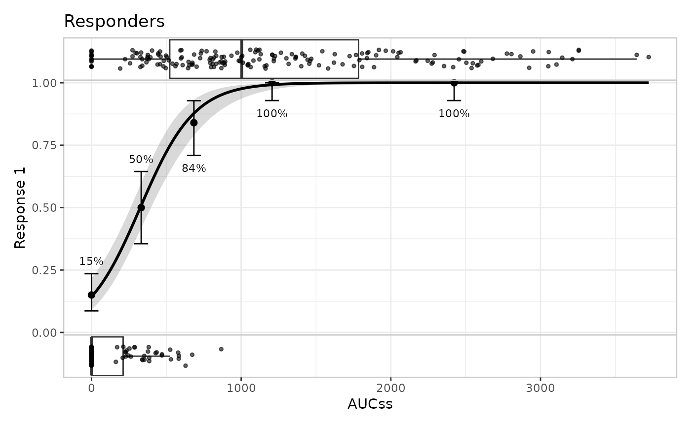

# The built plot object (internal structure)

> **This article documents an implementation detail, not a public
> interface.** Everything described below – the shape of `object$plot`,
> `object$layer`, and `object$output`, the names used internally, and
> the internal `.polish_*()`/`.build_*()` helpers – is unexported,
> undocumented in
> [`?er_plot`](https://erplots.djnavarro.net/reference/er_plot.md), and
> not covered by erplots’ usual conventions. It can, and likely will,
> change in a future release without notice or a deprecation period.
> Nothing in this article should be relied on in package code, and any
> script that depends on it should be treated as tied to the erplots
> version it was written against.
>
> The preferred way to change how a plot looks is a custom `style`
> function (see [Extending
> erplots](https://erplots.djnavarro.net/articles/extending.md)). Read
> this article only if you’ve hit a case that mechanism genuinely can’t
> reach – e.g. a one-off tweak to a specific panel’s theme, or a fix you
> need *right now* and don’t want to write and register a whole custom
> builder for – and you’re willing to reach into the object and patch it
> by hand.

``` r

library(erplots)
library(erglm)

mod <- erglm_model(ae1 ~ aucss, erglm_data, family = binomial())

p <- erglm_data |>
  er_plot(aucss, ae1) |>
  er_plot_add_model(mod) |>
  er_plot_add_quantiles() |>
  er_plot_add_data(style = er_style_data_boxjitter)
```

## Two stages: `object$plot`, then `object$output`

Calling [`plot()`](https://rdrr.io/r/graphics/plot.default.html) (or
[`print()`](https://rdrr.io/r/base/print.html)) on an `er_plot` object
calls
[`er_plot_build()`](https://erplots.djnavarro.net/reference/er_plot_build.md)
first.
[`er_plot_build()`](https://erplots.djnavarro.net/reference/er_plot_build.md)
does its work in two stages, and both intermediate results are kept on
the returned object rather than discarded:

``` r

built <- er_plot_build(p)
names(built)
#> [1] "data"     "exposure" "response" "strata"   "layer"    "plot"     "theme"   
#> [8] "output"
```

**Stage one** builds one ordinary ggplot2 object per layer family,
stored under `built$plot`. **Stage two** (“polishing”: margins,
axis/legend labels, discrete colour scales, panel arrangement, legend
deduplication, and the plot-level theme) turns those separate ggplot2
objects into a single [patchwork](https://patchwork.data-imaginist.com/)
object, stored under `built$output`. `plot.er_plot()` itself is little
more than

``` r

plot.er_plot <- function(x, y = NULL, ...) {
  object <- er_plot_build(x)
  plot(object$output)
}
```

so `built$output` is exactly what you see rendered.

## `object$plot`: one ggplot2 object per layer family

`built$plot` is a plain list with up to three slots – `base`, `data`,
`group` – each either `NULL` or containing real ggplot2 object(s):

``` r

names(built$plot)
#> [1] "base"  "data"  "group"
class(built$plot$base)
#> [1] "ggplot2::ggplot" "ggplot"          "ggplot2::gg"     "S7_object"      
#> [5] "gg"
```

- **`base`** is a single ggplot2 object. It carries the model
  curve/ribbon, the quantile summary geoms, and the summary annotation –
  whichever of those layers are present – and only exists at all if at
  least one of them is (or if the plot has no layers whatsoever, in
  which case it’s an empty axes-only canvas). An `"overlay"`-layout data
  builder (the default,
  [`er_style_data_overlay()`](https://erplots.djnavarro.net/reference/er_style_data.md))
  also draws directly onto `base`, rather than into its own panel – so a
  plot built with the default data style has a `NULL` `built$plot$data`
  even though it clearly *has* a data layer:

  ``` r

  p_overlay <- erglm_data |> er_plot(aucss, ae1) |> er_plot_add_data()
  built_overlay <- er_plot_build(p_overlay)
  names(built_overlay$plot)
  #> [1] "base"  "data"  "group"
  is.null(built_overlay$plot$data)
  #> [1] TRUE
  ```

- **`data`** is a *named list* of ggplot2 objects – never a single bare
  object, even when there’s only one panel – used only by a
  `"panel"`-layout data builder
  (e.g. [`er_style_data_boxjitter()`](https://erplots.djnavarro.net/reference/er_style_data.md),
  used in `p` above). The names are meaningful and depend on response
  type and stratification: `"upper"`/`"lower"` for the binary
  responder/non-responder split, `"data"` for a single unstratified
  continuous/count panel, or one name per stratum level when stratified
  and faceted.

  ``` r

  names(built$plot$data)
  #> [1] "upper" "lower"
  ```

- **`group`** is a named list of ggplot2 objects, one per grouping
  variable added via
  [`er_plot_add_groups()`](https://erplots.djnavarro.net/reference/er_plot_add_groups.md),
  keyed by variable name. `NULL` if no group layer was added.

## `object$output`: the final patchwork object

``` r

class(built$output)
#> [1] "patchwork"       "ggplot2::ggplot" "ggplot"          "ggplot2::gg"    
#> [5] "S7_object"       "gg"
```

`built$output` is what
[`patchwork::wrap_plots()`](https://patchwork.data-imaginist.com/reference/wrap_plots.html)
produces from the individual panels in `built$plot` (stacked vertically
via `ncol = 1`, sized by
[`er_plot_theme()`](https://erplots.djnavarro.net/reference/er_plot_theme.md)’s
`height_*` arguments, with `guides = "collect"` and `axes = "collect"`
to merge legends and align axes across panels), plus
[`patchwork::plot_annotation()`](https://patchwork.data-imaginist.com/reference/plot_annotation.html)
for the plot-level title/subtitle/caption.

A patchwork object behaves like an ordinary list of its constituent
plots for indexing purposes, which is the most direct route to a hand
patch: pull out the panel you want, modify it like any ggplot2 object,
and put it back.

``` r

length(built$output)
#> [1] 3
built$output[[1]] <- built$output[[1]] + ggplot2::labs(title = "Responders")
built$output
```



This is usually less error-prone than editing `built$plot` and
re-running the polishing steps yourself, since it works entirely with
ordinary, already-composed ggplot2 objects and doesn’t need to know
about the internal `.polish_*()` helpers at all. Its limitation is
exactly that it operates *after* polishing – e.g. adding a new discrete
colour mapping this way won’t get the cross-panel legend deduplication
that `er_plot_theme(color_discrete = ...)` gets, because that logic
already ran.

## Summary

| Object | Type | Contains |
|----|----|----|
| `built$plot$base` | single ggplot object, or `NULL` | model/summary/quantile geoms, and an `"overlay"`-layout data builder’s points |
| `built$plot$data` | named list, or `NULL` | one panel per `"panel"`-layout data builder’s output |
| `built$plot$group` | named list, or `NULL` | one panel per [`er_plot_add_groups()`](https://erplots.djnavarro.net/reference/er_plot_add_groups.md) variable |
| `built$output` | single `patchwork` object | all of the above, stacked, themed, and annotated |

Treat all of this as a snapshot of the current implementation, not a
contract – see the warning at the top of this article.
