# Plotting: binary responses

erplots draws exposure-response plots from *any* model that implements
\[er_model_interface\]. This article uses a logistic regression model
fitted with erglm, but the plotting code itself has no knowledge of
[`glm()`](https://rdrr.io/r/stats/glm.html). It’s the most detailed of
the three response-type articles (binary/continuous/count); the
continuous and count articles link back here for the model and group
layers, which work identically regardless of response type.

``` r

library(erplots)
library(erglm)
```

## Fit the model first

Unlike a plotting function that fits a model behind the scenes, erplots
expects you to fit the model yourself and pass it in explicitly:

``` r

mod <- erglm_model(ae1 ~ aucss, erglm_data, family = binomial())
```

## Defining plots

Basic usage

``` r

erglm_data |> 
  er_plot(exposure = aucss, response = ae1) |> 
  er_plot_add_model(mod) |> 
  er_plot_add_quantiles() |> 
  plot()
```

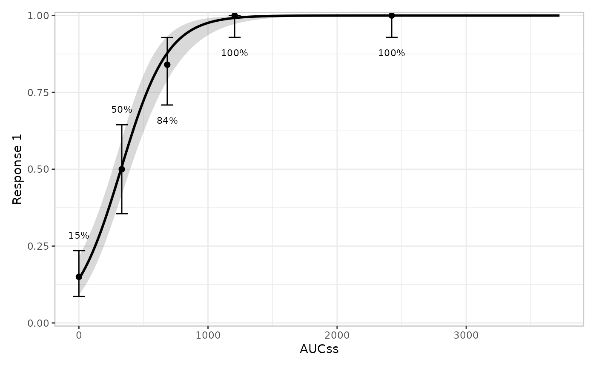

Adding extra layers

``` r

erglm_data |> 
  er_plot(exposure = aucss, response = ae1) |> 
  er_plot_add_model(mod) |> 
  er_plot_add_quantiles() |>
  er_plot_add_data() |>
  er_plot_add_groups(group_by = aucss) |> 
  plot()
```

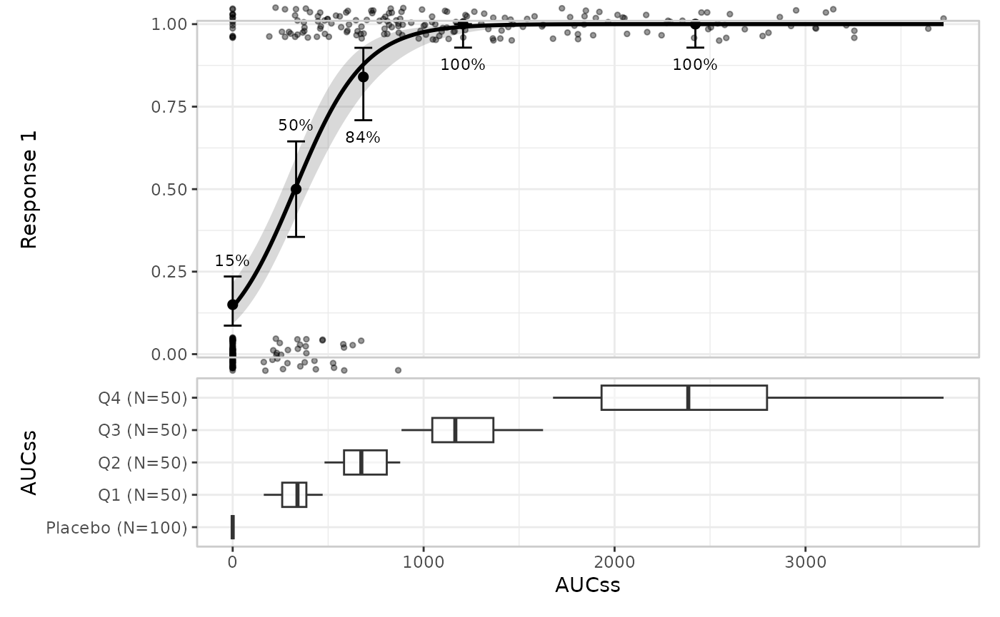

## Stratification

Stratification adds colour across all layers. This requires a model that
includes the stratification variable as a term:

``` r

mod_strat <- erglm_model(ae1 ~ aucss + sex, erglm_data, family = binomial())

erglm_data |> 
  er_plot(
    exposure = aucss, 
    response = ae1, 
    stratify_by = sex
  ) |> 
  er_plot_add_model(mod_strat) |> 
  er_plot_add_quantiles() |> 
  er_plot_add_data() |>
  plot()
```

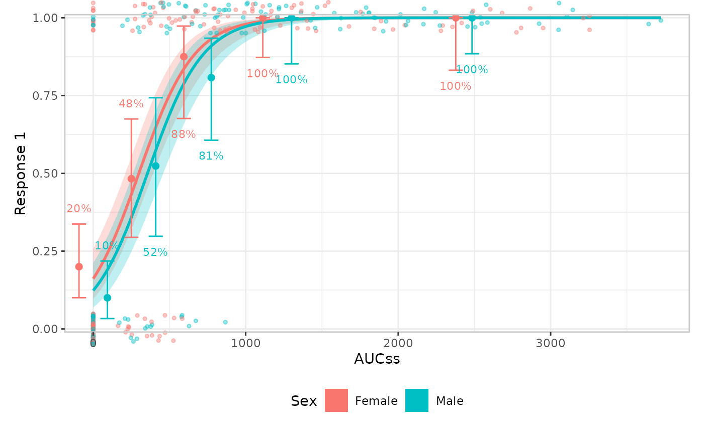

You can suppress stratification for specific layers

``` r

erglm_data |> 
  er_plot(
    exposure = aucss, 
    response = ae1, 
    stratify_by = sex
  ) |> 
  # keep_strata = FALSE needs a model that doesn't include the
  # stratification variable, so we pass the un-stratified `mod` here
  er_plot_add_model(mod, keep_strata = FALSE) |> 
  er_plot_add_quantiles() |> 
  er_plot_add_data() |>
  plot()
```


## Model layer

The default builder is
[`er_style_model_ribbonline()`](https://erplots.djnavarro.net/reference/er_style_model.md),
but you can also draw spaghetti plots to represent parameter uncertainty
with
[`er_style_model_spaghetti()`](https://erplots.djnavarro.net/reference/er_style_model.md).
Spaghetti plots require the model to implement
[`er_simulate()`](https://erplots.djnavarro.net/reference/er_model_interface.md)
(erglm’s models do); models that only implement
[`er_predict()`](https://erplots.djnavarro.net/reference/er_model_interface.md)
fall back to
[`er_style_model_ribbonline()`](https://erplots.djnavarro.net/reference/er_style_model.md)
with a message. This layer doesn’t look at `response_type` at all – it
only consumes \[er_predict()\]/\[er_simulate()\] output – so everything
in this section applies unchanged to continuous and count responses too.

``` r

erglm_data |> 
  er_plot(aucss, ae1) |> 
  er_plot_add_model(mod, style = er_style_model_spaghetti) |> 
  er_plot_add_quantiles() |> 
  plot()
#> Using seed = 3244
```

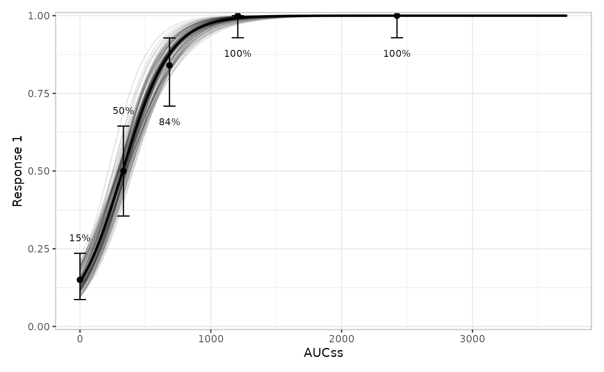

## Quantile layer

You can modify the number of bins:

``` r

erglm_data |> 
  er_plot(aucss, ae1) |> 
  er_plot_add_model(mod) |> 
  er_plot_add_quantiles(bins = 6) |> 
  plot()
```

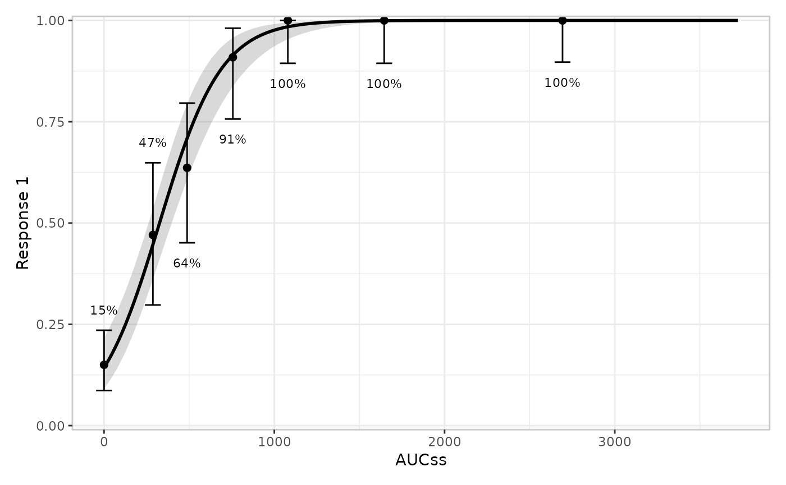

You can also modify the confidence level for the interval around each
bin’s summary. For a binary response this is a Clopper-Pearson interval
for the response *rate*; see the
[continuous](https://erplots.djnavarro.net/articles/plot-continuous.html#quantile-layer)
and
[count](https://erplots.djnavarro.net/articles/plot-count.html#quantile-layer)
articles for how this layer adapts its summary statistic and interval
method to those response types.

``` r

erglm_data |> 
  er_plot(aucss, ae1) |> 
  er_plot_add_model(mod) |> 
  er_plot_add_quantiles(bins = 6, conf_level = .8) |> 
  plot()
```


## Data layer

[`er_plot_add_data()`](https://erplots.djnavarro.net/reference/er_plot_add_data.md)
adds the raw observations. By default
([`er_style_data_overlay()`](https://erplots.djnavarro.net/reference/er_style_data.md)),
points are drawn at their true `(exposure, response)` coordinates in the
*main* model panel – for a binary response this is a scatter with a
small vertical jitter, since the y-values are exactly 0/1 and would
otherwise overplot into two solid lines:

``` r

erglm_data |> 
  er_plot(aucss, ae1) |> 
  er_plot_add_model(mod) |> 
  er_plot_add_quantiles() |> 
  er_plot_add_data() |> 
  plot()
```

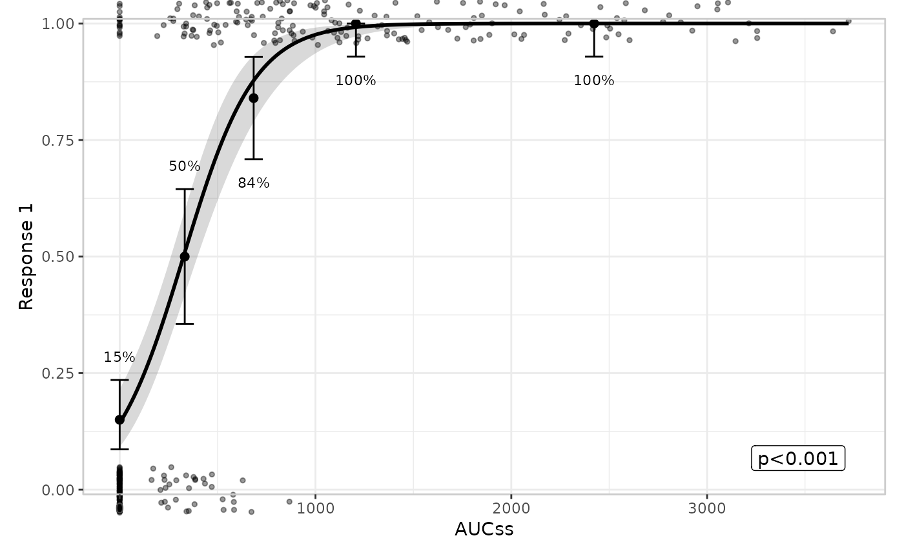

### `er_style_data_overlay()` vs. `er_style_data_boxjitter()`

[`er_style_data_boxjitter()`](https://erplots.djnavarro.net/reference/er_style_data.md)
is the older, panel-based design, and is binary-response only: it splits
responders/non-responders into separate panels above/below the main
plot, each showing a boxplot of the exposure values with the raw
jittered points layered on top – so the panel shows the exposure
*distribution* conditional on response, not just individual points.
There is no built-in panel-based builder for a continuous/count
response;
[`er_style_data_overlay()`](https://erplots.djnavarro.net/reference/er_style_data.md)
(raw points at their true `(exposure, response)` coordinates, shown in
the
[continuous](https://erplots.djnavarro.net/articles/plot-continuous.html#data-layer)
and
[count](https://erplots.djnavarro.net/articles/plot-count.html#data-layer)
articles) covers that case there, and a custom `"panel"`-layout builder
(e.g. a single color-encoded panel) remains possible via
\[er_style_tag()\] if a project needs one – see
`vignettes/articles/design.Rmd`’s “Extending erplots” section. Each
builder declares which of the two structural families it belongs to via
\[er_style_tag()\], which is what
[`er_plot_add_data()`](https://erplots.djnavarro.net/reference/er_plot_add_data.md)
uses to decide whether to merge it into the main panel or stack it in
panels below.

Building both side by side (via patchwork’s `|` operator) makes the
difference concrete:

``` r

p_overlay <- erglm_data |> 
  er_plot(aucss, ae1) |> 
  er_plot_add_model(mod) |> 
  er_plot_add_quantiles() |> 
  er_plot_add_data() |> 
  er_plot_build()

p_boxjitter <- erglm_data |> 
  er_plot(aucss, ae1) |> 
  er_plot_add_model(mod) |> 
  er_plot_add_quantiles() |> 
  er_plot_add_data(style = er_style_data_boxjitter) |> 
  er_plot_build()

p_overlay$output | p_boxjitter$output
```

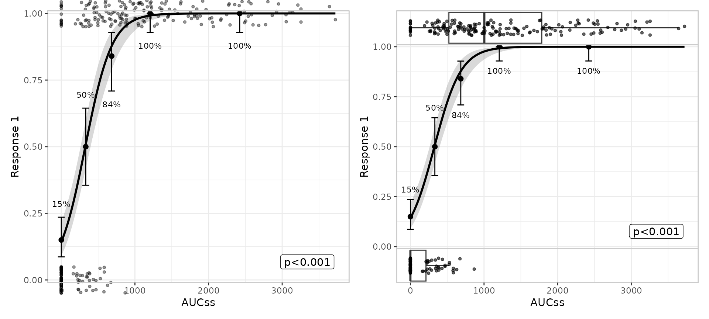

Stratification looks the same for both: color/fill always means strata
for
[`er_style_data_boxjitter()`](https://erplots.djnavarro.net/reference/er_style_data.md),
sharing the model curve’s own legend, the same way
[`er_style_data_overlay()`](https://erplots.djnavarro.net/reference/er_style_data.md)’s
color aesthetic does for any response type:

``` r

p_overlay_strat <- erglm_data |> 
  er_plot(aucss, ae1, stratify_by = sex) |> 
  er_plot_add_model(mod_strat) |> 
  er_plot_add_data() |> 
  er_plot_build()

p_boxjitter_strat <- erglm_data |> 
  er_plot(aucss, ae1, stratify_by = sex) |> 
  er_plot_add_model(mod_strat) |> 
  er_plot_add_data(style = er_style_data_boxjitter) |> 
  er_plot_build()

p_overlay_strat$output | p_boxjitter_strat$output
```

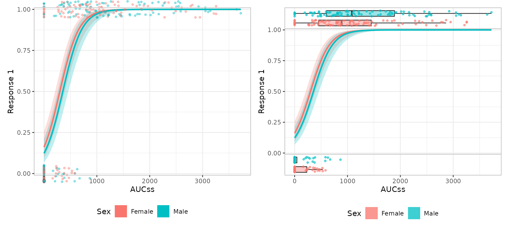

## Group layer

Multiple grouping variables are allowed. Like the model layer, this
layer doesn’t look at `response_type` at all – it only consumes the
exposure variable – so everything in this section applies unchanged to
continuous and count responses too.

``` r

erglm_data |> 
  er_plot(aucss, ae1) |> 
  er_plot_add_model(mod) |> 
  er_plot_add_quantiles() |>
  er_plot_add_groups(group_by = c(aucss, sex)) |> 
  plot()
```

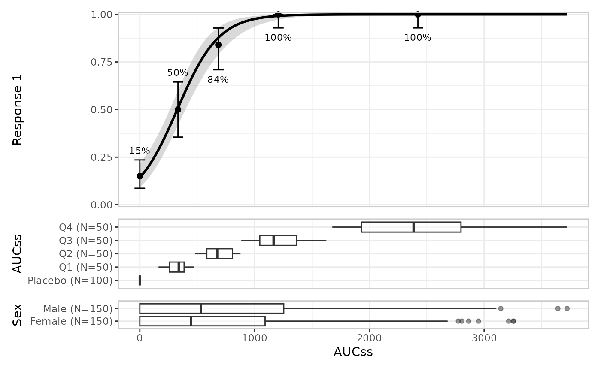

Stratification propagates to the group layer:

``` r

erglm_data |> 
  er_plot(aucss, ae1, stratify_by = sex) |> 
  er_plot_add_model(mod_strat) |> 
  er_plot_add_quantiles() |>
  er_plot_add_groups(group_by = aucss) |> 
  plot()
```

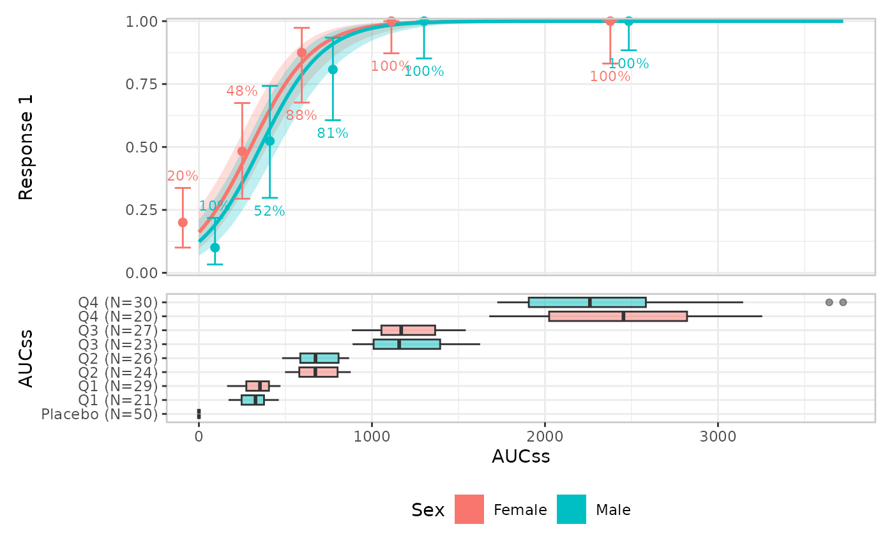

The default builder is
[`er_style_group_boxplot()`](https://erplots.djnavarro.net/reference/er_style_group.md),
but you can also use violin plots with
[`er_style_group_violin()`](https://erplots.djnavarro.net/reference/er_style_group.md):

``` r

erglm_data |> 
  er_plot(aucss, ae1) |> 
  er_plot_add_model(mod) |> 
  er_plot_add_quantiles() |>
  er_plot_add_groups(group_by = sex, style = er_style_group_violin) |> 
  plot()
```

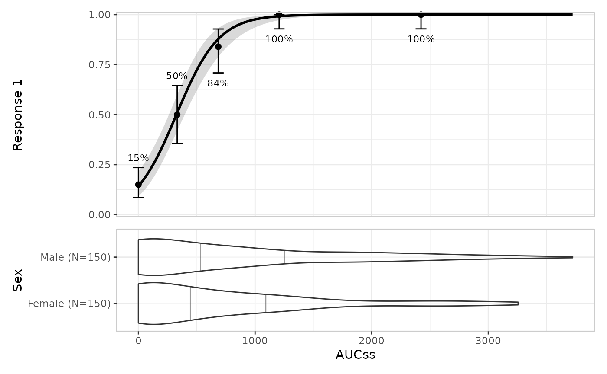

## VPC plot

[`er_vpc_plot()`](https://erplots.djnavarro.net/reference/er_vpc_plot.md)
is a model-agnostic VPC-style plot that compares observed data against
model-simulated data, operating on plain data frames rather than an
`er_plot` object. For a binary response it compares observed vs.
simulated response *rates*:

``` r

sim_binary <- erglm_vpc_sim(mod, seed = 5218)
er_vpc_plot(erglm_data, sim_binary, aucss, ae1, group_by = aucss)
```

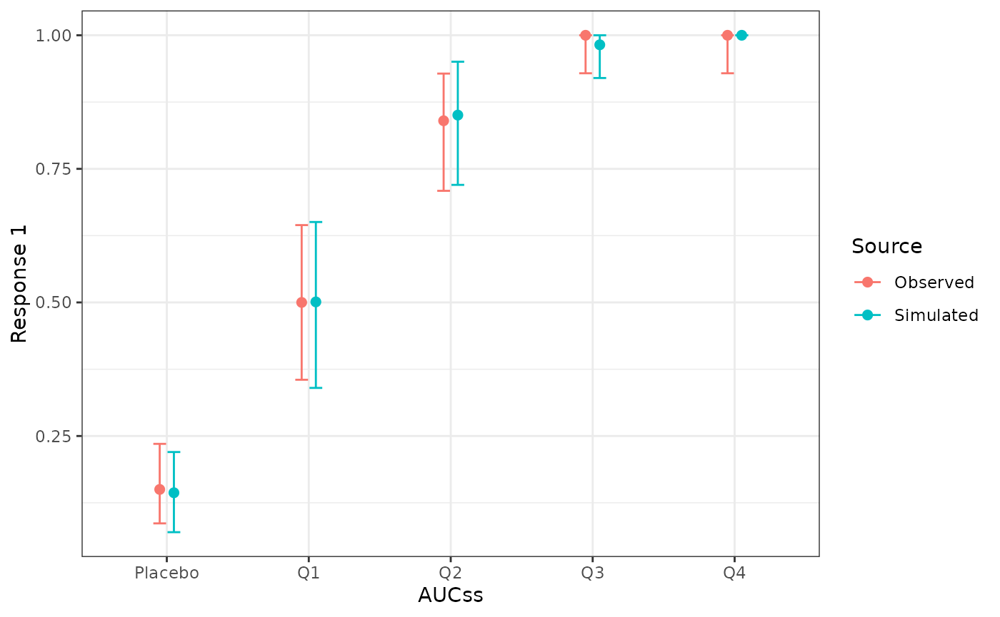

See the
[continuous](https://erplots.djnavarro.net/articles/plot-continuous.html#vpc-plot)
and
[count](https://erplots.djnavarro.net/articles/plot-count.html#vpc-plot)
articles for how this generalises to means (with a t-interval or exact
Poisson interval, respectively) for those response types.
