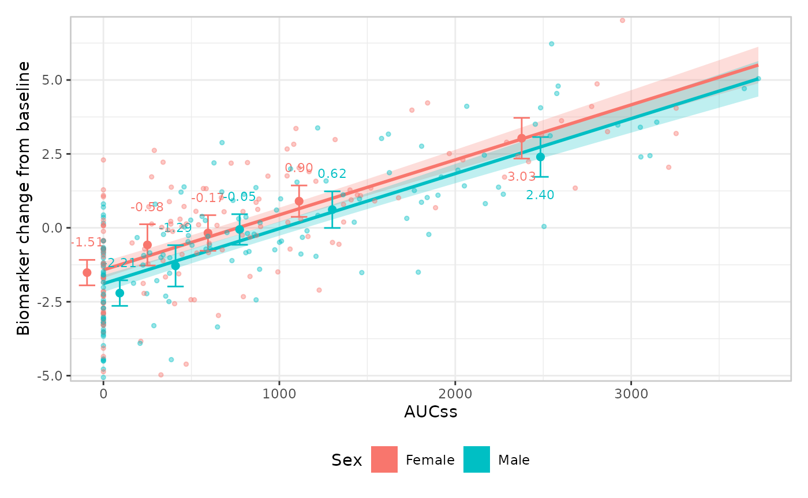
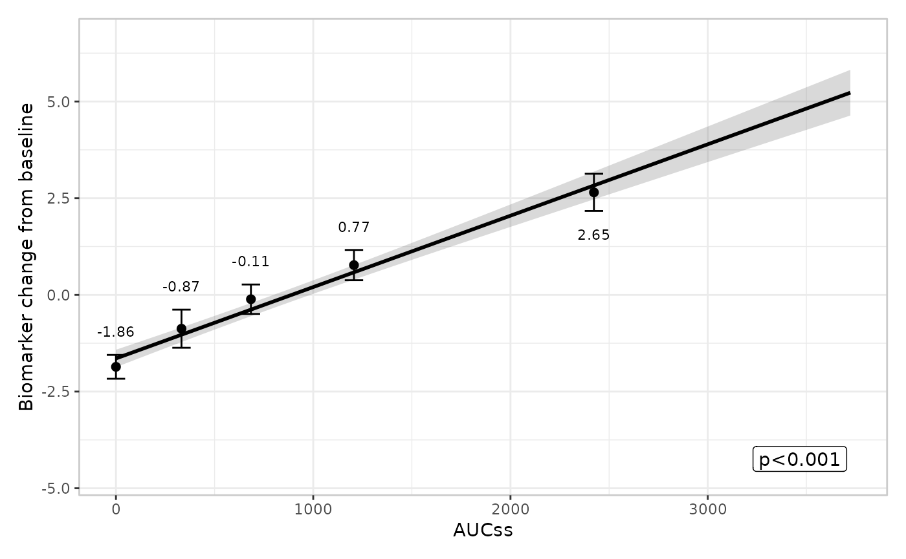
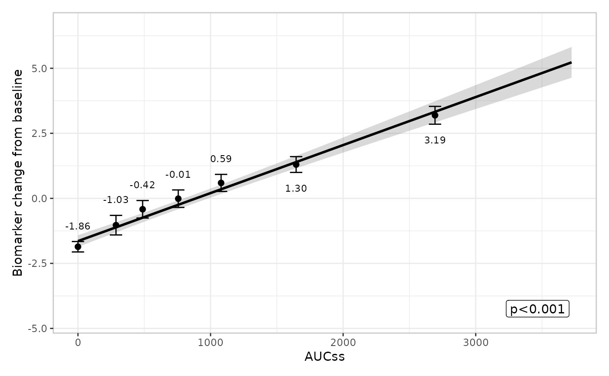
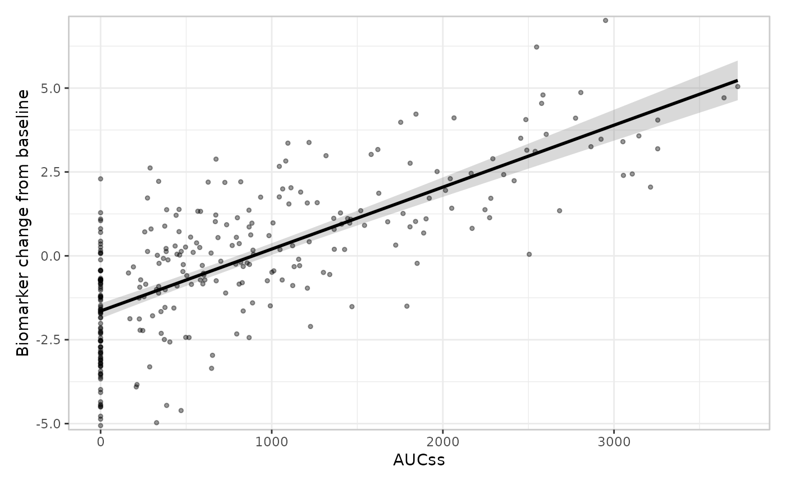
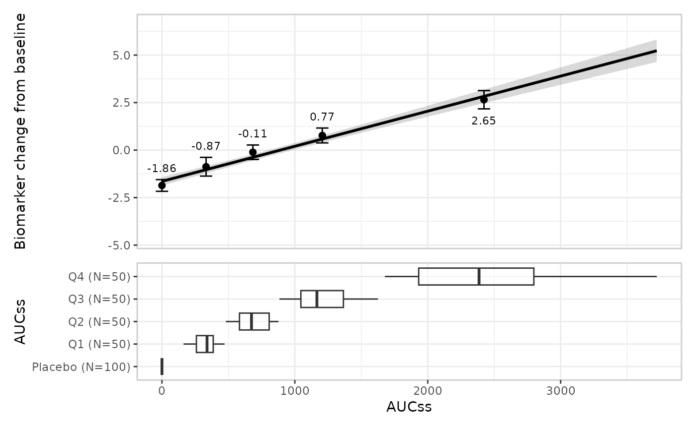
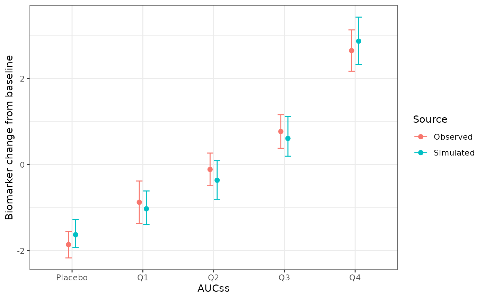

# Plotting: continuous responses

erplots draws exposure-response plots from *any* model that implements
\[er_model_interface\]. This article uses a gaussian model fitted with
erglm to cover continuous-response specifics; the model and group
components work identically for every response type, so this article
only shows their default usage and links to the [binary
responses](https://erplots.djnavarro.net/articles/plot-binary.md)
article for the builder-swapping detail (spaghetti plots, violin plots).

``` r

library(erplots)
library(erglm)
```

## Fit the model first

``` r

mod_gaussian <- erglm_model(biomarker_change ~ aucss, erglm_data, family = gaussian())
```

[`er_plot()`](https://erplots.djnavarro.net/reference/er_plot.md)
auto-detects whether a response is binary (logical, or values entirely
in `{0, 1}`) or continuous, and you can override the detection with
`response_type`. `biomarker_change` auto-detects as `"continuous"`.

## Defining plots

``` r

erglm_data |> 
  er_plot(aucss, biomarker_change) |> 
  er_plot_show_model(mod_gaussian) |> 
  er_plot_show_quantiles() |> 
  plot()
```


## Stratification

Stratification adds colour across all components, and requires a model
that includes the stratification variable as a term. See the [binary
responses](https://erplots.djnavarro.net/articles/plot-binary.html#stratification)
article for a fuller worked example, including how to suppress
stratification for specific components with `keep_strata = FALSE`.

``` r

mod_gaussian_sex <- erglm_model(
  biomarker_change ~ aucss + sex, erglm_data, family = gaussian()
)

erglm_data |> 
  er_plot(aucss, biomarker_change, stratify_by = sex) |> 
  er_plot_show_model(mod_gaussian_sex) |> 
  er_plot_show_quantiles() |> 
  er_plot_show_data() |>
  plot()
```



## Model component

The model layer doesn’t look at `response_type` at all – it only
consumes \[er_predict()\]/\[er_simulate()\] output – so it works exactly
the same way as for a binary response. See the [binary
responses](https://erplots.djnavarro.net/articles/plot-binary.html#model-component)
article for
[`build_model_spaghetti()`](https://erplots.djnavarro.net/reference/build_model.md)
and the parameter-uncertainty rationale behind it; the default builder
is used here:

``` r

erglm_data |> 
  er_plot(aucss, biomarker_change) |> 
  er_plot_show_model(mod_gaussian) |> 
  er_plot_show_quantiles() |> 
  plot()
```



## Quantile component

For a continuous response, each exposure-quantile bin is summarised by
its **mean** with a **t-interval**, rather than a rate with a
Clopper-Pearson interval:

``` r

erglm_data |> 
  er_plot(aucss, biomarker_change) |> 
  er_plot_show_model(mod_gaussian) |> 
  er_plot_show_quantiles(bins = 6, conf_level = .8) |> 
  plot()
```



The t-interval is a reasonable default for a genuinely continuous
response like this one. See the [count
responses](https://erplots.djnavarro.net/articles/plot-count.md) article
for a case – low-count Poisson data – where the t-interval approximation
can misbehave (a negative lower bound), and the
`response_type = "count"` declaration that fixes it.

## Data component

[`er_plot_show_data()`](https://erplots.djnavarro.net/reference/er_plot_show_data.md)
adds the raw observations at their true `(exposure, response)`
coordinates via
[`build_data_overlay()`](https://erplots.djnavarro.net/reference/build_data.md),
the default and only built-in builder for a continuous response – no
jitter is needed, since the response isn’t confined to 0/1:

``` r

erglm_data |> 
  er_plot(aucss, biomarker_change) |> 
  er_plot_show_model(mod_gaussian) |> 
  er_plot_show_data() |> 
  plot()
```



There’s no built-in panel-based alternative for a continuous response –
[`build_data_boxjitter()`](https://erplots.djnavarro.net/reference/build_data.md)
(the older, panel-based responders/non-responders design covered in the
[binary
responses](https://erplots.djnavarro.net/articles/plot-binary.html#build_data_overlay-vs--build_data_boxjitter)
article) is binary-only. If you need a panel-based builder here (e.g. a
single color-encoded panel), you can write a custom one and tag it with
`er_layout(fn, "panel")` – see `design.Rmd`’s “Extending erplots”
section.

## Group component

The group layer doesn’t look at `response_type` at all – it only
consumes the exposure variable – so it works exactly the same way as for
a binary response. See the [binary
responses](https://erplots.djnavarro.net/articles/plot-binary.html#group-component)
article for multiple grouping variables and
[`build_group_violin()`](https://erplots.djnavarro.net/reference/build_group.md);
the default builder and a single grouping variable are shown here:

``` r

erglm_data |> 
  er_plot(aucss, biomarker_change) |> 
  er_plot_show_model(mod_gaussian) |> 
  er_plot_show_quantiles() |>
  er_plot_show_groups(group_by = aucss) |> 
  plot()
```



## VPC plot

[`er_vpc_plot()`](https://erplots.djnavarro.net/reference/er_vpc_plot.md)
generalises the same way as the quantile layer, comparing observed
vs. simulated **means** rather than rates:

``` r

sim_gaussian <- erglm_vpc_sim(mod_gaussian, seed = 3947)
er_vpc_plot(erglm_data, sim_gaussian, aucss, biomarker_change, group_by = aucss)
```


