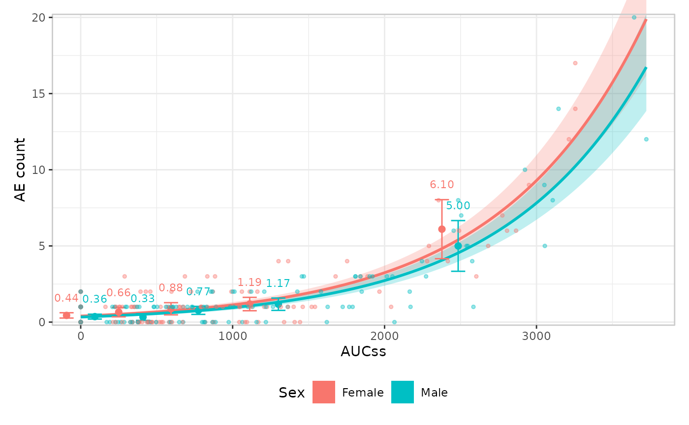
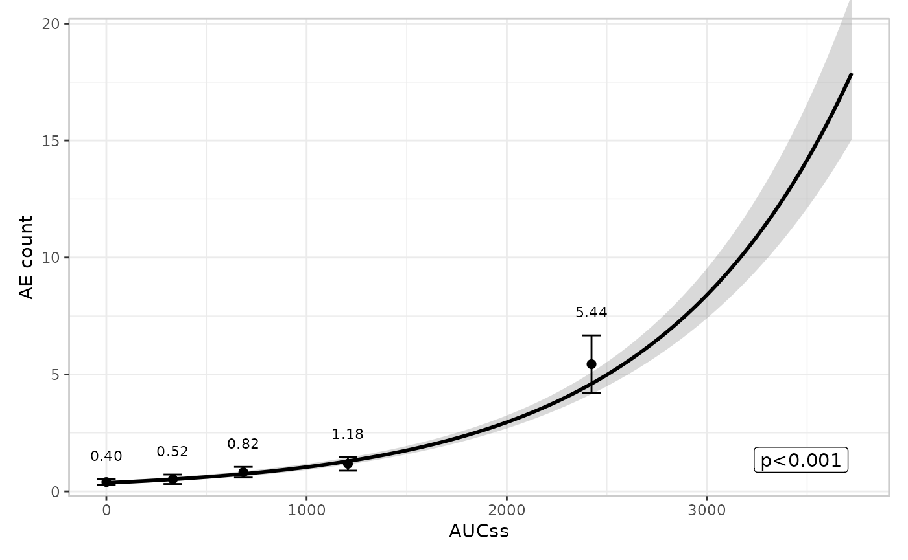
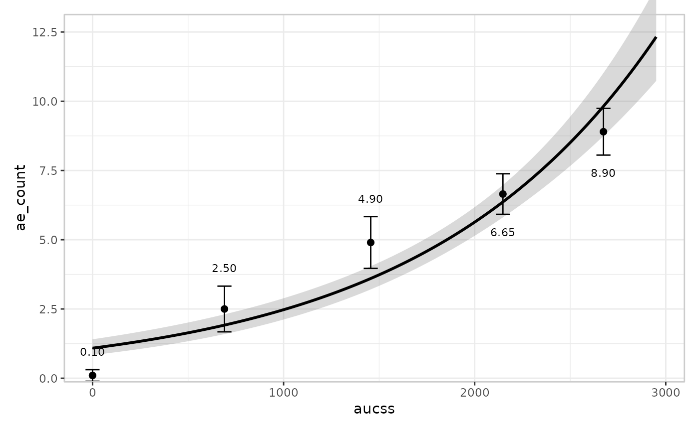
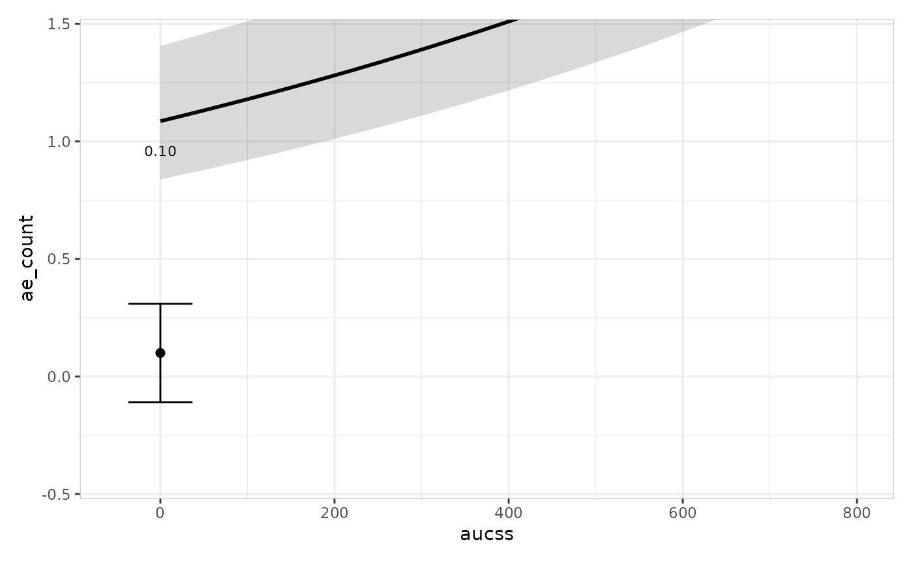
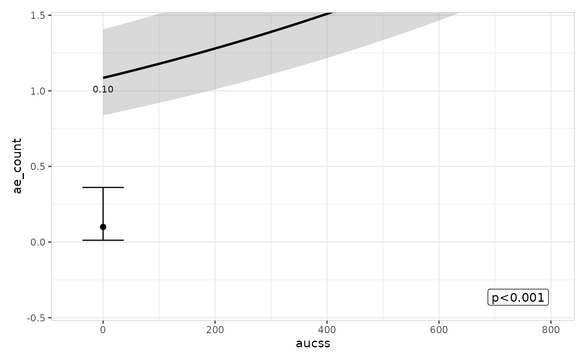
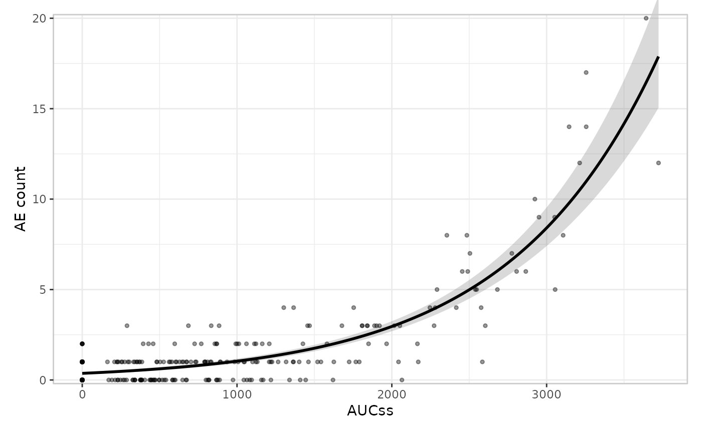
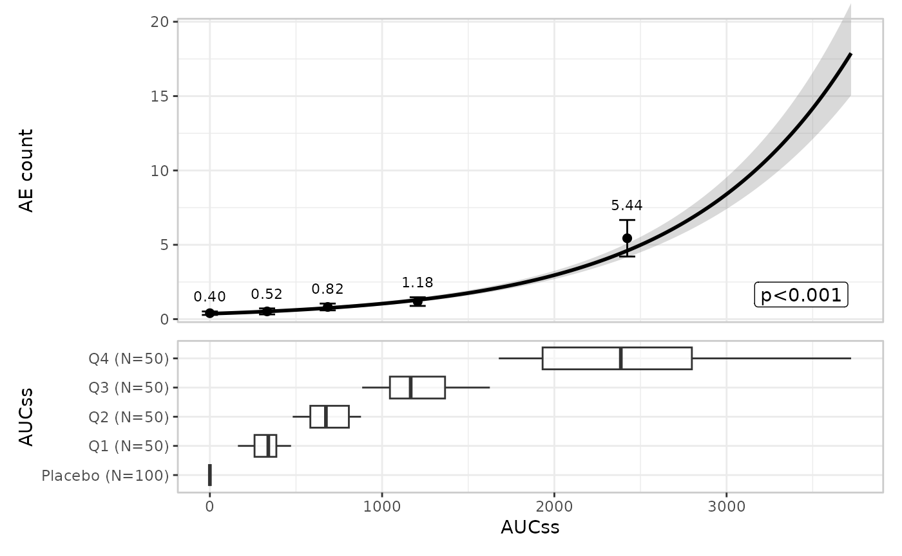
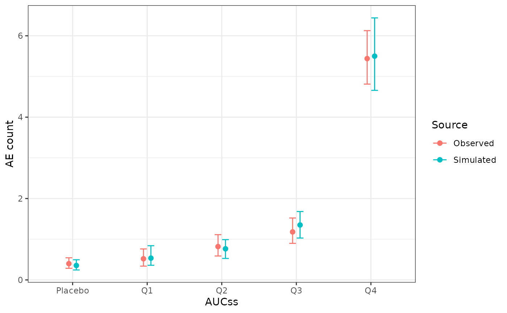

# Plotting: count responses

erplots draws exposure-response plots from *any* model that implements
\[er_model_interface\]. This article uses a Poisson model fitted with
erglm to cover count-response specifics – most importantly, the
`response_type = "count"` declaration and when it matters. The model and
group layers work identically for every response type, so this article
only shows their default usage and links to the [binary
responses](https://erplots.djnavarro.net/articles/plot-binary.md)
article for the builder-swapping detail (spaghetti plots, violin plots).

``` r

library(erplots)
library(erglm)
```

## Fit the model first

``` r

mod_poisson <- erglm_model(ae_count ~ aucss, erglm_data, family = poisson())
```

Count responses, such as an adverse-event count, auto-detect as
`"continuous"` under
[`er_plot()`](https://erplots.djnavarro.net/reference/er_plot.md)’s
`"auto"` logic (they’re neither logical nor confined to `{0, 1}`), and
are summarised the same way a genuinely continuous response is (bin mean
plus t-interval) unless you declare `response_type = "count"`
explicitly.

## Defining plots

``` r

erglm_data |> 
  er_plot(aucss, ae_count) |> 
  er_plot_add_model(mod_poisson) |> 
  er_plot_add_quantiles() |> 
  plot()
```


## Stratification

Stratification adds colour across all layers, and requires a model that
includes the stratification variable as a term. See the [binary
responses](https://erplots.djnavarro.net/articles/plot-binary.html#stratification)
article for a fuller worked example, including how to suppress
stratification for specific layers with `keep_strata = FALSE`.

``` r

mod_poisson_sex <- erglm_model(
  ae_count ~ aucss + sex, erglm_data, family = poisson()
)

erglm_data |> 
  er_plot(aucss, ae_count, stratify_by = sex) |> 
  er_plot_add_model(mod_poisson_sex) |> 
  er_plot_add_quantiles() |> 
  er_plot_add_data() |>
  plot()
```



## Model layer

The model layer doesn’t look at `response_type` at all – it only
consumes \[er_predict()\]/\[er_simulate()\] output – so it works exactly
the same way as for a binary response. See the [binary
responses](https://erplots.djnavarro.net/articles/plot-binary.html#model-layer)
article for
[`er_style_model_spaghetti()`](https://erplots.djnavarro.net/reference/er_style_model.md);
the default builder is used here:

``` r

erglm_data |> 
  er_plot(aucss, ae_count) |> 
  er_plot_add_model(mod_poisson) |> 
  er_plot_add_quantiles() |> 
  plot()
```


## Quantile layer

Under auto-detection, a count response is summarised the same way a
continuous response is – bin mean plus t-interval:

``` r

erglm_data |> 
  er_plot(aucss, ae_count) |> 
  er_plot_add_model(mod_poisson) |> 
  er_plot_add_quantiles() |> 
  plot()
```



Declaring `response_type = "count"` swaps the t-interval approximation
for an exact Poisson interval (bin mean plus \[ci_poisson()\] instead of
\[ci_t()\]), which never produces a negative lower bound – useful for
low-count bins, where the t-interval approximation can. For
`erglm_data`’s own `ae_count`, none of the bin means are low enough for
this to actually happen, so the two plots above would look almost
identical if you re-ran the last one with `response_type = "count"`. To
make the difference concrete, here’s a synthetic dataset where the
placebo arm has only 2 events among 20 subjects:

``` r

set.seed(84)
placebo_counts <- rpois(20, 0.05)
while (sum(placebo_counts) != 2) placebo_counts <- rpois(20, 0.05)

aucss_dosed <- sort(runif(80, 100, 3000))
count_dosed <- rpois(80, 0.1 + 0.003 * aucss_dosed)

low_count_data <- data.frame(
  aucss = c(rep(0, 20), aucss_dosed),
  ae_count = c(placebo_counts, count_dosed)
)

mod_low_count <- erglm_model(ae_count ~ aucss, low_count_data, family = poisson())
```

The default (t-interval) path’s placebo-arm error bar dips visibly below
zero – a nonsensical negative event rate:

``` r

low_count_data |> 
  er_plot(aucss, ae_count) |> 
  er_plot_add_model(mod_low_count) |> 
  er_plot_add_quantiles() |> 
  plot() +
  ggplot2::coord_cartesian(ylim = c(-0.5, 1.5), xlim = c(-50, 800))
```



    #> Coordinate system already present.
    #> ℹ Adding new coordinate system, which will replace the existing one.



Declaring `response_type = "count"` keeps the same placebo-arm point
estimate but replaces the t-interval with an exact Poisson interval,
which stays non-negative:

``` r

low_count_data |> 
  er_plot(aucss, ae_count, response_type = "count") |> 
  er_plot_add_model(mod_low_count) |> 
  er_plot_add_quantiles() |> 
  plot() +
  ggplot2::coord_cartesian(ylim = c(-0.5, 1.5), xlim = c(-50, 800))
```


    #> Coordinate system already present.
    #> ℹ Adding new coordinate system, which will replace the existing one.



## Data layer

[`er_plot_add_data()`](https://erplots.djnavarro.net/reference/er_plot_add_data.md)
adds the raw observations at their true `(exposure, response)`
coordinates via
[`er_style_data_overlay()`](https://erplots.djnavarro.net/reference/er_style_data.md),
the default and only built-in builder for a count response – no jitter
is needed, since the response isn’t confined to 0/1:

``` r

erglm_data |> 
  er_plot(aucss, ae_count) |> 
  er_plot_add_model(mod_poisson) |> 
  er_plot_add_data() |> 
  plot()
```



There’s no built-in panel-based alternative for a count response –
[`er_style_data_boxjitter()`](https://erplots.djnavarro.net/reference/er_style_data.md)
(the older, panel-based responders/non-responders design covered in the
[binary
responses](https://erplots.djnavarro.net/articles/plot-binary.html#er_style_data_overlay-vs--er_style_data_boxjitter)
article) is binary-only. If you need a panel-based builder here, you can
write a custom one and tag it with `er_style_tag(fn, layout = "panel")`
– see `design.Rmd`’s “Extending erplots” section.

## Group layer

The group layer doesn’t look at `response_type` at all – it only
consumes the exposure variable – so it works exactly the same way as for
a binary response. See the [binary
responses](https://erplots.djnavarro.net/articles/plot-binary.html#group-layer)
article for multiple grouping variables and
[`er_style_group_violin()`](https://erplots.djnavarro.net/reference/er_style_group.md);
the default builder and a single grouping variable are shown here:

``` r

erglm_data |> 
  er_plot(aucss, ae_count) |> 
  er_plot_add_model(mod_poisson) |> 
  er_plot_add_quantiles() |>
  er_plot_add_groups(group_by = aucss) |> 
  plot()
```



## VPC plot

[`er_vpc_plot()`](https://erplots.djnavarro.net/reference/er_vpc_plot.md)
takes the same `response_type = "count"` declaration as
[`er_plot()`](https://erplots.djnavarro.net/reference/er_plot.md),
swapping in the exact Poisson interval for the observed-side summary:

``` r

sim_poisson <- erglm_vpc_sim(mod_poisson, seed = 6142)
er_vpc_plot(
  erglm_data, sim_poisson, aucss, ae_count, group_by = aucss,
  response_type = "count"
)
```


