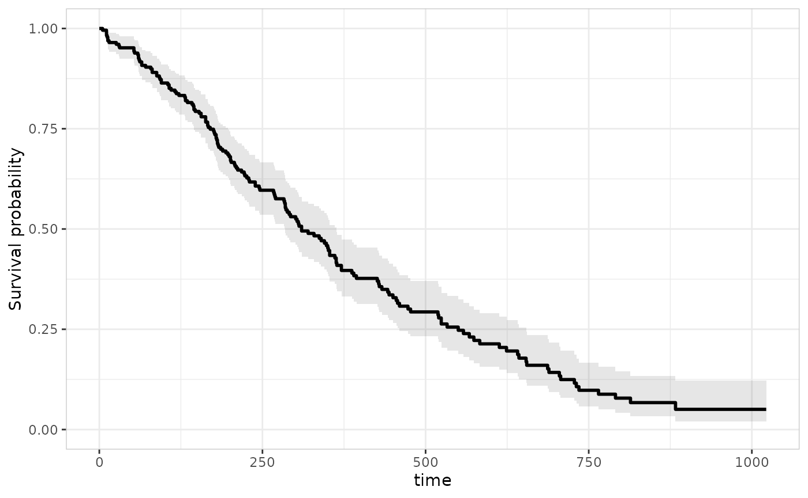
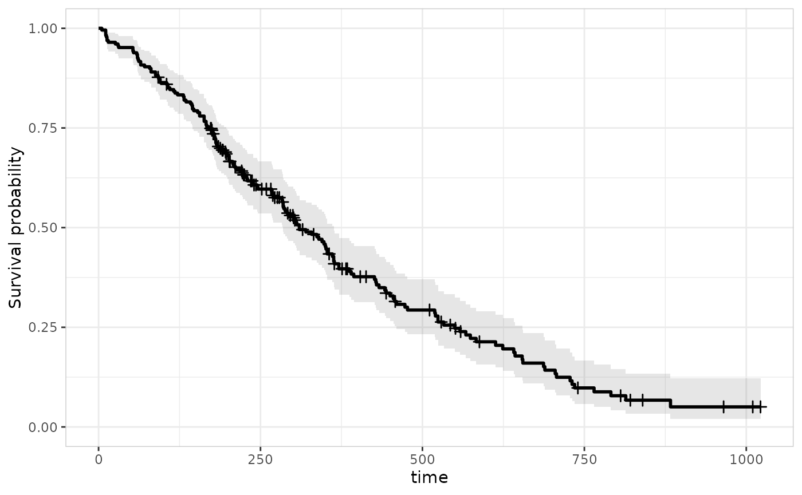
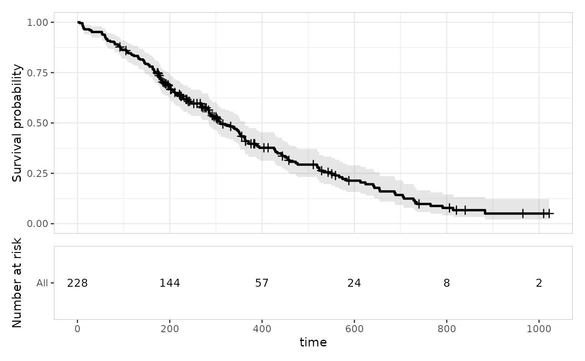
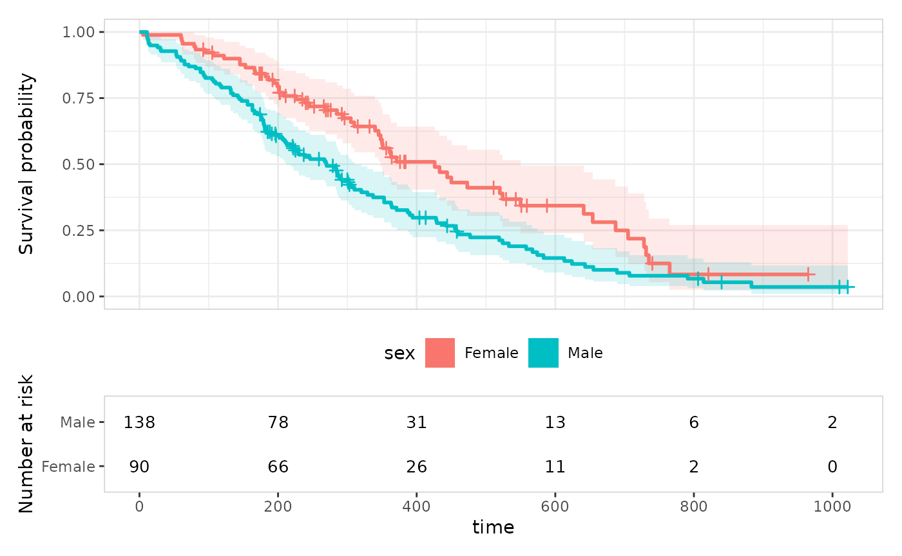
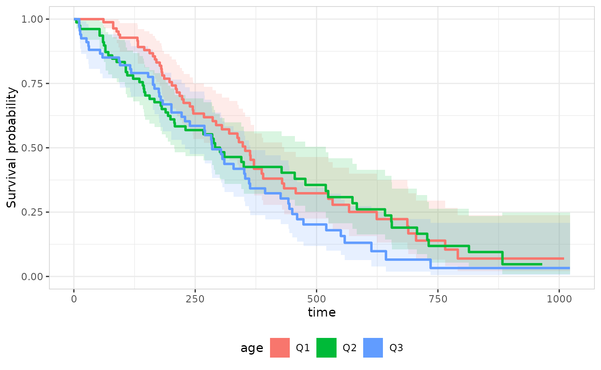
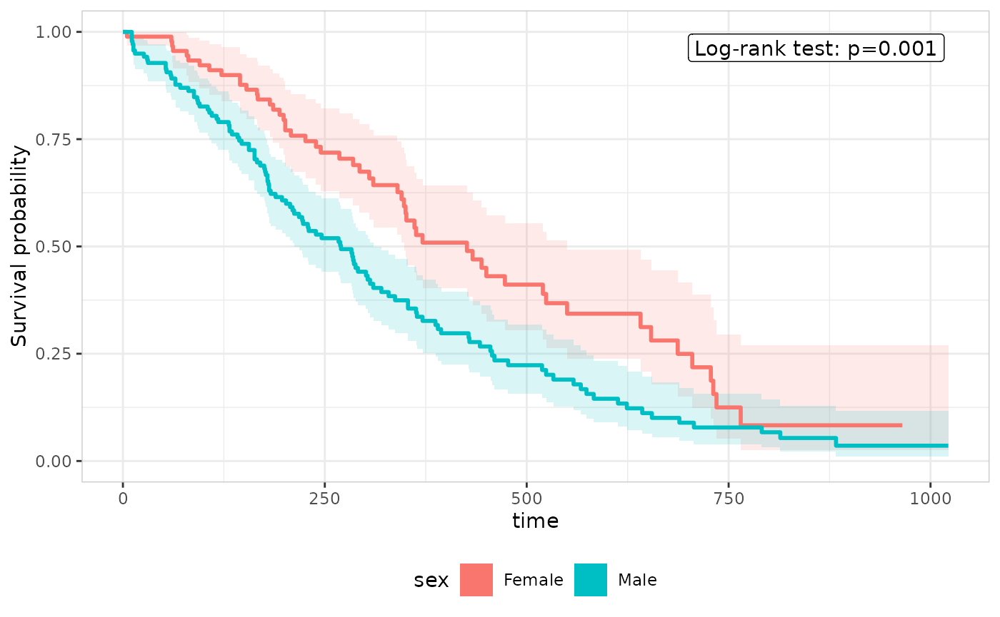
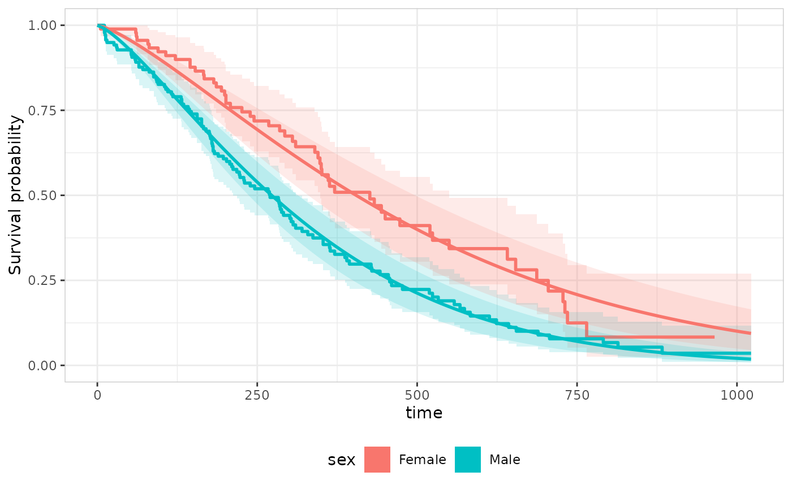
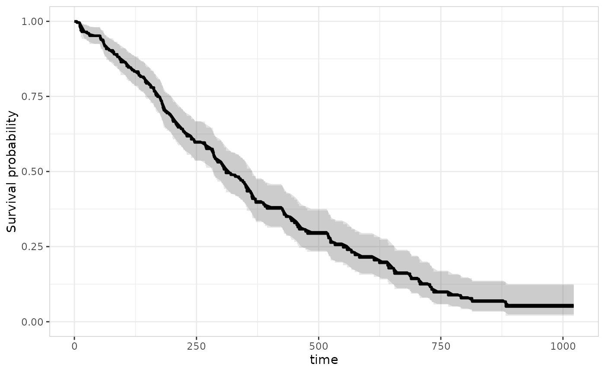
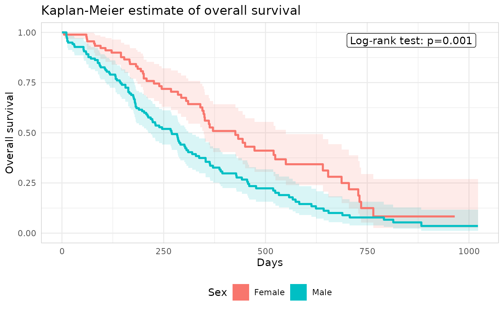
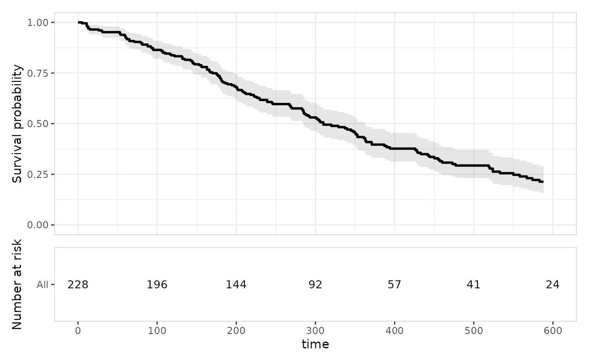

# Time-to-event plots

``` r

library(erplots)
library(survival)
library(ertte)
```

Alongside the
[`er_plot()`](https://erplots.djnavarro.net/reference/er_plot.md)/[`er_vpc()`](https://erplots.djnavarro.net/reference/er_vpc.md)
mini-grammars covered in the other articles, erplots supplies a third,
separate mini-grammar built around
[`er_tte()`](https://erplots.djnavarro.net/reference/er_tte.md) for
Kaplan-Meier/survival-over-time figures. It has a different coordinate
system to the other two: time on the x-axis, survival probability on the
y-axis, rather than exposure-vs-response.
[`er_tte()`](https://erplots.djnavarro.net/reference/er_tte.md) itself
computes the Kaplan-Meier estimate once
([`survival::survfit()`](https://rdrr.io/pkg/survival/man/survfit.html)),
and every layer added afterwards reads from that shared fit rather than
recomputing it. As with
[`er_plot()`](https://erplots.djnavarro.net/reference/er_plot.md)/[`er_vpc()`](https://erplots.djnavarro.net/reference/er_vpc.md),
nothing is drawn until at least one `er_tte_add_*()` layer has been
added and the pipeline is plotted.

This article uses the `lung` dataset from the survival package
throughout, treating `status == 2` as the event indicator (the dataset
codes `1` = censored, `2` = dead).

## A single curve

The minimal pipeline is
[`er_tte()`](https://erplots.djnavarro.net/reference/er_tte.md) followed
by
[`er_tte_add_curve()`](https://erplots.djnavarro.net/reference/er_tte_add_curve.md),
which draws the Kaplan-Meier step curve with a confidence band:

``` r

lung |>
  er_tte(time, status == 2) |>
  er_tte_add_curve() |>
  plot()
```



[`er_tte_add_censor()`](https://erplots.djnavarro.net/reference/er_tte_add_censor.md)
adds a tick mark at every censoring time, layered on top of the curve:

``` r

lung |>
  er_tte(time, status == 2) |>
  er_tte_add_curve() |>
  er_tte_add_censor() |>
  plot()
```



[`er_tte_add_risktable()`](https://erplots.djnavarro.net/reference/er_tte_add_risktable.md)
adds a number-at-risk panel, stacked below the curve via patchwork, with
a shared x-axis:

``` r

lung |>
  er_tte(time, status == 2) |>
  er_tte_add_curve() |>
  er_tte_add_censor() |>
  er_tte_add_risktable() |>
  plot()
```



## Stratified curves

Passing `stratify_by` to
[`er_tte()`](https://erplots.djnavarro.net/reference/er_tte.md) splits
the Kaplan-Meier estimate into one curve per level
(`survival::survfit(... ~ strata)`), and every layer added afterwards
follows suit. `lung$sex` is coded numerically (1/2), so we convert it to
a factor first – otherwise a numeric `stratify_by` is automatically
quantile-binned rather than used as-is (useful for a genuinely
continuous covariate, not what we want here):

``` r

lung_sex <- lung |> transform(sex = factor(sex, labels = c("Male", "Female")))

lung_sex |>
  er_tte(time, status == 2, stratify_by = sex) |>
  er_tte_add_curve() |>
  er_tte_add_censor() |>
  er_tte_add_risktable() |>
  plot()
```



A numeric `stratify_by` is split into `n_strata` quantile bins instead,
with a message reporting that this happened:

``` r

lung |>
  er_tte(time, status == 2, stratify_by = age, n_strata = 3) |>
  er_tte_add_curve() |>
  plot()
#> `stratify_by` (`age`) is numeric; splitting into 3 quantile bins. Pass a
#> categorical variable to `stratify_by`, or set `n_strata` to change the bin
#> count.
```



### Log-rank test annotation

[`er_tte_add_pvalue()`](https://erplots.djnavarro.net/reference/er_tte_add_pvalue.md)
adds a corner-placed annotation of the log-rank test comparing survival
across `stratify_by`’s levels
([`survival::survdiff()`](https://rdrr.io/pkg/survival/man/survdiff.html)).
It requires a stratified object – calling it on an unstratified one
errors, since a log-rank test needs at least two groups to compare:

``` r

lung_sex |>
  er_tte(time, status == 2, stratify_by = sex) |>
  er_tte_add_curve() |>
  er_tte_add_pvalue() |>
  plot()
```



## Overlaying a parametric model

[`er_tte_add_model()`](https://erplots.djnavarro.net/reference/er_tte_add_model.md)
overlays a fitted parametric $`S(t)`$ curve (with an uncertainty band)
on top of the Kaplan-Meier estimate, for any model implementing
[`er_predict_survival()`](https://erplots.djnavarro.net/reference/er_model_interface.md)
(see [Implementing the model
interface](https://erplots.djnavarro.net/articles/model-interface.md)).
This article uses `ertte`, the package that implements the full model
interface for time-to-event models, fitting an accelerated failure time
model:

``` r

mod <- ertte_aft(Surv(time, status == 2) ~ sex, lung_sex)

lung_sex |>
  er_tte(time, status == 2, stratify_by = sex) |>
  er_tte_add_curve() |>
  er_tte_add_model(mod) |>
  plot()
```



`model` may reference covariates beyond the strata variable; erplots
fills any other covariate from the plot data with a reference value
(first factor level or numeric mean), the same approach
[`er_plot_add_model()`](https://erplots.djnavarro.net/reference/er_plot_add_model.md)
uses. A Cox model works the same way, and doesn’t require `stratify_by`
to be set at all:

``` r

mod_cox <- ertte_coxph(Surv(time, status == 2) ~ age, lung)

lung |>
  er_tte(time, status == 2) |>
  er_tte_add_curve() |>
  er_tte_add_model(mod_cox) |>
  plot()
```



Since `age` isn’t a stratification variable here,
[`er_tte_add_model()`](https://erplots.djnavarro.net/reference/er_tte_add_model.md)
predicts `S(t)` at `age`’s mean value from the plot data – a single
overlay curve, rather than one per stratum.

## Theming

[`er_tte_theme()`](https://erplots.djnavarro.net/reference/er_tte_theme.md)
adjusts labels, titles, axis limits, and the overall ggplot2 theme,
without changing which variable drives which aesthetic. As with
[`er_plot_theme()`](https://erplots.djnavarro.net/reference/er_plot_theme.md)/[`er_vpc_theme()`](https://erplots.djnavarro.net/reference/er_vpc_theme.md),
every argument defaults to `NULL` (“leave unchanged”), so repeated calls
only touch the fields they supply:

``` r

lung_sex |>
  er_tte(time, status == 2, stratify_by = sex) |>
  er_tte_add_curve() |>
  er_tte_add_pvalue() |>
  er_tte_theme(
    xlab = "Days",
    ylab = "Overall survival",
    strata_lab = "Sex",
    title = "Kaplan-Meier estimate of overall survival",
    theme_base = ggplot2::theme_minimal()
  ) |>
  plot()
```



One theming argument is structural rather than purely cosmetic: `xlim`
overwrites the time axis’s limits directly, and those limits are what
[`er_tte_add_model()`](https://erplots.djnavarro.net/reference/er_tte_add_model.md)’s
default `time_grid` and
[`er_tte_add_risktable()`](https://erplots.djnavarro.net/reference/er_tte_add_risktable.md)’s
default `times` are computed from *at add-layer time*. So
`er_tte_theme(xlim = ...)` needs to be called before those layers to
affect their defaults – calling it afterwards only changes the curve
panel’s own displayed range:

``` r

lung |>
  er_tte(time, status == 2) |>
  er_tte_theme(xlim = c(0, 600)) |>
  er_tte_add_curve() |>
  er_tte_add_risktable() |>
  plot()
#> Warning: Removed 24 rows containing missing values or values outside the scale range
#> (`geom_step()`).
```



For anything
[`er_tte_theme()`](https://erplots.djnavarro.net/reference/er_tte_theme.md)
doesn’t cover, `+ ggplot2::theme(...)`/`+ ggplot2::labs(...)` remains
the general-purpose escape hatch on the ggplot2 object
[`plot()`](https://rdrr.io/r/graphics/plot.default.html) returns –
though note that once
[`er_tte_add_risktable()`](https://erplots.djnavarro.net/reference/er_tte_add_risktable.md)
is in play, the result is a patchwork composition of two panels rather
than a single ggplot2 object, so such additions only apply to the
top-level object, not automatically to both panels.
