# Visual predictive checks

``` r

library(erplots)
library(emaxnls)
library(erglm)
```

Alongside the
[`er_plot()`](https://erplots.djnavarro.net/reference/er_plot.md)
mini-grammar covered in the
[binary](https://erplots.djnavarro.net/articles/plot-binary.md),
[continuous](https://erplots.djnavarro.net/articles/plot-continuous.md),
and [count](https://erplots.djnavarro.net/articles/plot-count.md)
articles, erplots supplies a second, smaller mini-grammar built around
[`er_vpc()`](https://erplots.djnavarro.net/reference/er_vpc.md) for
constructing visual predictive checks (VPCs). A VPC compares what a
model predicts against what was actually observed, binned by exposure
(or some other variable of interest), so that any systematic mismatch
between model and data is easy to spot. The grammar is deliberately
narrower than
[`er_plot()`](https://erplots.djnavarro.net/reference/er_plot.md)’s in
one respect: there’s no colour/facet precedence rule to reconcile across
builders, since an optional `stratify_by` splits the plot into facet
panels only (see
[`?er_vpc`](https://erplots.djnavarro.net/reference/er_vpc.md)), never
colour. But the same model-agnostic philosophy still applies – any model
implementing
[`er_predict()`](https://erplots.djnavarro.net/reference/er_model_interface.md)/[`er_simulate()`](https://erplots.djnavarro.net/reference/er_model_interface.md)
(see [Implementing the model
interface](https://erplots.djnavarro.net/articles/model-interface.md))
can be visualised this way, and this article uses the same erglm and
emaxnls models as the other articles to demonstrate it. As with
[`er_plot()`](https://erplots.djnavarro.net/reference/er_plot.md),
[`er_vpc()`](https://erplots.djnavarro.net/reference/er_vpc.md) itself
only sets up the plot’s variables and bins; nothing is drawn until
[`er_vpc_add_observed()`](https://erplots.djnavarro.net/reference/er_vpc_add_observed.md)
and
[`er_vpc_add_simulated()`](https://erplots.djnavarro.net/reference/er_vpc_add_simulated.md)
are added and the pipeline is plotted.

## Binary response

For a binary response,
[`er_vpc_add_observed()`](https://erplots.djnavarro.net/reference/er_vpc_add_observed.md)
bins the data and computes the observed response rate (plus a confidence
interval) in each bin, and
[`er_vpc_add_simulated()`](https://erplots.djnavarro.net/reference/er_vpc_add_simulated.md)
draws `nsim` replicate datasets from the model and summarises those the
same way – so the two rates can be compared directly, bin by bin.

### VPC by exposure

``` r

mod <- erglm_model(ae1 ~ aucss, erglm_data, family = binomial())
```

The default approach for binary outcomes is to bin the exposure variable
by quartiles, and then show the confidence interval for the response
rate for both observed and simulated:

``` r

erglm_data |> 
  er_vpc(exposure = aucss, response = ae1) |>
  er_vpc_add_observed() |>
  er_vpc_add_simulated(model = mod, seed = 1234) |>
  plot()
```

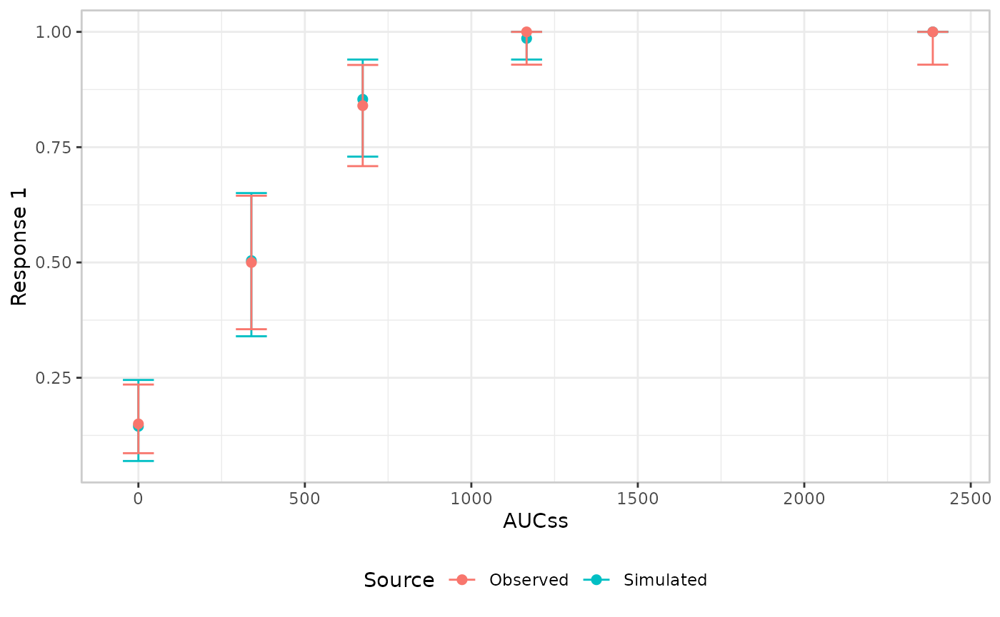

### VPC by continuous covariate

The variable used to bin the data and position the x-axis, `plot_by`,
defaults to the exposure variable, but it doesn’t have to be. Setting it
to a different continuous variable lets you check whether the model’s
predictions track the observed data as *that* variable changes, even
when it isn’t part of the fitted model itself. Here we bin by `weight`
instead of `aucss`, using the same exposure-only model as above:

``` r

erglm_data |> 
  er_vpc(exposure = aucss, response = ae1, plot_by = weight) |>
  er_vpc_add_observed() |>
  er_vpc_add_simulated(model = mod, seed = 1234) |>
  plot()
```

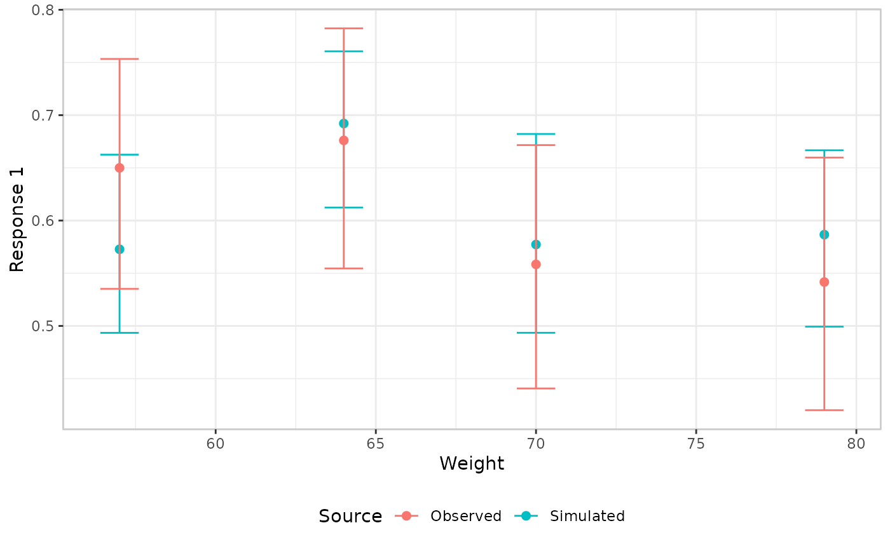

### VPC by discrete covariate

The same idea applies to a categorical `plot_by`: there’s no x-axis
binning to do, since the categories already partition the data, and each
level gets its own position. Here we bin by `sex`, using a model that
actually includes `sex` as a covariate, so the simulated layer’s
predictions can differ between the two groups:

``` r

mod <- erglm_model(ae1 ~ aucss + sex, erglm_data, family = binomial())

erglm_data |> 
  er_vpc(exposure = aucss, response = ae1, plot_by = sex) |>
  er_vpc_add_observed() |>
  er_vpc_add_simulated(model = mod, seed = 1234) |>
  plot()
```

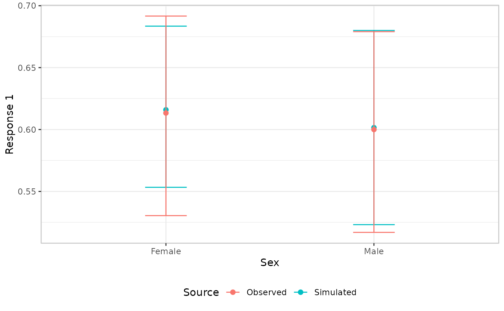

## Stratified panels

`plot_by` changes *what’s binned* along the x-axis; `stratify_by`
instead keeps the x-axis as-is and splits the plot into one facet panel
per level of some other, discrete variable, via
[`ggplot2::facet_wrap()`](https://ggplot2.tidyverse.org/reference/facet_wrap.html).
It’s useful when you want to check the model against a covariate without
giving up the usual exposure-response view. Unlike `plot_by`,
`stratify_by` never changes what’s plotted on the x-axis or how it’s
binned – both
[`er_vpc_add_observed()`](https://erplots.djnavarro.net/reference/er_vpc_add_observed.md)
and
[`er_vpc_add_simulated()`](https://erplots.djnavarro.net/reference/er_vpc_add_simulated.md)
behave exactly as before within each panel.

`stratify_by` must name a discrete/categorical variable, used as-is –
one panel per level. Here we reuse the `ae1 ~ aucss + sex` model from
above, faceting by `sex` while keeping `aucss` on the x-axis:

``` r

erglm_data |> 
  er_vpc(exposure = aucss, response = ae1, stratify_by = sex) |>
  er_vpc_add_observed() |>
  er_vpc_add_simulated(model = mod, seed = 1234) |>
  plot()
```

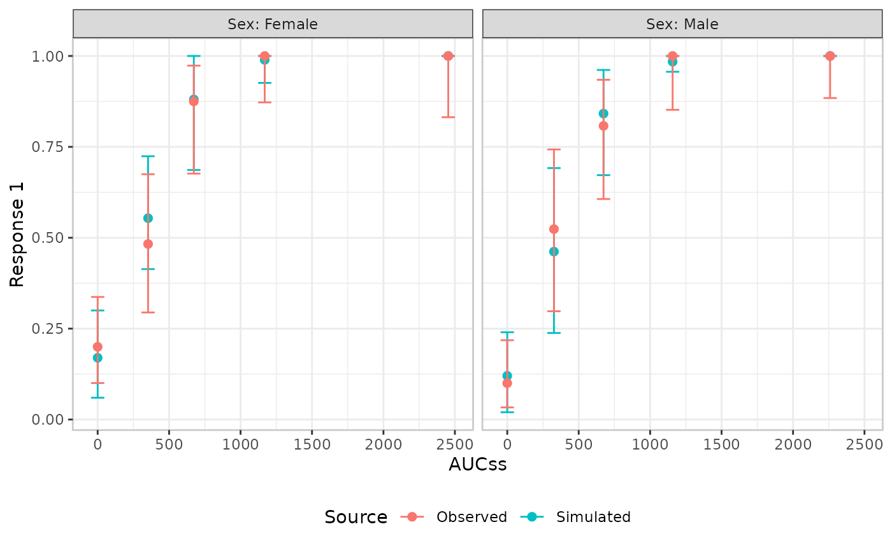

A genuinely continuous covariate, like `weight`, needs binning into
groups first –
[`cut_quantile()`](https://erplots.djnavarro.net/reference/cut_quantile.md)/[`cut_exposure_quantile()`](https://erplots.djnavarro.net/reference/cut_quantile.md)
give full control over bin count, tie-breaking, and labels:

``` r

erglm_data |> 
  transform(weight_grp = cut_quantile(weight, n = 3)) |>
  er_vpc(exposure = aucss, response = ae1, stratify_by = weight_grp) |>
  er_vpc_add_observed() |>
  er_vpc_add_simulated(model = mod, seed = 1234) |>
  plot()
```


`stratify_by` must resolve to a different variable than `plot_by` (which
defaults to the exposure variable) – faceting by the exact variable
already driving the x-axis binning would give each panel a single bin,
so [`er_vpc()`](https://erplots.djnavarro.net/reference/er_vpc.md)
errors rather than allow it.

## Continuous response

A continuous response supports the same mean/errorbar comparison used
above for binary outcomes, but it also supports a genuinely
distributional comparison: checking whether the model reproduces the
*shape* of the response distribution at each exposure level, not just
its mean.

### VPC by exposure

``` r

mod <- emax_nls(
  structural_model = rsp_1 ~ exp_1,
  covariate_model = list(E0 ~ 1, Emax ~ 1, logEC50 ~ 1),
  data = emax_df
)
```

We’ll start by showing the limitations of the default “mean plus
confidence interval” visual style. This is set as the default style for
VPCs because it has the virtue of working regardless of whether the
`plot_by` variable is continuous or discrete, and regardless of whether
the `response` variable is binary, continuous or counts. But as you can
see from the plot below, it’s not the best choice for a continuous
response variable:

``` r

emax_df |> 
  er_vpc(exposure = exp_1, response = rsp_1) |> 
  er_vpc_add_observed() |> 
  er_vpc_add_simulated(model = mod, seed = 1234) |>
  plot()
```


The plot renders correctly, but the only thing it shows is whether the
model can correctly predict the mean response within each bin. Because
of this, it’s almost never the best choice when the `response` is
continuous or count data.

As an alternative, we can switch to a genuinely distributional
comparison: connected lines for several observed quantiles, and shaded
ribbons showing the corresponding simulated quantiles. This style is the
most commonly used approach when VPCs are applied for pharmacokinetic
models, and works well for the exposure-response case with a continuous
response variable:

``` r

emax_df |> 
  er_vpc(
    exposure = exp_1, 
    response = rsp_1, 
    response_type = "continuous"
  ) |> 
  er_vpc_add_observed(style = er_style_vpc_observed_quantile_line) |> 
  er_vpc_add_simulated(
    model = mod, 
    seed = 1234, 
    style = er_style_vpc_simulated_quantile_ribbon
  ) |>
  plot()
```

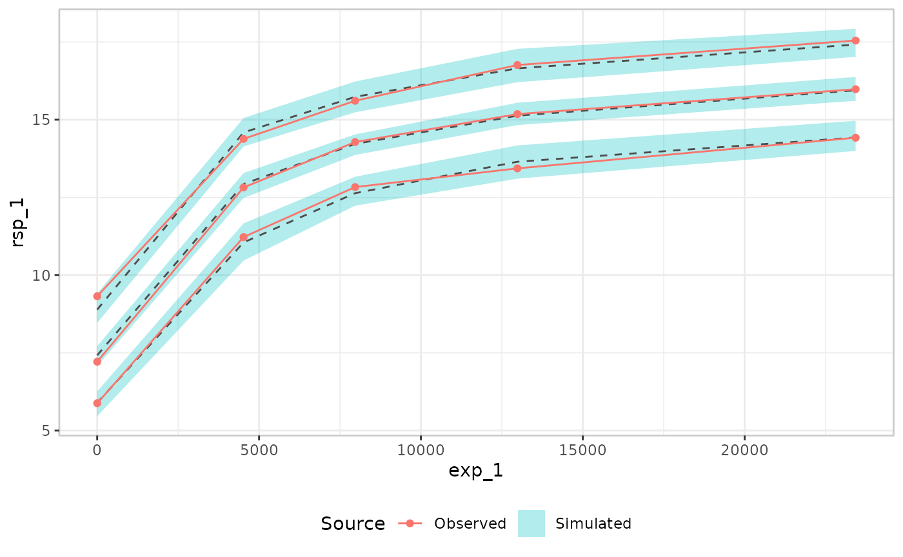

This works well, and is usually the best choice, but one thing that is
missing in this plot is an expression of uncertainty about the observed
quantiles. Sometimes that is useful to have, in which case you can do
something like this, where the
[`ci_quantile()`](https://erplots.djnavarro.net/reference/ci_quantile.md)
function is used under the hood to construct confidence intervals for
observed quantiles:

``` r

emax_df |> 
  er_vpc(
    exposure = exp_1, 
    response = rsp_1, 
    response_type = "continuous"
  ) |> 
  er_vpc_add_observed(style = er_style_vpc_observed_quantile_errorbar) |> 
  er_vpc_add_simulated(
    model = mod, 
    seed = 1234, 
    style = er_style_vpc_simulated_quantile_errorbar
  ) |>
  plot()
```

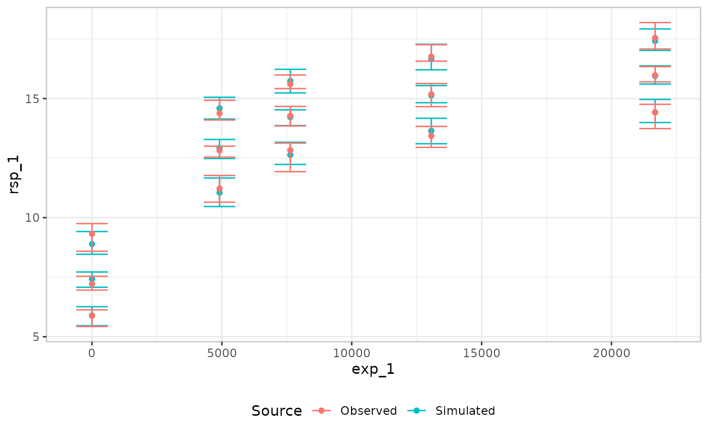

### VPC by continuous covariate

As with the binary case, a continuous `plot_by` doesn’t have to be the
exposure variable. Here the Emax model includes a covariate effect of
`cnt_a` on the baseline parameter `E0`, so we bin on `cnt_a` directly to
check the model’s percentile predictions against it. Here is the VPC
plotted in an errorbar style:

``` r

mod <- emax_nls(
  structural_model = rsp_1 ~ exp_1,
  covariate_model = list(E0 ~ cnt_a, Emax ~ 1, logEC50 ~ 1),
  data = emax_df
)

emax_df |> 
  er_vpc(
    exposure = exp_1, 
    response = rsp_1, 
    response_type = "continuous",
    plot_by = cnt_a
  ) |> 
  er_vpc_add_observed(style = er_style_vpc_observed_quantile_errorbar) |> 
  er_vpc_add_simulated(
    model = mod, 
    seed = 1234, 
    style = er_style_vpc_simulated_quantile_errorbar
  ) |>
  plot()
```


For comparison, the plot below shows the same VPC in the ribbon style.
The two show the same underlying comparison styled differently; which
one to use is mostly a matter of taste (and, as covered below,
legibility):

``` r

emax_df |> 
  er_vpc(
    exposure = exp_1, 
    response = rsp_1, 
    response_type = "continuous",
    plot_by = cnt_a
  ) |> 
  er_vpc_add_observed(style = er_style_vpc_observed_quantile_errorbar) |> 
  er_vpc_add_simulated(
    model = mod, 
    seed = 1234, 
    style = er_style_vpc_simulated_quantile_ribbon
  ) |>
  plot()
```

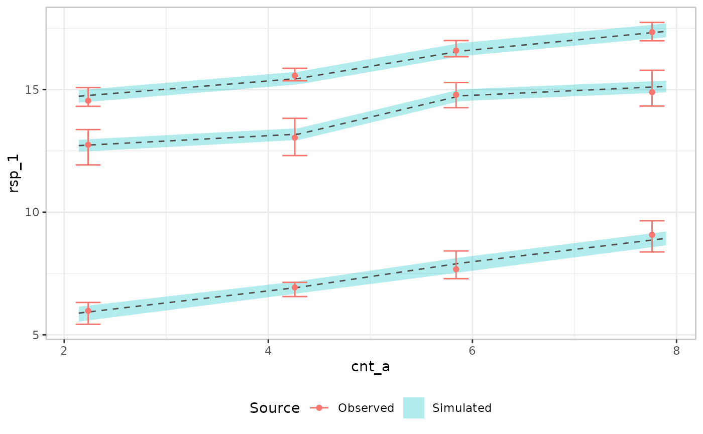

### VPC by discrete covariate

As before, a categorical `plot_by` works with the default mean/errorbar
pair too, this time using a model that includes `sex` as a covariate on
the continuous response:

``` r

mod <- erglm_model(
  biomarker_change ~ aucss + sex, erglm_data, family = gaussian()
)

erglm_data |> 
  er_vpc(exposure = aucss, response = biomarker_change, plot_by = sex) |>
  er_vpc_add_observed() |>
  er_vpc_add_simulated(model = mod, seed = 1234) |>
  plot()
```

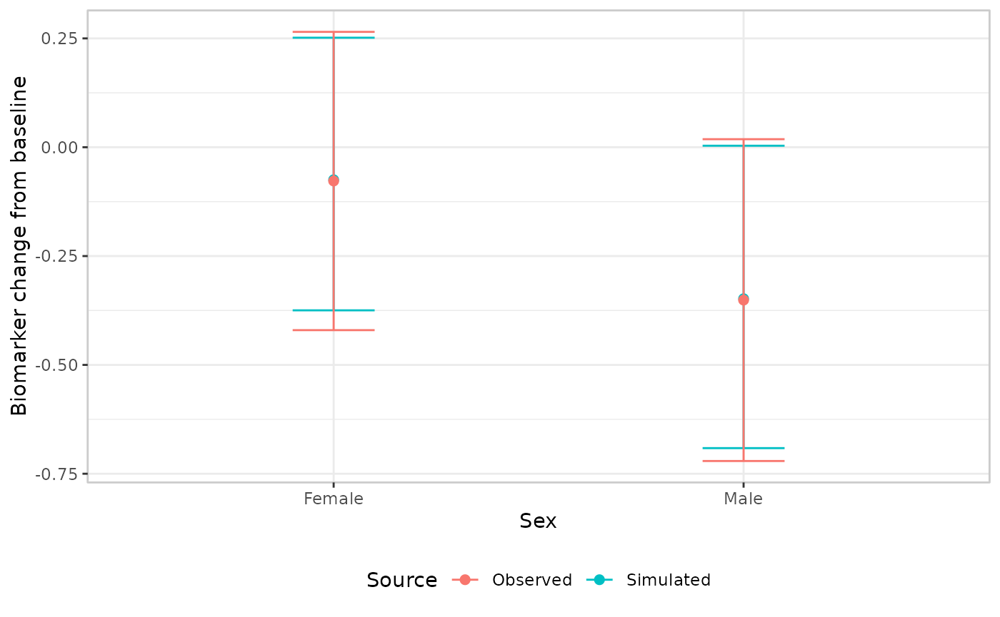

## Theming

[`er_vpc_theme()`](https://erplots.djnavarro.net/reference/er_vpc_theme.md)
adjusts labels, titles, axis limits, and the overall ggplot2 theme,
without changing which variable drives which aesthetic. Every argument
defaults to `NULL` (“leave unchanged”), so repeated calls only touch the
fields they supply:

``` r

mod <- erglm_model(ae1 ~ aucss, erglm_data, family = binomial())

erglm_data |> 
  er_vpc(exposure = aucss, response = ae1) |>
  er_vpc_add_observed() |>
  er_vpc_add_simulated(model = mod, seed = 1234) |>
  er_vpc_theme(
    xlab = "AUC at steady state",
    ylab = "Probability of event",
    title = "Visual predictive check",
    theme_base = ggplot2::theme_minimal()
  ) |>
  plot()
```

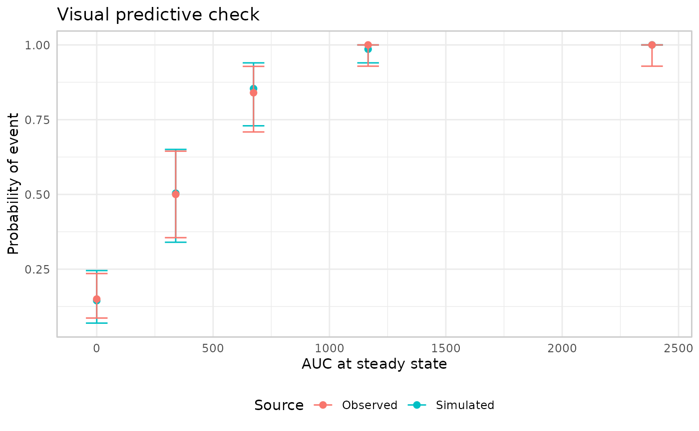

Note that `xlab` labels `plot_by` (the VPC’s actual x-axis variable),
not necessarily `exposure` – the two only coincide when `plot_by` wasn’t
overridden.

`subtitle`/`caption` add further plot-level text, and `strata_lab`
relabels the facet strip prefix for a stratified VPC (errors if
`stratify_by` wasn’t set in
[`er_vpc()`](https://erplots.djnavarro.net/reference/er_vpc.md)):

``` r

mod_strat <- erglm_model(ae1 ~ aucss + sex, erglm_data, family = binomial())

erglm_data |>
  er_vpc(exposure = aucss, response = ae1, stratify_by = sex) |>
  er_vpc_add_observed() |>
  er_vpc_add_simulated(model = mod_strat, seed = 1234) |>
  er_vpc_theme(
    strata_lab = "Sex",
    subtitle = "Binary response",
    caption = "Source: erglm_data"
  ) |>
  plot()
```

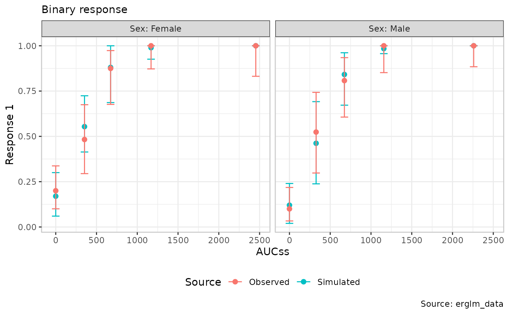

`xlim`/`ylim` override the axis limits
[`er_vpc()`](https://erplots.djnavarro.net/reference/er_vpc.md)
otherwise computes automatically from the data, applied via
`ggplot2::coord_cartesian(clip = "off")`:

``` r

erglm_data |>
  er_vpc(exposure = aucss, response = ae1) |>
  er_vpc_add_observed() |>
  er_vpc_add_simulated(model = mod, seed = 1234) |>
  er_vpc_theme(xlim = c(-100, 3000), ylim = c(-0.05, 1.05)) |>
  plot()
```

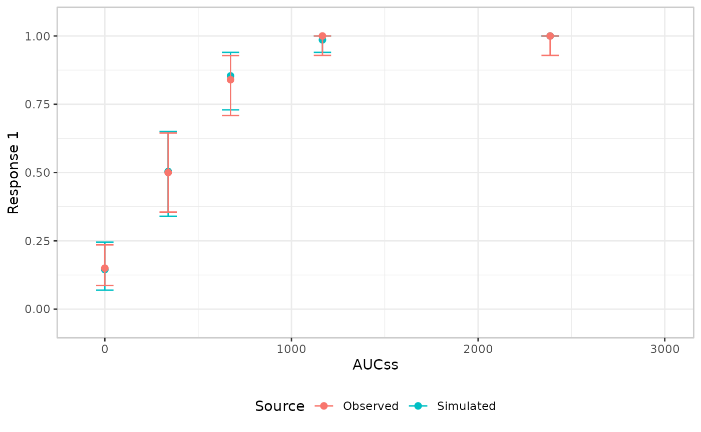

Narrowing the limits far enough to clip an actual marker produces a
warning naming which bins were hidden, rather than silently dropping
them – the bin’s own summary statistic is still computed from every
observation in it either way, only its plotted position is affected.

[`er_vpc_theme()`](https://erplots.djnavarro.net/reference/er_vpc_theme.md)
doesn’t cover everything. There’s no argument for the observed/simulated
colour scale, for instance, since it’s fixed to keep the two aligned
across builders that mix colour and fill for the same distinction.
`format_percent`/`format_number` are accepted and stored, intended to
format the rate/mean value attached to each bin’s summary
(`config$summary$y_mid_lbl`), but no built-in VPC style currently draws
that label on the plot – they’re there for a custom `style` builder to
read (see [Extending
erplots](https://erplots.djnavarro.net/articles/extending.md)), not for
a visible effect on any of the built-in idioms shown in this article.
For anything else not covered,
`+ ggplot2::theme(...)`/`+ ggplot2::labs(...)` on the object returned by
[`plot()`](https://rdrr.io/r/graphics/plot.default.html) remains the
general-purpose escape hatch.

## Troubleshooting plot legibility

A persistent problem when creating VPC plots is cleaning up an illegible
plot. To an extent, this problem is unavoidable: VPC plots attempt to
display a *lot* of information in a single image, and it has a tendency
to make them difficult to read. Because the specific pattern of
illegibility tends to vary from plot to plot, it is almost impossible to
build in an automated fix to this problem. Instead of attempting an
automated fix that will very likely not work, the
[`er_vpc()`](https://erplots.djnavarro.net/reference/er_vpc.md)
mini-grammar exposes some customisation tools that you can use to clean
up a VPC plot that doesn’t look very nice. In this section, we outline
some of the options that you have.

``` r

mod <- emax_nls(
  structural_model = rsp_1 ~ exp_1,
  covariate_model = list(E0 ~ 1, Emax ~ 1, logEC50 ~ 1),
  data = emax_df
)
```

### Errorbar collisions

We’ll start by creating a deliberately terrible VPC plot, using the Emax
regression in the `mod` object. Suppose that, for one reason or another,
you have been asked to show *five* quantiles for this model rather than
the usual three. This is rarely a good idea because it leads to terrible
crowding in the plot. Here’s what happens if we do this, using errorbar
styling for both the observed data and the model simulations:

``` r

emax_df |>
  er_vpc(
    exposure = exp_1,
    response = rsp_1,
    response_type = "continuous",
    n_bins = 5,
    probs = c(0.1, 0.3, 0.5, 0.7, 0.9)
  ) |>
  er_vpc_add_observed(style = er_style_vpc_observed_quantile_errorbar) |>
  er_vpc_add_simulated(
    model = mod,
    seed = 1234,
    style = er_style_vpc_simulated_quantile_errorbar
  ) |>
  plot()
```

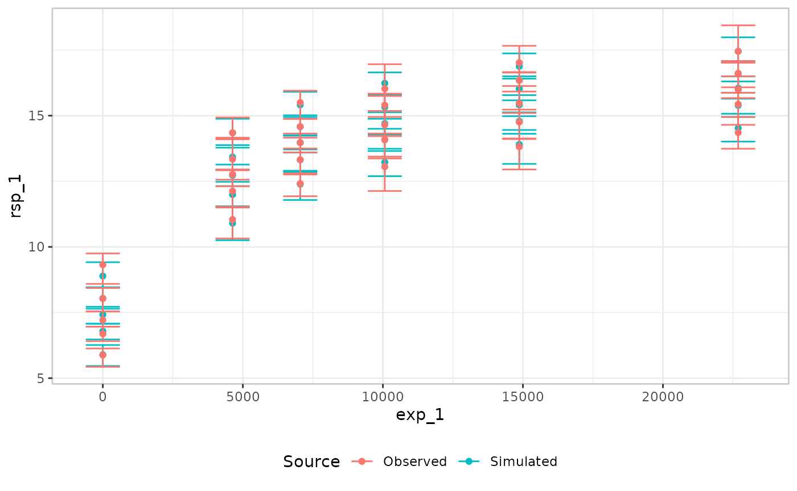

There’s no simple fix for this: in this plot we have unpleasant
collisions between the observed and simulated layers, *and* between the
five individual `probs` within each layer. However, you do have some
options. Assuming for the sake of this vignette that you really do need
all five quantiles, and for the moment assuming that both the simulated
and observed layers must be displayed in an errorbar style, there are
three arguments we can tinker with to improve legibility:

- `dodge` shifts a whole builder’s error bars sideways – pair an equal
  and opposite `dodge` on the observed and simulated builders to pull
  the two layers apart.
- `prob_dodge_width` spreads a single builder’s own `probs` apart,
  symmetrically around the bin’s true position.
- `errorbar_width` narrows or widens the error bars themselves, giving
  the eye more room to separate bars that remain close together after
  dodging

``` r

emax_df |>
  er_vpc(
    exposure = exp_1,
    response = rsp_1,
    response_type = "continuous",
    n_bins = 5,
    probs = c(0.1, 0.3, 0.5, 0.7, 0.9)
  ) |>
  er_vpc_add_observed(
    style = er_style_vpc_observed_quantile_errorbar,
    dodge = -0.005, 
    prob_dodge_width = 0.005,
    errorbar_width = 0.0025
  ) |>
  er_vpc_add_simulated(
    model = mod,
    seed = 1234,
    style = er_style_vpc_simulated_quantile_errorbar,
    dodge = 0.005, 
    prob_dodge_width = 0.005,
    errorbar_width = 0.0025
  ) |>
  plot()
```

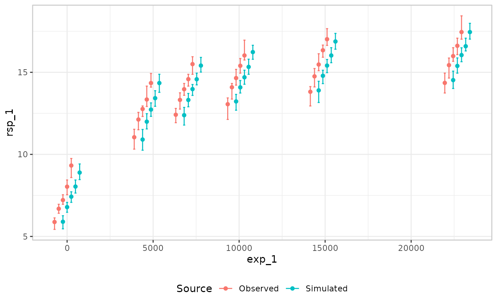

It takes a little bit of trial and error to find values that work in any
specific case (and it does help to take a close look at the
documentation to see how the different arguments are interpreted), but
nevertheless this is a substantial improvement. It is not perfect, but
it works reasonably well.

### Ribbon collisions

A different kind of legibility issue arises when ribbons are used to
display confidence intervals. As before, we’ll illustrate this using the
extreme case when five quantiles are being displayed. A common visual
style used for VPC plots is to use connected lines for the observed
quantiles, and then ribbons to show model predictions and uncertainty at
each quantile. In this case, however, the confidence bands are so
closely packed together that they blend together visually and it is
impossible to tell where the boundaries are:

``` r

emax_df |>
  er_vpc(
    exposure = exp_1,
    response = rsp_1,
    response_type = "continuous",
    n_bins = 5,
    probs = c(0.1, 0.3, 0.5, 0.7, 0.9)
  ) |>
  er_vpc_add_observed(style = er_style_vpc_observed_quantile_line) |>
  er_vpc_add_simulated(
    model = mod,
    seed = 1234,
    style = er_style_vpc_simulated_quantile_ribbon
  ) |>
  plot()
```

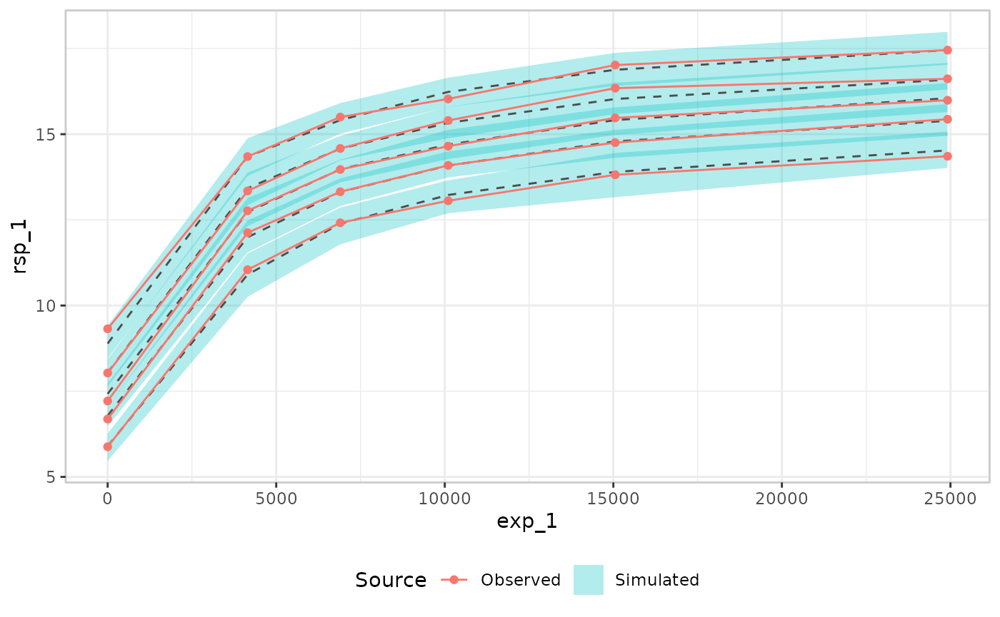

Sometimes you can improve legibility in this case by placing more
emphasis on the edges of the bands, and reducing the salience of the
band shading. The code below illustrates this, and it helps somewhat,
but the plot is still difficult to read:

``` r

emax_df |>
  er_vpc(
    exposure = exp_1,
    response = rsp_1,
    response_type = "continuous",
    n_bins = 5,
    probs = c(0.1, 0.3, 0.5, 0.7, 0.9)
  ) |>
  er_vpc_add_observed(style = er_style_vpc_observed_quantile_line) |>
  er_vpc_add_simulated(
    model = mod,
    seed = 1234,
    style = er_style_vpc_simulated_quantile_ribbon,
    ribbon_alpha = 0.1,
    ribbon_edges = TRUE
  ) |>
  plot()
```

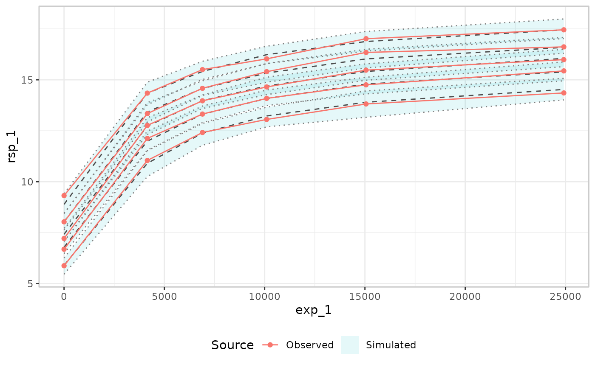

Ultimately, in this situation the most likely resolution is that you
would have to revert from five quantile bands to the usual three:

``` r

emax_df |>
  er_vpc(
    exposure = exp_1,
    response = rsp_1,
    response_type = "continuous",
    n_bins = 5,
    probs = c(0.1, 0.5, 0.9)
  ) |>
  er_vpc_add_observed(style = er_style_vpc_observed_quantile_line) |>
  er_vpc_add_simulated(
    model = mod,
    seed = 1234,
    style = er_style_vpc_simulated_quantile_ribbon,
    ribbon_alpha = 0.2,
    ribbon_edges = TRUE
  ) |>
  plot()
```

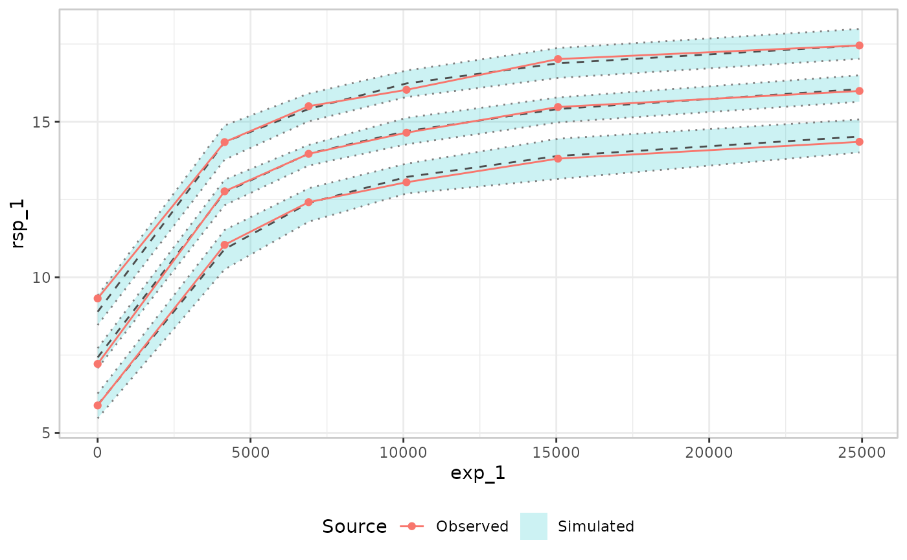

Some of the distributional information is lost, but overall the plot is
a lot easier to understand.
