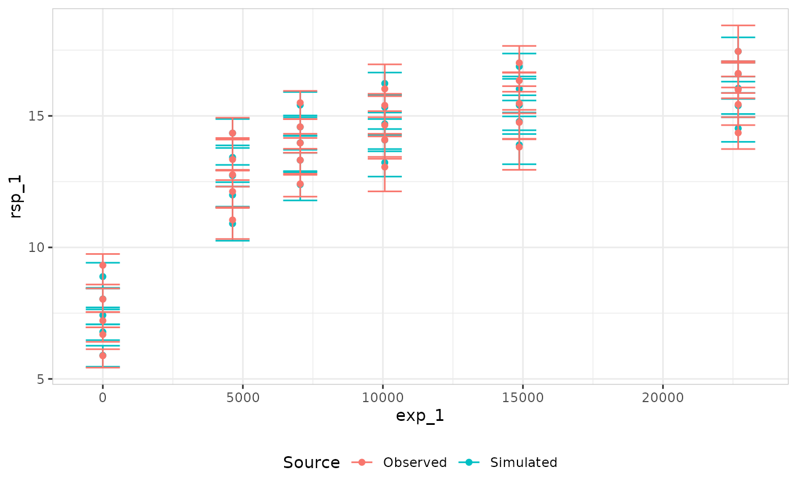
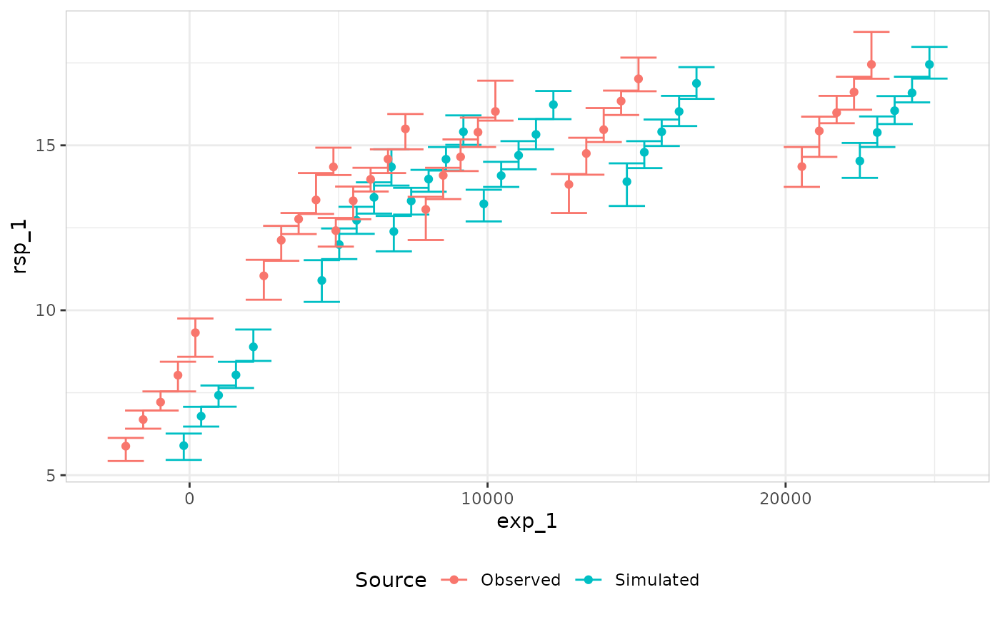

# Visual predictive checks

``` r

library(erplots)
library(emaxnls)
library(erglm)
```

The mini-grammar for VPC plots is considerably simpler than the one for
exposure-response plots.

## Binary response

### By exposure

``` r

mod <- erglm_model(ae1 ~ aucss, erglm_data, family = binomial())
```

The default approach for binary outcomes is to bin the exposure variable
by quartiles, and then show the confidence interval for the response
rate for both observed and simulated:

``` r

erglm_data |> 
  er_vpc(exposure = aucss, response = ae1) |>
  er_vpc_add_observed() |>
  er_vpc_add_simulated(model = mod, seed = 1234) |>
  plot()
```


### By continuous covariate

Continuous `plot_by` does not have to be the same as the exposure
variable:

``` r

erglm_data |> 
  er_vpc(exposure = aucss, response = ae1, plot_by = weight) |>
  er_vpc_add_observed() |>
  er_vpc_add_simulated(model = mod, seed = 1234) |>
  plot()
```


### By discrete covariate

``` r

mod <- erglm_model(ae1 ~ aucss + sex, erglm_data, family = binomial())

erglm_data |> 
  er_vpc(exposure = aucss, response = ae1, plot_by = sex) |>
  er_vpc_add_observed() |>
  er_vpc_add_simulated(model = mod, seed = 1234) |>
  plot()
```


## Continuous response

### By exposure

``` r

mod <- emax_nls(
  structural_model = rsp_1 ~ exp_1,
  covariate_model = list(E0 ~ 1, Emax ~ 1, logEC50 ~ 1),
  data = emax_df
)
```

For continuous outcomes, more options are available. It is possible to
adopt the same approach as we did for binary outcomes, and it does work:

``` r

emax_df |> 
  er_vpc(exposure = exp_1, response = rsp_1) |> 
  er_vpc_add_observed() |> 
  er_vpc_add_simulated(model = mod, seed = 1234) |>
  plot()
```


However, this approach only considers whether the model is correctly
predicting the mean response within each bin.

As an alternative, we can switch to a distributional approach:

``` r

emax_df |> 
  er_vpc(
    exposure = exp_1, 
    response = rsp_1, 
    response_type = "continuous"
  ) |> 
  er_vpc_add_observed(style = er_style_vpc_observed_quantile_line) |> 
  er_vpc_add_simulated(
    model = mod, 
    seed = 1234, 
    style = er_style_vpc_simulated_quantile_ribbon
  ) |>
  plot()
```


For more detailed examination, it is also possible to display
nonparametric confidence intervals for the observed data quantiles,
plotted (like the default mean/errorbar pair) at each bin’s numeric
median on the exposure scale.

``` r

emax_df |> 
  er_vpc(
    exposure = exp_1, 
    response = rsp_1, 
    response_type = "continuous"
  ) |> 
  er_vpc_add_observed(style = er_style_vpc_observed_quantile_errorbar) |> 
  er_vpc_add_simulated(
    model = mod, 
    seed = 1234, 
    style = er_style_vpc_simulated_quantile_errorbar
  ) |>
  plot()
```


### By continuous covariate

Continuous `plot_by` variables can be something other than the exposure:

``` r

mod <- emax_nls(
  structural_model = rsp_1 ~ exp_1,
  covariate_model = list(E0 ~ cnt_a, Emax ~ 1, logEC50 ~ 1),
  data = emax_df
)

emax_df |> 
  er_vpc(
    exposure = exp_1, 
    response = rsp_1, 
    response_type = "continuous",
    plot_by = cnt_a
  ) |> 
  er_vpc_add_observed(style = er_style_vpc_observed_quantile_errorbar) |> 
  er_vpc_add_simulated(
    model = mod, 
    seed = 1234, 
    style = er_style_vpc_simulated_quantile_errorbar
  ) |>
  plot()
```


``` r


emax_df |> 
  er_vpc(
    exposure = exp_1, 
    response = rsp_1, 
    response_type = "continuous",
    plot_by = cnt_a
  ) |> 
  er_vpc_add_observed(style = er_style_vpc_observed_quantile_errorbar) |> 
  er_vpc_add_simulated(
    model = mod, 
    seed = 1234, 
    style = er_style_vpc_simulated_quantile_ribbon
  ) |>
  plot()
```


### By discrete covariate

``` r

mod <- erglm_model(
  biomarker_change ~ aucss + sex, erglm_data, family = gaussian()
)

erglm_data |> 
  er_vpc(exposure = aucss, response = biomarker_change, plot_by = sex) |>
  er_vpc_add_observed() |>
  er_vpc_add_simulated(model = mod, seed = 1234) |>
  plot()
```


## Troubleshooting: overlapping quantile bands

The quantile idioms
(`er_style_vpc_*_quantile_line()`/`_ribbon()`/`_errorbar()`) plot
several `probs` at once, and none of them use anything besides
y-position to tell those percentiles apart. When the underlying bands
sit close together – a small sample per bin, few simulated replicates,
or several `probs` requested close to one another – this can make a plot
illegible. The `_errorbar()` idiom is the most exposed to this: it plots
every requested percentile at the *same* x-position within a bin, so
pairing
[`er_style_vpc_observed_quantile_errorbar()`](https://erplots.djnavarro.net/reference/er_style_vpc_observed.md)
with
[`er_style_vpc_simulated_quantile_errorbar()`](https://erplots.djnavarro.net/reference/er_style_vpc_simulated.md)
can stack up to `2 * length(probs)` error bars on top of one another.
Here it is with five requested percentiles:

``` r

mod <- emax_nls(
  structural_model = rsp_1 ~ exp_1,
  covariate_model = list(E0 ~ 1, Emax ~ 1, logEC50 ~ 1),
  data = emax_df
)

emax_df |>
  er_vpc(
    exposure = exp_1,
    response = rsp_1,
    response_type = "continuous",
    n_bins = 5,
    probs = c(0.1, 0.3, 0.5, 0.7, 0.9)
  ) |>
  er_vpc_add_observed(style = er_style_vpc_observed_quantile_errorbar) |>
  er_vpc_add_simulated(
    model = mod,
    seed = 1234,
    style = er_style_vpc_simulated_quantile_errorbar
  ) |>
  plot()
```



There’s no automatic fix for this: whether the collision is between the
observed and simulated layers, between the individual `probs` within one
layer, or both at once depends entirely on the data at hand, so any
heuristic dodge would risk distorting some plots it wasn’t meant to
touch. Instead, both `_errorbar()` builders take two manual, opt-in
arguments (default `0`, reproducing the layout above) for a numeric
`plot_by`:

- `dodge` shifts a whole builder’s error bars sideways – pair an equal
  and opposite `dodge` on the observed and simulated builders to pull
  the two layers apart.
- `prob_dodge_width` spreads a single builder’s own `probs` apart,
  symmetrically around the bin’s true position.

``` r

emax_df |>
  er_vpc(
    exposure = exp_1,
    response = rsp_1,
    response_type = "continuous",
    n_bins = 5,
    probs = c(0.1, 0.3, 0.5, 0.7, 0.9)
  ) |>
  er_vpc_add_observed(
    style = er_style_vpc_observed_quantile_errorbar,
    dodge = -0.02, prob_dodge_width = 0.012
  ) |>
  er_vpc_add_simulated(
    model = mod,
    seed = 1234,
    style = er_style_vpc_simulated_quantile_errorbar,
    dodge = 0.02, prob_dodge_width = 0.012
  ) |>
  plot()
```



Both arguments are expressed as a fraction of `plot_by`’s own range
(like `errorbar_width_continuous`), so the same value scales sensibly
across datasets; picking a good value is inherently a bit of trial and
error, since it depends on how many bins/`probs` are requested and how
spread out the data is. Neither argument is supported for a categorical
`plot_by` yet – there, adjacent bins are already spaced apart, so this
kind of collision is confined to the `probs`-within-a-bin case, which
currently has no dodge option (a nonzero `dodge`/`prob_dodge_width` is
ignored with a warning rather than silently distorting the categorical
axis).

The ribbon/line idiom has the same underlying problem – overlapping
bands merge into a single shaded region, and the identically-styled
median lines become the only (unreliable) way to tell them apart – but a
different fix:
`er_style_vpc_simulated_quantile_ribbon(ribbon_edges = TRUE)` draws each
band’s own bounds as a line, which stays traceable across the plot even
where the fills themselves overlap into an indistinguishable blob.
