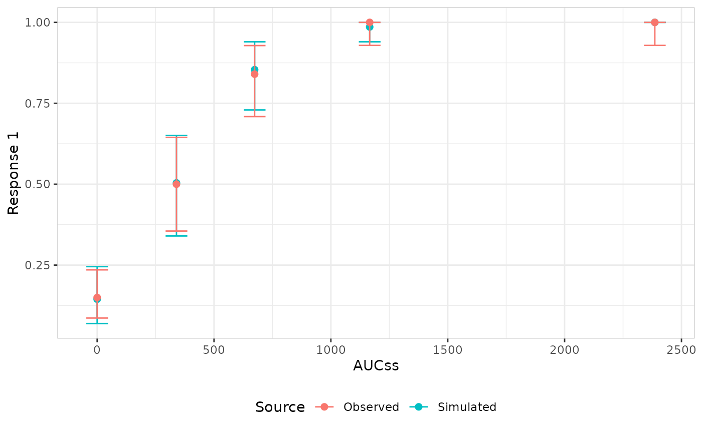
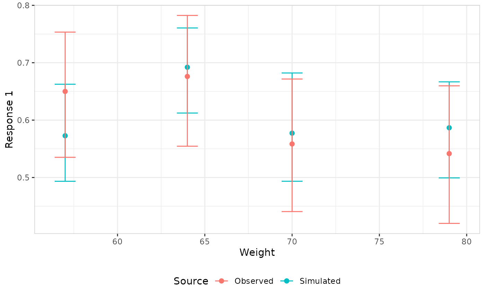
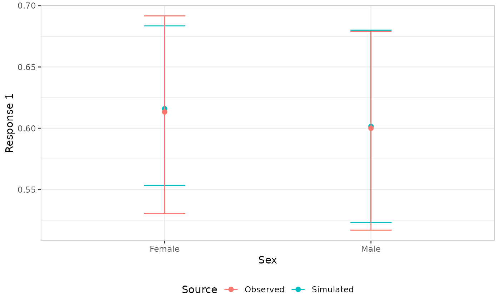
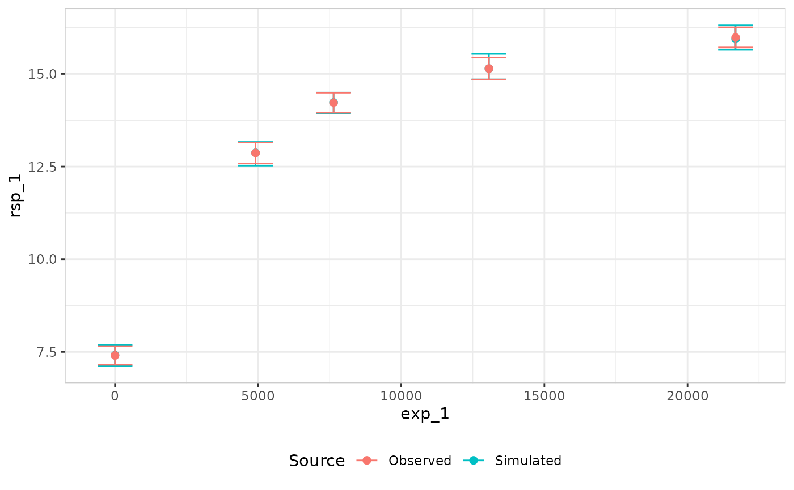
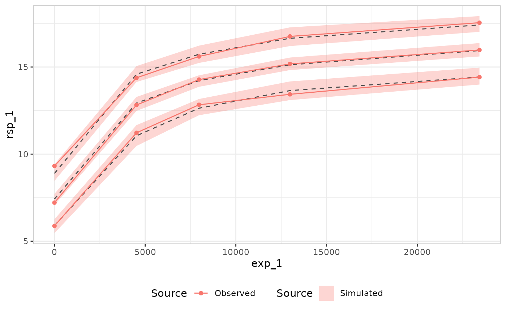
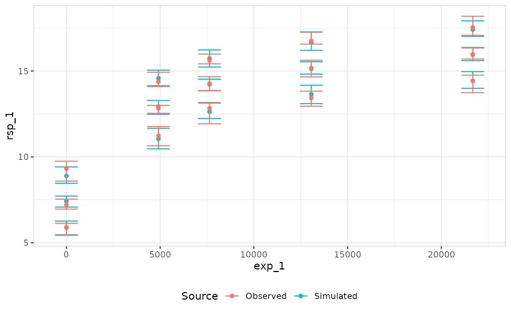
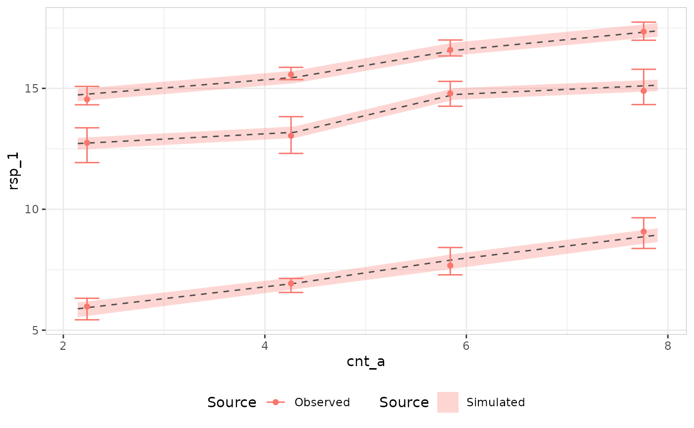

# Visual predictive checks

``` r

library(erplots)
library(emaxnls)
library(erglm)
```

The mini-grammar for VPC plots is considerably simpler than the one for
exposure-response plots.

## Binary response

### By exposure

``` r

mod <- erglm_model(ae1 ~ aucss, erglm_data, family = binomial())
```

The default approach for binary outcomes is to bin the exposure variable
by quartiles, and then show the confidence interval for the response
rate for both observed and simulated:

``` r

erglm_data |> 
  er_vpc(exposure = aucss, response = ae1) |>
  er_vpc_add_observed() |>
  er_vpc_add_simulated(model = mod, seed = 1234) |>
  plot()
```



In this approach, the quantiles are displayed as discrete categories,
and not plotted at the median exposure associated with the bin.

### By continuous covariate

Continuous `plot_by` does not have to be the same as the exposure
variable:

``` r

erglm_data |> 
  er_vpc(exposure = aucss, response = ae1, plot_by = weight) |>
  er_vpc_add_observed() |>
  er_vpc_add_simulated(model = mod, seed = 1234) |>
  plot()
```



### By discrete covariate

``` r

mod <- erglm_model(ae1 ~ aucss + sex, erglm_data, family = binomial())

erglm_data |> 
  er_vpc(exposure = aucss, response = ae1, plot_by = sex) |>
  er_vpc_add_observed() |>
  er_vpc_add_simulated(model = mod, seed = 1234) |>
  plot()
```



## Continuous response

### By exposure

``` r

mod <- emax_nls(
  structural_model = rsp_1 ~ exp_1,
  covariate_model = list(E0 ~ 1, Emax ~ 1, logEC50 ~ 1),
  data = emax_df
)
```

For continuous outcomes, more options are available. It is possible to
adopt the same approach as we did for binary outcomes, and it does work:

``` r

emax_df |> 
  er_vpc(exposure = exp_1, response = rsp_1) |> 
  er_vpc_add_observed() |> 
  er_vpc_add_simulated(model = mod, seed = 1234) |>
  plot()
```



However, this approach only considers whether the model is correctly
predicting the mean response within each bin.

As an alternative, we can switch to a distributional approach:

``` r

emax_df |> 
  er_vpc(
    exposure = exp_1, 
    response = rsp_1, 
    response_type = "continuous"
  ) |> 
  er_vpc_add_observed(style = er_style_vpc_observed_quantile_line) |> 
  er_vpc_add_simulated(
    model = mod, 
    seed = 1234, 
    style = er_style_vpc_simulated_quantile_ribbon
  ) |>
  plot()
```



For more detailed examination, it is also possible to display
nonparametric confidence intervals for the observed data quantiles,
plotted (like the default mean/errorbar pair) at each bin’s numeric
median on the exposure scale. (Note: when more than one percentile is
requested, they are currently plotted at the same x-position within a
bin rather than dodged apart – dodging support for this idiom is
deferred to a future release.)

``` r

emax_df |> 
  er_vpc(
    exposure = exp_1, 
    response = rsp_1, 
    response_type = "continuous"
  ) |> 
  er_vpc_add_observed(style = er_style_vpc_observed_quantile_errorbar) |> 
  er_vpc_add_simulated(
    model = mod, 
    seed = 1234, 
    style = er_style_vpc_simulated_quantile_errorbar
  ) |>
  plot()
```



### By continuous covariate

Continuous `plot_by` variables can be something other than the exposure:

``` r

mod <- emax_nls(
  structural_model = rsp_1 ~ exp_1,
  covariate_model = list(E0 ~ cnt_a, Emax ~ 1, logEC50 ~ 1),
  data = emax_df
)

emax_df |> 
  er_vpc(
    exposure = exp_1, 
    response = rsp_1, 
    response_type = "continuous",
    plot_by = cnt_a
  ) |> 
  er_vpc_add_observed(style = er_style_vpc_observed_quantile_errorbar) |> 
  er_vpc_add_simulated(
    model = mod, 
    seed = 1234, 
    style = er_style_vpc_simulated_quantile_errorbar
  ) |>
  plot()
```


``` r


emax_df |> 
  er_vpc(
    exposure = exp_1, 
    response = rsp_1, 
    response_type = "continuous",
    plot_by = cnt_a
  ) |> 
  er_vpc_add_observed(style = er_style_vpc_observed_quantile_errorbar) |> 
  er_vpc_add_simulated(
    model = mod, 
    seed = 1234, 
    style = er_style_vpc_simulated_quantile_ribbon
  ) |>
  plot()
```



### By discrete covariate

``` r

mod <- erglm_model(
  biomarker_change ~ aucss + sex, erglm_data, family = gaussian()
)

erglm_data |> 
  er_vpc(exposure = aucss, response = biomarker_change, plot_by = sex) |>
  er_vpc_add_observed() |>
  er_vpc_add_simulated(model = mod, seed = 1234) |>
  plot()
```


