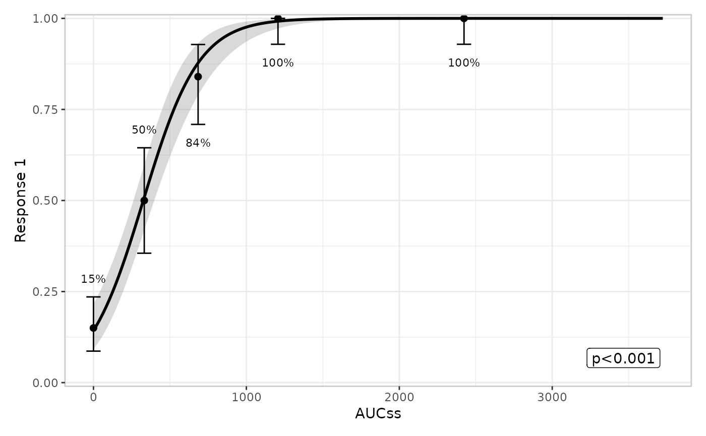
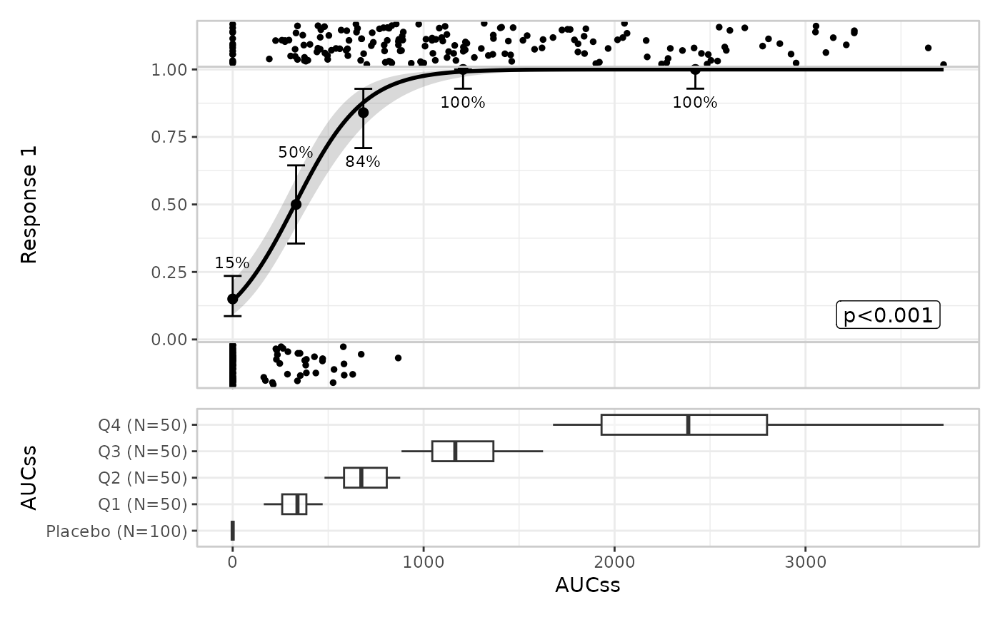
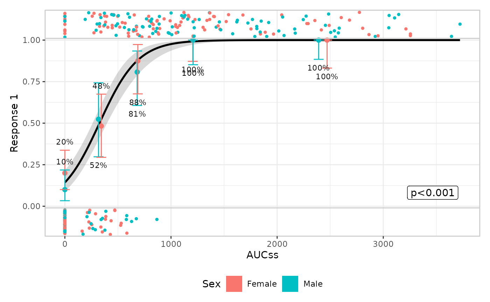
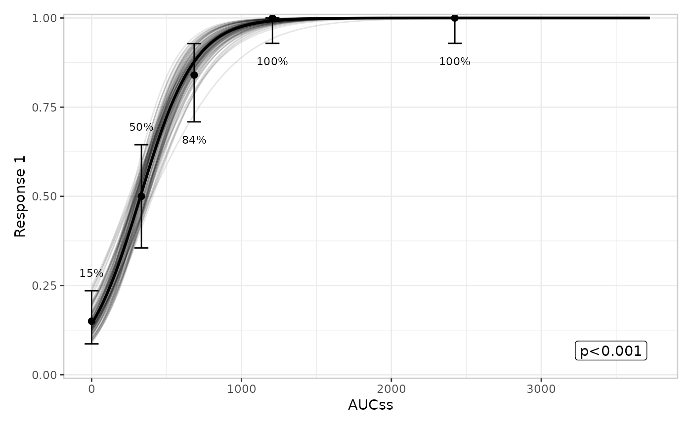
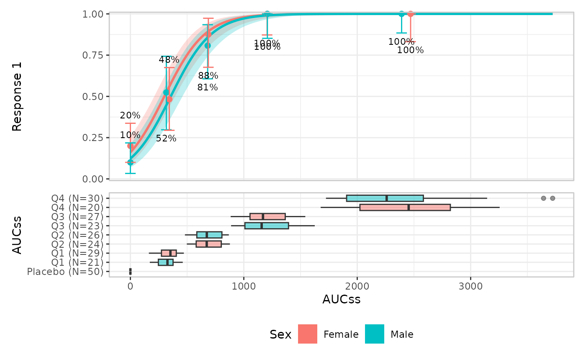
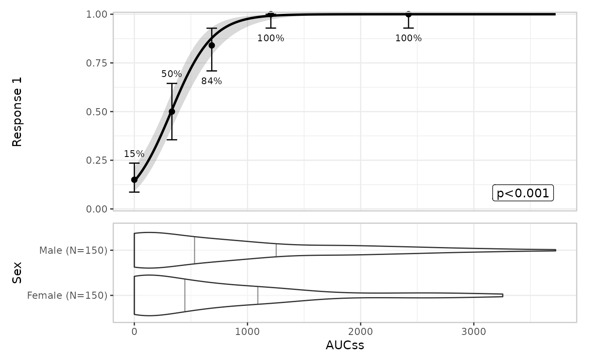

# Plotting

erplots draws exposure-response plots from *any* model that implements
the \[er_model_interface\]. This article uses logistic regression models
fitted with erglm, but the plotting code itself has no knowledge of
[`glm()`](https://rdrr.io/r/stats/glm.html).

``` r

library(erplots)
library(erglm)
```

## Fit the model first

Unlike a plotting function that fits a model behind the scenes, erplots
expects you to fit the model yourself and pass it in explicitly:

``` r

mod <- erglm_model(ae1 ~ aucss, erglm_data, family = binomial())
```

## Defining plots

Basic usage

``` r

erglm_data |> 
  er_plot(exposure = aucss, response = ae1) |> 
  er_plot_show_model(mod) |> 
  er_plot_show_quantiles() |> 
  plot()
```



Adding extra components

``` r

erglm_data |> 
  er_plot(exposure = aucss, response = ae1) |> 
  er_plot_show_model(mod) |> 
  er_plot_show_quantiles() |>
  er_plot_show_datastrip() |>
  er_plot_show_groups(group_by = aucss) |> 
  plot()
```



## Stratification

Stratification adds colour across all components. This requires a model
that includes the stratification variable as a term:

``` r

mod_strat <- erglm_model(ae1 ~ aucss + sex, erglm_data, family = binomial())

erglm_data |> 
  er_plot(
    exposure = aucss, 
    response = ae1, 
    stratify_by = sex
  ) |> 
  er_plot_show_model(mod_strat) |> 
  er_plot_show_quantiles() |> 
  er_plot_show_datastrip() |>
  plot()
```


You can suppress stratification for specific components

``` r

erglm_data |> 
  er_plot(
    exposure = aucss, 
    response = ae1, 
    stratify_by = sex
  ) |> 
  # keep_strata = FALSE needs a model that doesn't include the
  # stratification variable, so we pass the un-stratified `mod` here
  er_plot_show_model(mod, keep_strata = FALSE) |> 
  er_plot_show_quantiles() |> 
  er_plot_show_datastrip() |>
  plot()
```



## Model component

Default is `style = "ribbonline"` but you can also draw spaghetti plots
to represent parameter uncertainty. Spaghetti plots require the model to
implement
[`er_simulate()`](https://erplots.djnavarro.net/reference/er_model_interface.md)
(erglm’s models do); models that only implement
[`er_predict()`](https://erplots.djnavarro.net/reference/er_model_interface.md)
fall back to `"ribbonline"` with a message.

``` r

erglm_data |> 
  er_plot(aucss, ae1) |> 
  er_plot_show_model(mod, style = "spaghetti") |> 
  er_plot_show_quantiles() |> 
  plot()
#> Using seed = 4371
#> Warning in ggplot2::geom_path(data = sim, mapping = ggplot2::aes(x =
#> .data[[exposure$name]], : Ignoring unknown parameters: `fill`
```



## Quantile component

You can modify the number of bins:

``` r

erglm_data |> 
  er_plot(aucss, ae1) |> 
  er_plot_show_model(mod) |> 
  er_plot_show_quantiles(bins = 6) |> 
  plot()
```


You can also modify the confidence level for the Clopper-Pearson
interval (this empirical-summary layer currently assumes a binary
response):

``` r

erglm_data |> 
  er_plot(aucss, ae1) |> 
  er_plot_show_model(mod) |> 
  er_plot_show_quantiles(bins = 6, conf_level = .8) |> 
  plot()
```


## Strip component

## Group component

Multiple grouping variables are allowed:

``` r

erglm_data |> 
  er_plot(aucss, ae1) |> 
  er_plot_show_model(mod) |> 
  er_plot_show_quantiles() |>
  er_plot_show_groups(group_by = c(aucss, sex)) |> 
  plot()
```


Stratification propagates to the group component:

``` r

erglm_data |> 
  er_plot(aucss, ae1, stratify_by = sex) |> 
  er_plot_show_model(mod_strat) |> 
  er_plot_show_quantiles() |>
  er_plot_show_groups(group_by = aucss) |> 
  plot()
```



The default is `style = "boxplot"` but you can also use violin plots:

``` r

erglm_data |> 
  er_plot(aucss, ae1) |> 
  er_plot_show_model(mod) |> 
  er_plot_show_quantiles() |>
  er_plot_show_groups(group_by = sex, style = "violin") |> 
  plot()
```


