# Theming erplots

The goal of this article is to discuss the
[`er_plot_theme()`](https://erplots.djnavarro.net/reference/er_plot_theme.md)
function, used to control the surface appearance of plots. In contrast
to the `er_plot_add_*()` functions and their associated builder
functions, which can change substantive features of the plot, the role
of
[`er_plot_theme()`](https://erplots.djnavarro.net/reference/er_plot_theme.md)
is to control labels, axis limits, palettes, plot titles, and other
thematic aspects to the plot.

``` r

library(erplots)
library(erglm)

mod <- erglm_model(ae1 ~ aucss, erglm_data, family = binomial())
mod_strat <- erglm_model(ae1 ~ aucss + sex, erglm_data, family = binomial())
mod_gaussian <- erglm_model(biomarker_change ~ aucss, erglm_data, family = gaussian())
```

Every example below reuses the same stratified plot:

``` r

erglm_data |>
  er_plot(aucss, ae1, stratify_by = sex) |>
  er_plot_add_model(mod_strat) |>
  er_plot_add_quantiles() |>
  er_plot_add_data() |>
  plot()
```

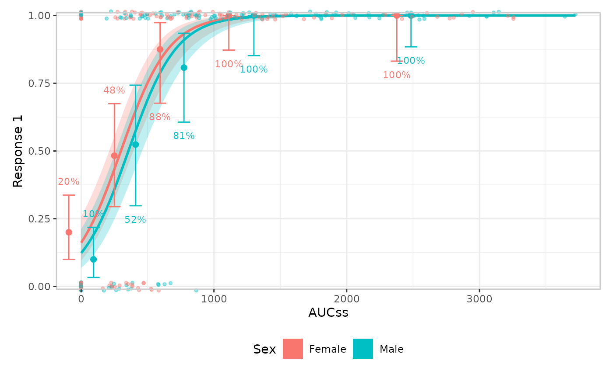

[`er_plot_theme()`](https://erplots.djnavarro.net/reference/er_plot_theme.md)
slots into the same pipeline anywhere after
[`er_plot()`](https://erplots.djnavarro.net/reference/er_plot.md) – its
arguments are read lazily at build time, so it doesn’t matter whether it
comes before or after the layer functions. Every argument defaults to
`NULL`, meaning “leave whatever was set before unchanged”.

## Labels

`xlab`/`ylab` relabel the exposure/response axes; `strata_lab` relabels
the stratification legend (this errors if `stratify_by` wasn’t set in
[`er_plot()`](https://erplots.djnavarro.net/reference/er_plot.md) –
there’s no legend to label):

``` r

erglm_data |>
  er_plot(aucss, ae1, stratify_by = sex) |>
  er_plot_add_model(mod_strat) |>
  er_plot_add_quantiles() |>
  er_plot_add_data() |>
  er_plot_theme(
    xlab = "Steady-state AUC",
    ylab = "Adverse event (1)",
    strata_lab = "Sex"
  ) |>
  plot()
```

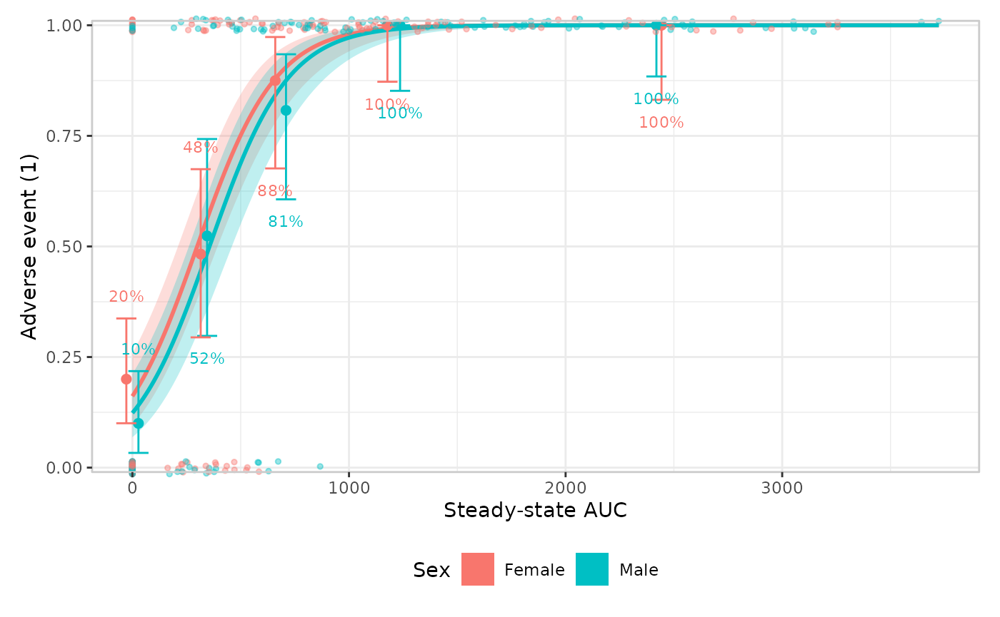

## Plot-level text

`title`/`subtitle`/`caption` add the usual plot-level annotations, via
[`patchwork::plot_annotation()`](https://patchwork.data-imaginist.com/reference/plot_annotation.html):

``` r

erglm_data |>
  er_plot(aucss, ae1, stratify_by = sex) |>
  er_plot_add_model(mod_strat) |>
  er_plot_add_quantiles() |>
  er_plot_add_data() |>
  er_plot_theme(
    title = "Adverse event vs. exposure",
    subtitle = "Stratified by sex",
    caption = "Source: erglm_data"
  ) |>
  plot()
```

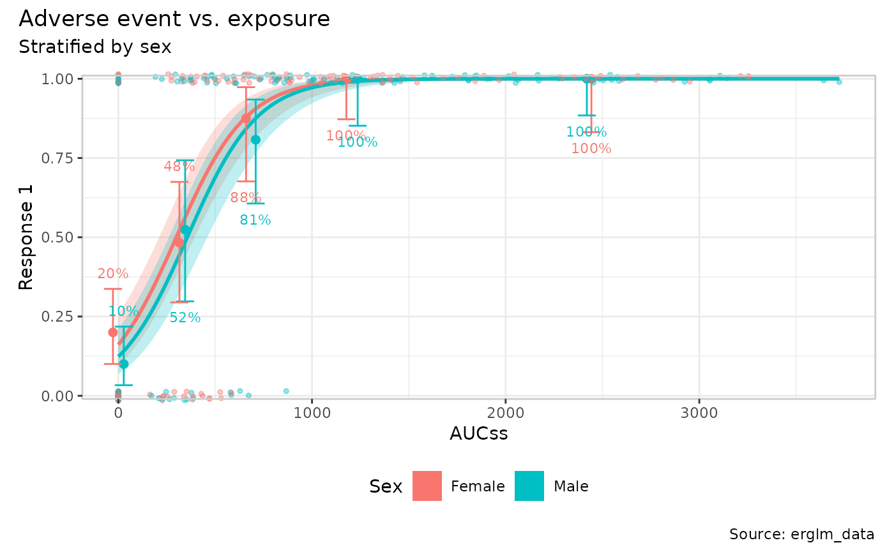

## Axis limits

`xlim`/`ylim` override the exposure/response axis limits that
[`er_plot()`](https://erplots.djnavarro.net/reference/er_plot.md)
otherwise computes automatically from the data:

``` r

erglm_data |>
  er_plot(aucss, ae1, stratify_by = sex) |>
  er_plot_add_model(mod_strat) |>
  er_plot_add_quantiles() |>
  er_plot_add_data() |>
  er_plot_theme(ylim = c(-0.1, 1.1)) |>
  plot()
```

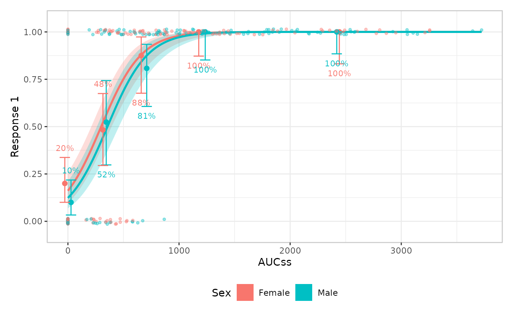

## Visual theme

`theme_base` swaps out the overall ggplot2 theme (default
[`ggplot2::theme_bw()`](https://ggplot2.tidyverse.org/reference/ggtheme.html));
`theme_extra` replaces the small set of additional tweaks erplots
applies on top (by default, a panel border plus
`legend.position = "bottom"`). Supplying `theme_extra` **replaces** that
default rather than adding to it, so re-include anything you want to
keep:

``` r

erglm_data |>
  er_plot(aucss, ae1, stratify_by = sex) |>
  er_plot_add_model(mod_strat) |>
  er_plot_add_quantiles() |>
  er_plot_add_data() |>
  er_plot_theme(
    theme_base = ggplot2::theme_minimal(),
    theme_extra = ggplot2::theme(legend.position = "right")
  ) |>
  plot()
```

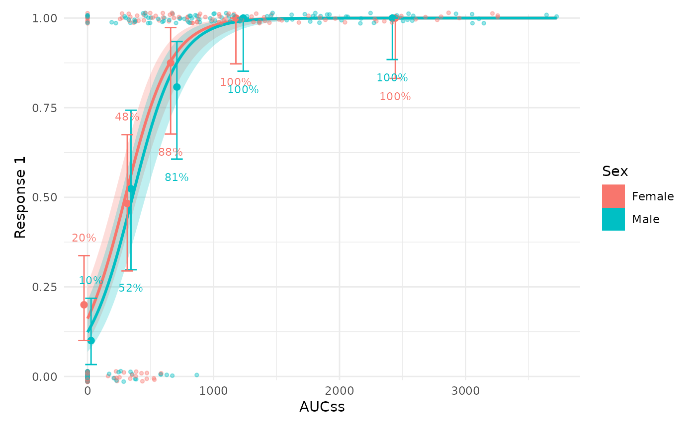

## Discrete color/fill palette

`color_discrete`/`fill_discrete` take a discrete ggplot2 scale object
(e.g. from
[`ggplot2::scale_color_brewer()`](https://ggplot2.tidyverse.org/reference/scale_brewer.html)
or
[`ggplot2::scale_color_viridis_d()`](https://ggplot2.tidyverse.org/reference/scale_viridis.html))
and apply it wherever `colour`/`fill` is genuinely mapped to the
stratification variable:

``` r

erglm_data |>
  er_plot(aucss, ae1, stratify_by = sex) |>
  er_plot_add_model(mod_strat) |>
  er_plot_add_quantiles() |>
  er_plot_add_data() |>
  er_plot_theme(
    color_discrete = ggplot2::scale_color_brewer(palette = "Dark2"),
    fill_discrete = ggplot2::scale_fill_brewer(palette = "Dark2")
  ) |>
  plot()
```

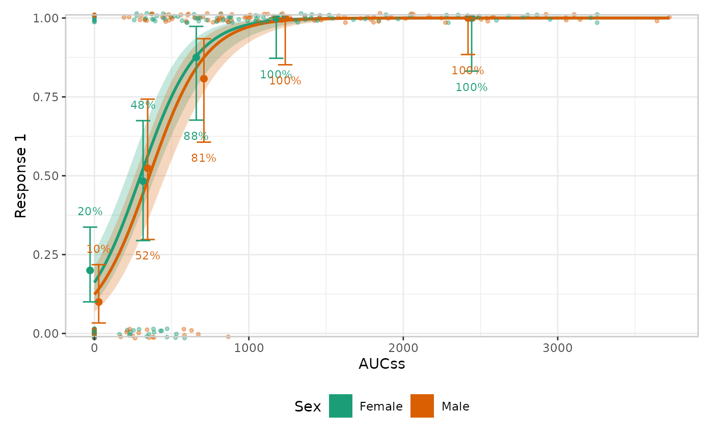

`color_discrete`/`fill_discrete` are left alone wherever `colour`/`fill`
means something other than strata –
e.g. [`er_style_data_hex()`](https://erplots.djnavarro.net/reference/er_style_data.md)’s
density fill, below.

## Stratified quantile spacing

`dodge_width` adjusts the horizontal separation between strata within
each quantile bin. This is a theme-level setting, because it controls
the layout of stratification across the quantile layer rather than the
look of any single builder.

``` r

erglm_data |>
  er_plot(aucss, ae1, stratify_by = sex) |>
  er_plot_add_model(mod_strat) |>
  er_plot_add_quantiles(style = er_style_quantile_errorbar) |>
  er_plot_theme(dodge_width = 0.15) |>
  plot()
```

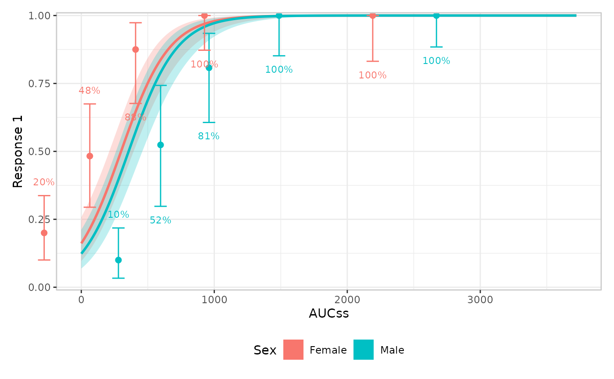

## Continuous color/fill palette

`color_continuous`/`fill_continuous` are the symmetric counterpart,
scoped to aesthetics mapped to something continuous *other* than the
stratification variable.
[`er_style_data_hex()`](https://erplots.djnavarro.net/reference/er_style_data.md)’s
bin-density `fill` is the one built-in example (a continuous/count
response’s response-colored data layer is the other, but there’s
currently no built-in “panel”-layout builder for it – see
`vignettes/articles/extending.Rmd` for writing a custom one).

Left unstyled,
[`er_style_data_hex()`](https://erplots.djnavarro.net/reference/er_style_data.md)
already supplies its own default – a light-grey-to-navy gradient that
fades toward the panel background as a cell’s count approaches zero,
rather than ggplot2’s own default mid-intensity blue:

``` r

erglm_data |>
  er_plot(aucss, biomarker_change) |>
  er_plot_add_model(mod_gaussian, style = er_style_model_line) |>
  er_plot_add_data(style = er_style_data_hex) |>
  plot()
```

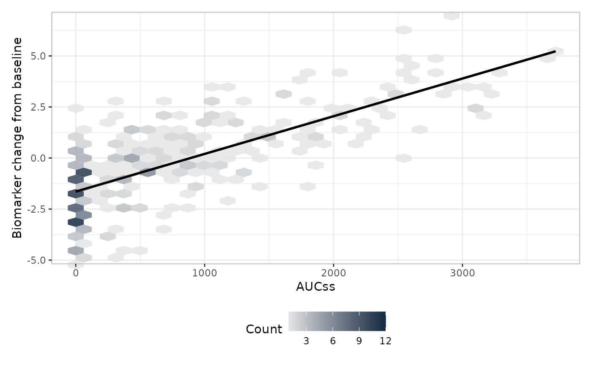

`fill_continuous` overrides that default wherever it’s set:

``` r

erglm_data |>
  er_plot(aucss, biomarker_change) |>
  er_plot_add_model(mod_gaussian, style = er_style_model_line) |>
  er_plot_add_data(style = er_style_data_hex) |>
  er_plot_theme(fill_continuous = ggplot2::scale_fill_viridis_c()) |>
  plot()
```

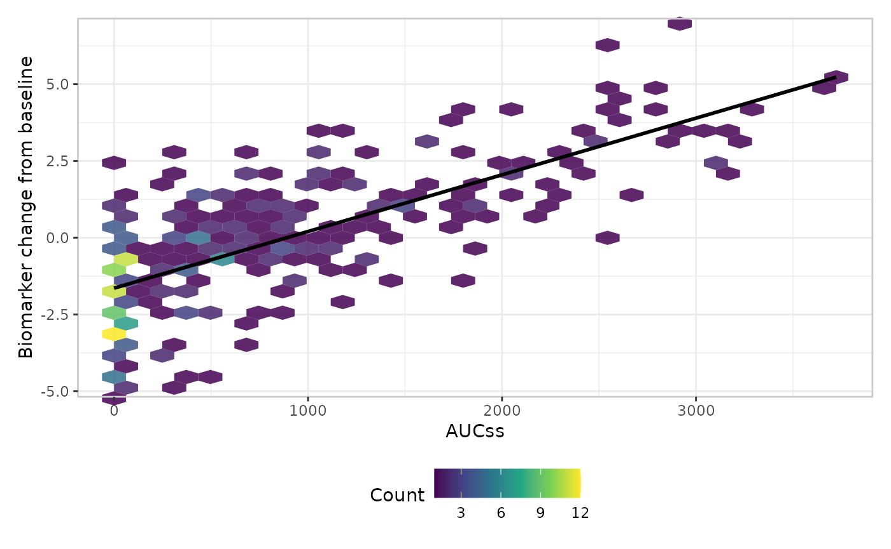

As with `color_discrete`/`fill_discrete`, `color_continuous`/
`fill_continuous` only ever touch the aesthetic role they name –
supplying `fill_continuous` here has no effect on a *discrete* `fill`
mapping elsewhere in the same plot (e.g. a stratified model ribbon’s
`fill = strata`), and vice versa for `fill_discrete`.

## Formatters

`format_p`/`format_percent`/`format_number` control how the summary and
quantile layers format their labels – typically a `scales::label_*()`
call:

``` r

erglm_data |>
  er_plot(aucss, ae1) |>
  er_plot_add_model(mod) |>
  er_plot_add_quantiles() |>
  er_plot_add_summary(model = mod) |>
  er_plot_theme(
    format_p = scales::label_pvalue(accuracy = .0001),
    format_percent = scales::label_percent(accuracy = .1)
  ) |>
  plot()
```

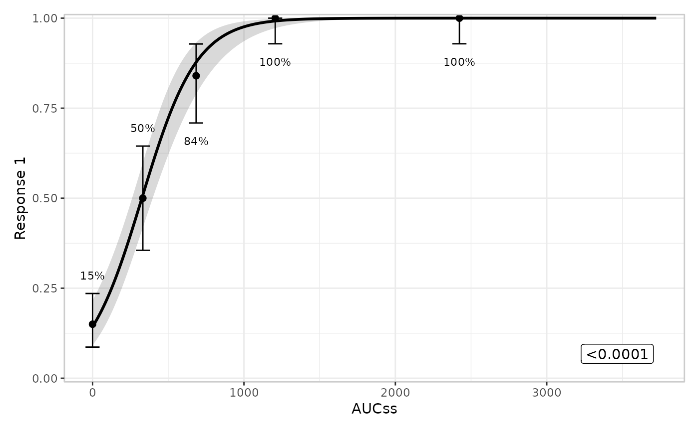

## Legend key glyph

`draw_key` controls the glyph ggplot2 draws in the legend, e.g. a point
instead of the default filled rectangle:

``` r

erglm_data |>
  er_plot(aucss, ae1, stratify_by = sex) |>
  er_plot_add_model(mod_strat) |>
  er_plot_add_data() |>
  er_plot_theme(draw_key = ggplot2::draw_key_point) |>
  plot()
```

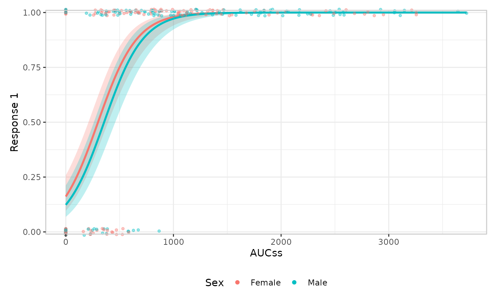

## Panel heights

`height_base`/`height_data`/`height_group` set the relative heights
patchwork gives to the main panel, any data panels, and any group panels
– supplying only one leaves the other two unchanged:

``` r

erglm_data |>
  er_plot(aucss, ae1) |>
  er_plot_add_model(mod) |>
  er_plot_add_quantiles() |>
  er_plot_add_groups(sex) |>
  er_plot_theme(height_group = 5) |>
  plot()
```

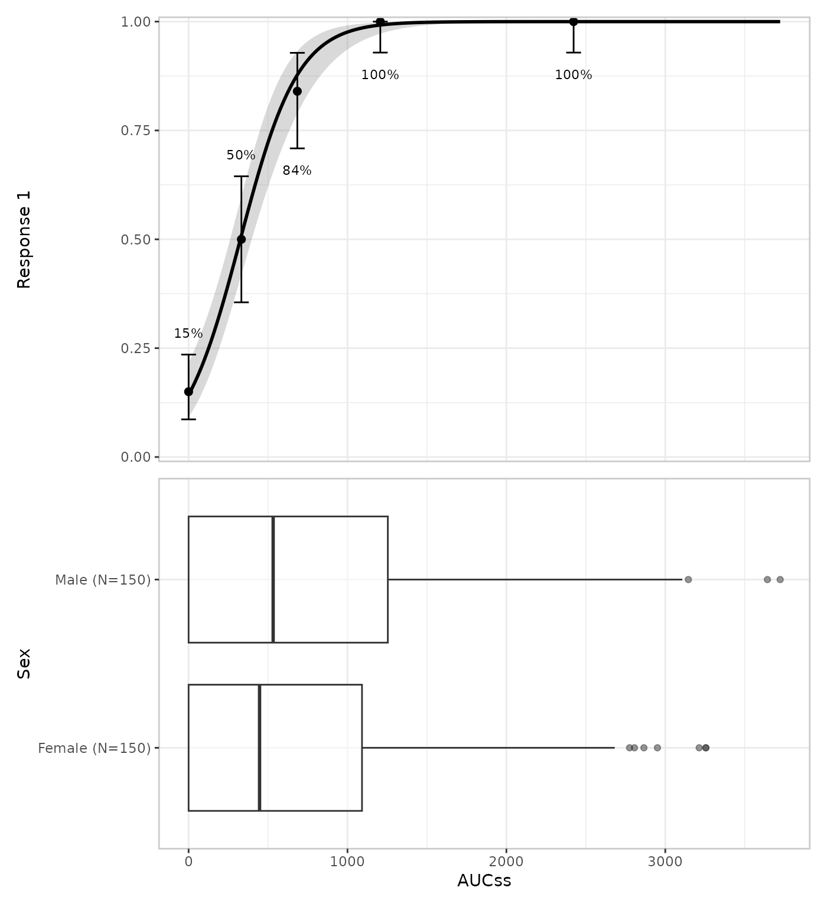

## Calling `er_plot_theme()` more than once

Every argument defaults to `NULL`, so repeated calls accumulate rather
than replace: each call only touches the arguments it actually supplies,
the same merging behaviour as
[`ggplot2::theme()`](https://ggplot2.tidyverse.org/reference/theme.html)
itself. This makes it natural to build up theming incrementally,
e.g. once for labels and again later for the palette:

``` r

erglm_data |>
  er_plot(aucss, ae1, stratify_by = sex) |>
  er_plot_add_model(mod_strat) |>
  er_plot_add_data() |>
  er_plot_theme(xlab = "Steady-state AUC") |>
  er_plot_theme(color_discrete = ggplot2::scale_color_brewer(palette = "Dark2")) |>
  plot()
```

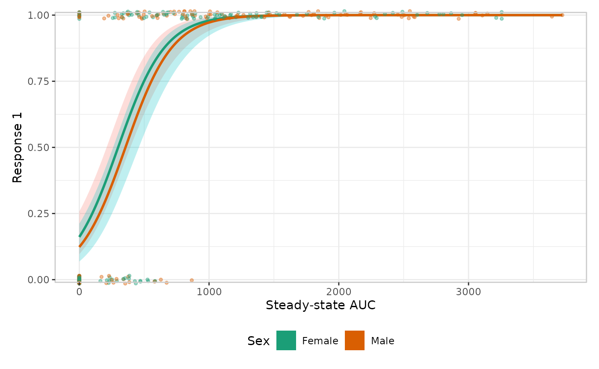

## Where to next

- [The plotting
  grammar](https://erplots.djnavarro.net/articles/design.md) explains
  the layer-composition rules
  [`er_plot_theme()`](https://erplots.djnavarro.net/reference/er_plot_theme.md)
  deliberately doesn’t touch.
- [Extending
  erplots](https://erplots.djnavarro.net/articles/extending.md) shows
  how to write a custom `style` builder, if changing *what’s drawn* –
  rather than *how it looks* – is what you need.
